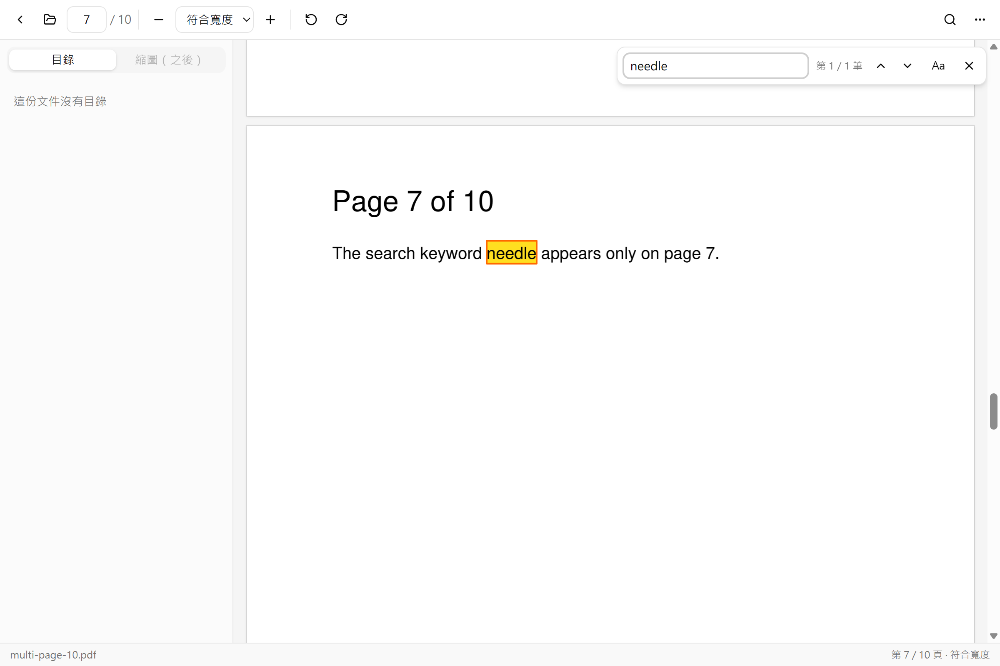
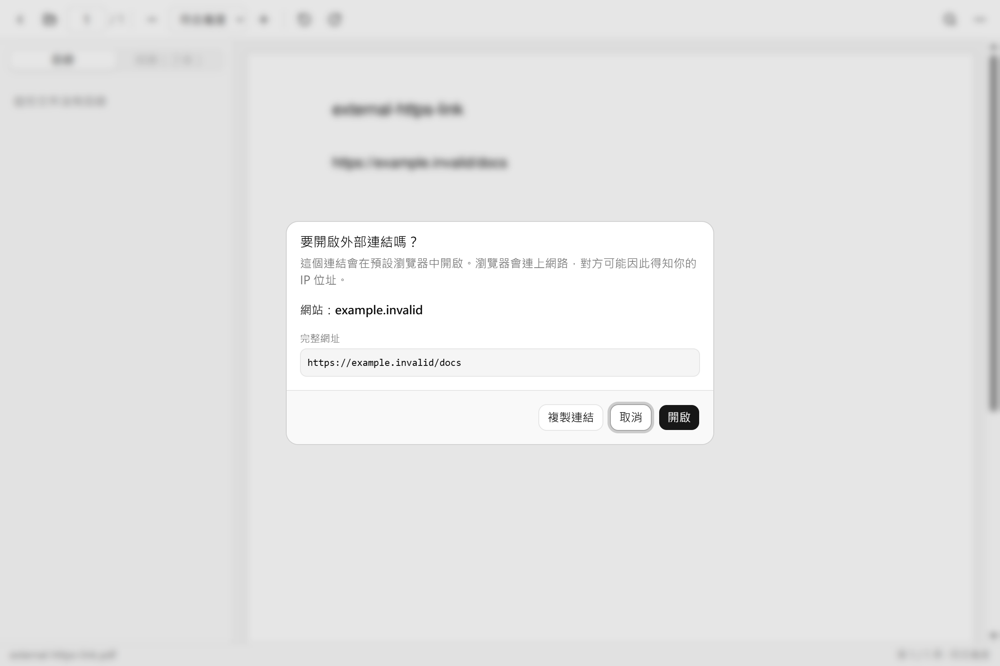

# Pdf-reader

注重隱私、完全離線的 Windows 桌面 PDF 閱讀器（之後擴充為編輯器）。不連網、無遙測、PDF 主動內容預設封鎖，PDF 引擎隔離在低權限子行程中執行。

> **狀態：MVP 開發中，尚未發布安裝檔。** 下面列出的功能都已完成並有測試；目前要自行從原始碼建置。進度見 [工作卡](docs/backlog/README.md) 與 [Issues](https://github.com/winner0988/Pdf-reader/issues)。
>
> **設為預設 PDF 閱讀器**：安裝後在「⋯」選單選「設為預設 PDF 閱讀器」，或在檔案總管對 PDF 按右鍵 →「開啟檔案」→ PDF Reader。
>
> **系統需求**：Windows 11（x64）。畫面使用 Windows 11 內建的 Microsoft Edge WebView2；安裝檔不會下載任何東西（[packaging.md](docs/architecture/packaging.md#webview2)）。

| 全文搜尋 | 外部連結要先確認 |
|---|---|
|  |  |

## 功能

| 功能 | 說明 |
|---|---|
| 開啟本機 PDF | 開啟對話框（可多選）、拖放、命令列參數、從檔案總管開啟；損毀、加密、不是 PDF 的檔案會顯示清楚的錯誤 |
| 分頁 | 同時開多份文件，每份一個分頁，最多 20 個；每個分頁記住自己的頁碼、縮放與搜尋 |
| 閱讀 | 虛擬滾動與 HiDPI 渲染；縮放（含符合寬度、符合頁面）與旋轉，只改檢視、不改檔案 |
| 目錄 | 側欄樹狀目錄，可以只用鍵盤操作 |
| 全文搜尋 | 逐頁搜尋文字層（不含 OCR）、標示結果、上一筆／下一筆、區分大小寫 |
| 選取與複製文字 | 拖曳、雙擊選詞、三擊選行，`Ctrl+C` 或右鍵複製；中文也可以；縮放、旋轉後仍對齊 |
| 主動內容 | JavaScript、開檔自動動作、`/Launch`、表單送出、遠端檔案引用等一律不執行；偵測到時以橫幅列出擋下了什麼 |
| 連結 | 文件內的連結直接跳頁；外部連結顯示完整網址，確認後才交給預設瀏覽器，只允許 `http`、`https`、`mailto`；其他一律封鎖並說明原因 |

OCR、Word 轉檔、完整編輯、簽章、加密、批次背景服務、表單腳本沙盒都**不在** MVP 內；每一項都要先做 POC 並寫 ADR。

## 安全設計

- **不連網、零遙測**：程式本身沒有任何網路功能，也不收集任何資料。CI 會擋下網路與遙測相關的依賴，並檢查 CSP、capability 與建置產物；完整的驗證方式見 [offline-verification.md](docs/security/offline-verification.md)。
- **引擎隔離**（[ADR 0008](docs/adr/0008-pdf-worker-isolation.md)、[worker-sandbox.md](docs/architecture/worker-sandbox.md)）：
  - MuPDF 只在 `pdf_worker` 子行程中執行，**每份文件有自己的 worker**（[ADR 0012](docs/adr/0012-tabs-and-worker-per-document.md)），一份惡意 PDF 碰不到其他文件：沒有任何 capability 的 AppContainer（連 localhost 都不能連、讀不到使用者的檔案）、Job Object、Low integrity，並關閉 win32k 系統呼叫等。
  - 前端只拿得到不透明的文件代號，拿不到檔案路徑。
- **主動內容**（[active-content.md](docs/architecture/active-content.md)）：MuPDF 編譯時就不含 JavaScript 引擎；掃描只是告知，沒有「允許執行」按鈕。
- **連結**（[links.md](docs/architecture/links.md)）：主行程不接受前端傳來的網址，只接受連結的代號，並重新向 worker 取得、檢查後才開啟。
- **測試**：
  - 惡意與損毀樣本的[語料庫](tests/corpus/README.md)，全部由腳本產生；
  - 以 Playwright 操作真正 app 的[端對端測試](docs/architecture/e2e.md)；
  - IPC 解碼與開啟 PDF 的 [fuzzing](docs/security/fuzzing.md)。

## 本機開發（Windows）

需要先安裝：

- [Node.js](https://nodejs.org/) 22 LTS（版本見 `.nvmrc`）
- [pnpm](https://pnpm.io/) 12：`npm install -g pnpm@12`
- [Rust](https://rustup.rs/)（rustup；實際版本由 `rust-toolchain.toml` 自動安裝）
- Visual Studio Build Tools，勾選「使用 C++ 的桌面開發」
- [LLVM](https://llvm.org/)：`winget install LLVM.LLVM`（建置 MuPDF 需要，安裝在預設位置即可；見 [docs/architecture/mupdf-binding.md](docs/architecture/mupdf-binding.md)）
- Microsoft Edge WebView2（Windows 11 已內建）

```bash
pnpm install
cargo build -p pdf_worker   # 第一次，或 worker 有變更時；開發模式的主程式在 target/debug/ 旁邊找 pdf_worker.exe
pnpm tauri dev
```

測試：

```bash
pnpm test                          # 前端單元測試
cargo test --workspace --locked    # Rust 測試
pnpm e2e:build && pnpm e2e         # 端對端測試：建置 release 版後以 Playwright 操作
```

`pnpm bundle` 會在 `target/release/bundle/nsis/` 產出包含 `pdf_worker.exe` 的安裝檔（尚未簽章），見 [docs/architecture/packaging.md](docs/architecture/packaging.md)。完整的檢查指令見 [AGENTS.md](AGENTS.md#指令)。

## 技術棧

Windows-first · Tauri 2 + Rust · React + TypeScript + Vite · Tailwind + shadcn/ui · MuPDF（`pdf_worker` 子行程）· SQLite · Windows Credential Manager。理由見 [ADR 0007](docs/adr/0007-tech-stack-and-platform.md)。

## 文件導覽

| 文件 | 用途 |
|---|---|
| [規格書（繁中）](docs/spec/PDF_Reader_Spec_ZH_v3.md)／[Spec (EN)](docs/spec/PDF_Reader_Spec_EN_v3.md) | 完整產品需求 |
| [CONTEXT.md](CONTEXT.md) | 專案詞彙表 |
| [docs/adr/](docs/adr/README.md) | 架構決策紀錄 |
| [docs/architecture/](docs/architecture/) | 各元件的設計：IPC 合約、worker 沙盒、渲染、搜尋、連結、主動內容、打包、E2E |
| [docs/security/](docs/security/) | 離線驗證、fuzzing 與人工安全檢查 |
| [docs/ux/](docs/ux/screen-map.md) | 畫面地圖、wireframe 與各功能的截圖 |
| [docs/backlog/](docs/backlog/README.md) | MVP 第一批工作卡 |
| [docs/workflow.md](docs/workflow.md) | 開發流程、分支與 CI 規則、GitHub 設定步驟 |
| [AGENTS.md](AGENTS.md) | AI coding agent 的工作規則 |
| [docs/planning/](docs/planning/2026-09-23-kickoff-plan.md) | 專案啟動時的規劃紀錄 |

## 開發流程

這個專案主要由 AI coding agent 依工作卡實作，每個 PR 都要通過 CI、由另一個 agent 或人 review；安全相關的變更由負責人親自審查。


細節見 [docs/workflow.md](docs/workflow.md)。

## 安全

請勿在公開管道張貼可利用的惡意 PDF；回報方式見 [SECURITY.md](SECURITY.md)。

## 授權

本專案以 [GNU Affero General Public License v3.0 或之後的版本](LICENSE)（AGPL-3.0-or-later）授權，理由與散布時的義務見 [ADR 0011](docs/adr/0011-license-and-distribution.md)。

PDF 引擎 [MuPDF](https://mupdf.com/) 由 Artifex Software 以 AGPL-3.0 授權（另有商業授權）；其他第三方套件保留各自的授權。
