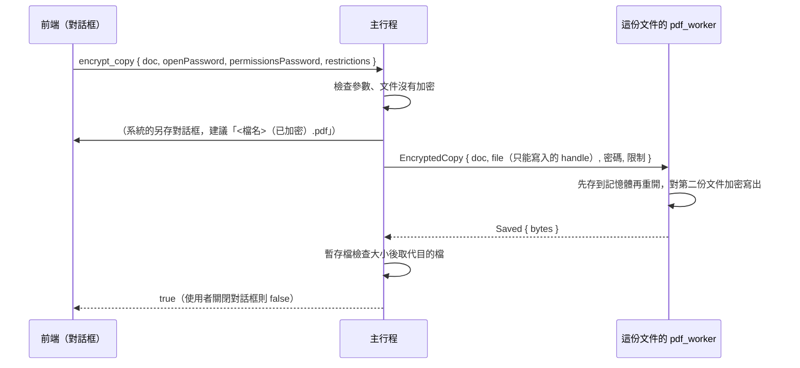

# 加密並另存新檔（B2-15）

工作卡 [#176](https://github.com/winner0988/Pdf-reader/issues/176)；規格 §3「檔案加密與權限」中**寫出**的部分（開啟加密檔案見 [encryption.md](encryption.md)）。畫面見 [screen-map.md](../ux/screen-map.md)「加密並另存新檔（B2-15）」。

## 範圍

- 把目前的文件（含還沒儲存的編輯）以 **AES-256**（`/V 5`、`/R 6`）加密後另存成**新檔**。目前的文件與它的檔案不會改變；副本不加入最近開啟的檔案。
- 可設定**開啟密碼**（沒有的話任何人都能開）、**權限密碼**（用來解除限制），以及三項限制：不允許列印、不允許複製文字與圖片、不允許修改（包含頁面整理、註解與填寫表單）。
- **不做**：RC4 與 AES-128（只寫 AES-256）、憑證加密、記住密碼（ADR 0006）、批次加密（ADR 0005）、移除或更改已加密文件的密碼。

## 規則

| 項目 | 規則 |
|---|---|
| 要設定什麼 | 至少要有開啟密碼或一項限制 |
| 限制 | 有任何限制就一定要有權限密碼，而且與開啟密碼不同：知道開啟密碼的人若也有權限密碼的權利，限制就形同虛設 |
| 只有開啟密碼 | 權限密碼由主行程隨機產生（128 位元，十六進位文字），不顯示、不保存、用完丟棄 |
| 密碼長度 | 最多 127 個位元組（`MAX_NEW_PASSWORD_BYTES`，PDF 標準的上限，也是 MuPDF 緩衝區的大小；Rust 繫結超過會 panic，所以三處都檢查）、不可為空、不可含 NUL；位元組不是字元，一個中文字 3 個位元組 |
| 權限位元 | 不允許列印清 `PRINT` 與 `PRINT_HQ`；不允許複製清 `COPY`；不允許修改清 `MODIFY`、`ANNOTATE`、`FORM`、`ASSEMBLE`。`ACCESSIBILITY`（讀給視障者的軟體）永遠保留 |
| 已加密的文件 | 拒絕（對話框的選單項目停用）。與隱私匯出相同：worker 不保存密碼，副本若用別的設定，會丟掉作者要求的保護 |
| 有數位簽章的文件 | 拒絕：加密要整份重寫，簽章會失效（比照扁平化）。對話框先說明；若仍送出，worker 拒絕，對話框顯示失敗，**沒有檔案被留下** |
| 文件自己的檔案 | 不能是目的地（比照隱私匯出，大小寫不同的寫法也算同一個檔案），主行程以訊息方塊請使用者另選 |

## 流程

- 命令 `encrypt_copy` 的參數是 `EncryptArgs`（見 [ipc-contract.md](ipc-contract.md)）：只有文件代號、密碼與限制，**沒有路徑**；另存對話框由主行程顯示。
- worker 請求 `EncryptedCopy`：與 `Save` 相同，worker 只拿到一個只能寫入的 handle，看不到路徑；回 `Saved { incremental: false }`。逾時 5 分鐘（`SAVE_TIMEOUT`）。
- **為什麼 worker 要先存到記憶體再重開**：MuPDF 用新的加密設定寫出時，會在**開著的那份文件**的 trailer 加上 `/Encrypt`；之後每一次儲存就都被加密了（密碼是使用者不知道的）。所以和隱私匯出一樣，開著的文件只被「存到記憶體」，加密寫出的是重開的第二份。測試 `making_a_copy_does_not_change_what_the_document_saves_as` 與 `a_copy_opens_only_with_its_password_and_the_document_is_as_it_was`（真的沙盒）驗證。

## 密碼的處理

規則同 [encryption.md](encryption.md)：不寫進日誌或錯誤訊息，用完即清除，不存檔。

| 位置 | 做法 |
|---|---|
| 對話框 | 密碼欄位是 `type="password"`（`autoComplete="new-password"`），關閉對話框、送出成功時清空；狀態只在元件裡 |
| IPC 型別 | `Password`：`Debug` 不印出內容、丟棄時以 `zeroize` 清除；`EncryptArgs` 的 `Debug` 因此也不會印出密碼 |
| 主行程 | `args.validate()` 之後，密碼只放進送給 worker 的那一個請求；frame 送出後以 `send_wiped` 清除。隨機產生的權限密碼同樣是 `Password` |
| worker | 請求以 `receive_wiped` 清除；密碼交給 MuPDF 的寫出選項（Rust 繫結把它複製進選項的緩衝區，沒有清除：只存在沙盒中的 worker，文件關閉時 worker 就結束） |
| 錯誤訊息 | 沒有密碼，也沒有 worker 的文字 |

做不到的部分同 encryption.md：JavaScript 字串、Tauri IPC 的暫存、作業系統的管線緩衝區。

## 測試

- `ipc_contract`：`what_a_copy_is_encrypted_with_is_checked`（至少一項、限制要有權限密碼、與開啟密碼不同、長度以位元組計）；模糊測試的種子有新的請求。
- `pdf_worker/src/engine.rs`：AES-256（`/AESV3`、`/R 6`）、密碼不在檔案裡、沒有密碼打不開、密碼錯誤被拒絕、兩個密碼都能開；限制的每一種組合（開啟密碼開啟時受限、權限密碼開啟時不受限）；不能有的密碼（太長、空的、NUL）被拒絕而不是 panic；已加密的文件被拒絕；做過副本的文件仍存成沒有加密的檔案。
- `pdf_worker/tests/encrypt_copy.rs`（真正的 worker、真正的沙盒）：同上，經由 handle 寫入；簽章與已加密的文件被拒絕；錯誤的密碼之後同一個 worker 仍然服務。
- 主行程（`documents.rs`）：副本含尚未儲存的編輯、文件與它的檔案不變、文件仍存成沒有加密的檔案、副本要密碼並依限制開啟；不能蓋掉文件自己的檔案；簽章文件拒絕且沒有留下檔案；已加密的副本不能再加密。
- 前端：`encrypt.test.ts`（規則）、`Encrypt.test.tsx`（對話框：欄位與提示、兩次輸入一致、限制要權限密碼、位元組長度、關閉對話框不留密碼、失敗說明、已加密的文件停用）。
- E2E（`tests/e2e/encrypt.spec.ts`，真正的 app）：填對話框、系統的另存對話框、原檔的雜湊不變、副本是 AES-256 且沒有密碼；重開副本：要密碼、錯的被拒絕、對的開啟、狀態列說明「不可複製」而沒有「不可列印」；簽章文件說明失敗且沒有檔案；已加密的文件停用。

## 已知限制

- 限制只有遵守的閱讀器才有效（這個 app 與 Acrobat 遵守，有些程式會忽略）；要真正保密請設開啟密碼。對話框這樣說明。
- 沒有開啟密碼、只有限制的副本，這個 app 沒有地方輸入權限密碼來解除限制（開啟時不會詢問密碼）；要解除請用別的工具，或照樣只用開啟密碼。有開啟密碼的副本，開啟時輸入權限密碼就不受限制（MVP-19、#88）。
- 簽章文件要先決定怎麼處理（拿掉簽章或不加密），對話框說明但不替使用者決定。
