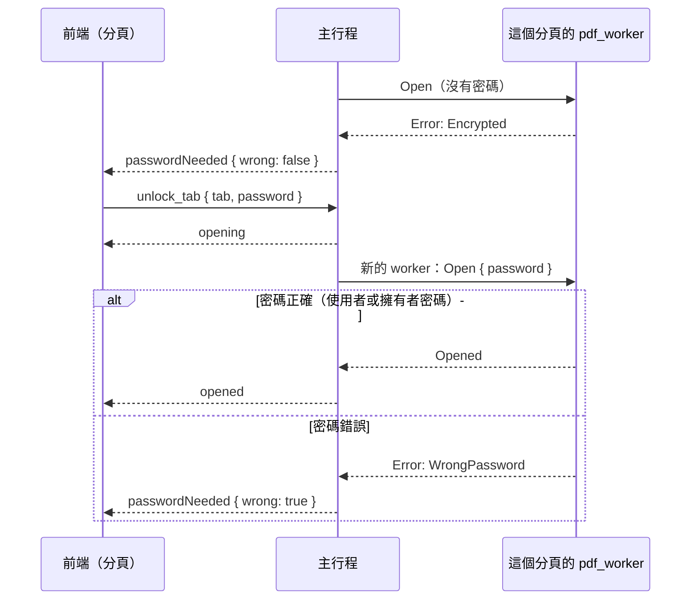

# 開啟加密 PDF（MVP-16）

工作卡 [#71](https://github.com/winner0988/Pdf-reader/issues/71)；規格 §3「檔案加密與權限」中開啟的部分。畫面見 [screen-map.md](../ux/screen-map.md) §2「需要密碼」。

## 流程

- **支援**：MuPDF 的標準安全處理程序（RC4、AES-128、AES-256），使用者密碼與擁有者密碼都能開啟。語料測試的是 RC4 40-bit（R2）與 AES-256（R6）兩個樣本。
- **使用者密碼為空**的文件（只設權限密碼）照常直接開啟，不會詢問。
- **不支援**：以憑證加密（`/Adobe.PubSec`）或其他安全處理程序、MuPDF 不認得的加密版本。MuPDF 開檔時就拒絕，worker 回報 `unsupportedEncryption`，分頁說明原因，不會被當成損毀。
- **取消**就是關閉這個分頁。
- 每份文件有自己的 worker（ADR 0012），所以密碼只送到這個分頁的 worker。

## 密碼的處理

規則：不寫進日誌或錯誤訊息，用完即從記憶體清除，只由主行程轉交給該文件的 worker，不存檔。

| 位置 | 做法 |
|---|---|
| 前端 | 密碼欄位送出後立刻清空；密碼只經過一次 `unlock_tab`。 |
| IPC 型別 | `Password`（`ipc_contract::types`）：`Debug` 只顯示 `Password(..)`，所以任何日誌、錯誤或 `{:?}` 都印不出密碼；被丟棄時以 `zeroize` 清除記憶體。 |
| 主行程 | 先檢查（不可為空、不可含 NUL、最多 `MAX_PASSWORD_BYTES` = 1,024 bytes），放進送給 worker 的 `Open` 請求；送出後編碼的 frame 以 `frame::send_wiped` 清除，請求本身隨即丟棄。**不保留密碼**。 |
| worker | 讀取請求改用沒有緩衝的標準輸入（標準函式庫的緩衝無法清除），收到的 frame 以 `frame::receive_wiped` 清除；密碼交給 MuPDF 驗證後，`open` 結束時丟棄。之後 MuPDF 只保留解密所需的金鑰。 |

### 做不到的部分

- **WebView 與 Tauri 的 IPC**：JavaScript 字串無法清除，Tauri 反序列化時的暫存也不在我們的控制範圍內。它們會隨著記憶體重複使用而被覆蓋。
- **MuPDF 的 Rust 繫結**：`authenticate` 會把密碼複製成 C 字串，用完沒有清除；這個暫存只存在沙盒中的 worker 裡，文件關閉時 worker 就結束。
- **作業系統的管線緩衝區**。

### worker 崩潰時

一般文件在 worker 崩潰後，會在新的 worker 中重新開啟（使用者看不出來）。以密碼開啟的文件做不到：密碼沒有保留。所以主行程放棄這份文件，分頁改回「需要密碼」（`passwordNeeded { wrong: false }`），使用者重新輸入後再開啟。

## 尚未處理

- **記住密碼**（Windows 認證管理員，ADR 0006）：另開工作卡。
- **權限**（禁止複製、禁止列印）：要不要遵守，已在 [#70](https://github.com/winner0988/Pdf-reader/issues/70#issuecomment-5822177101) 請負責人決定。`mupdf` 已提供安全的 `PdfDocument::permissions()`，實作時不需要 `unsafe`。
