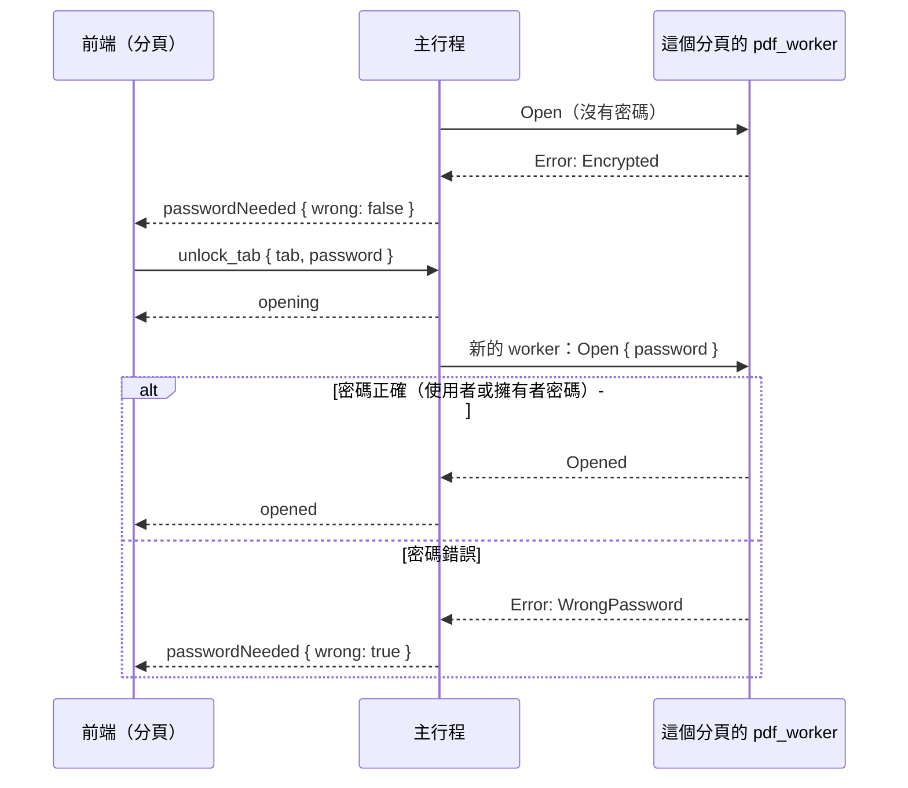

# 開啟加密 PDF（MVP-16）

工作卡 [#71](https://github.com/winner0988/Pdf-reader/issues/71)；規格 §3「檔案加密與權限」中開啟的部分。畫面見 [screen-map.md](../ux/screen-map.md) §2「需要密碼」。

## 流程

```mermaid
sequenceDiagram
  participant F as 前端（分頁）
  participant M as 主行程
  participant W as 這個分頁的 pdf_worker
  M->>W: Open（沒有密碼）
  W-->>M: Error: Encrypted
  M-->>F: passwordNeeded { wrong: false }
  F->>M: unlock_tab { tab, password }
  M-->>F: opening
  M->>W: 新的 worker：Open { password }
  alt 密碼正確（使用者或擁有者密碼）
    W-->>M: Opened
    M-->>F: opened
  else 密碼錯誤
    W-->>M: Error: WrongPassword
    M-->>F: passwordNeeded { wrong: true }
  end
```

- **支援**：MuPDF 的標準安全處理程序（RC4、AES-128、AES-256），使用者密碼與擁有者密碼都能開啟。語料測試的是 RC4 40-bit（R2）與 AES-256（R6）兩個樣本。
- **使用者密碼為空**的文件（只設權限密碼）照常直接開啟，不會詢問；作者設定的權限照樣生效（見下方「權限」）。
- **不支援**：以憑證加密（`/Adobe.PubSec`）或其他安全處理程序、MuPDF 不認得的加密版本。MuPDF 開檔時就拒絕，worker 回報 `unsupportedEncryption`，分頁說明原因，不會被當成損毀。
- **取消**就是關閉這個分頁。
- 每份文件有自己的 worker（ADR 0012），所以密碼只送到這個分頁的 worker。

## 密碼的處理

規則：不寫進日誌或錯誤訊息，用完即從記憶體清除，只由主行程轉交給該文件的 worker，不存檔。

| 位置 | 做法 |
|---|---|
| 前端 | 密碼欄位送出後立刻清空；密碼只經過一次 `unlock_tab`。 |
| IPC 型別 | `Password`（`ipc_contract::types`）：`Debug` 只顯示 `Password(..)`，所以任何日誌、錯誤或 `{:?}` 都印不出密碼；被丟棄時以 `zeroize` 清除記憶體。 |
| 主行程 | 先檢查（不可為空、不可含 NUL、最多 `MAX_PASSWORD_BYTES` = 1,024 bytes），放進送給 worker 的 `Open` 請求；送出後編碼的 frame 以 `frame::send_wiped` 清除，請求本身隨即丟棄。**不保留密碼**。 |
| worker | 讀取請求改用沒有緩衝的標準輸入（標準函式庫的緩衝無法清除），收到的 frame 以 `frame::receive_wiped` 清除；密碼交給 MuPDF 驗證後，`open` 結束時丟棄。判斷是否為擁有者密碼（#88）時交給 MuPDF 的複本，用完即以 `zeroize` 清除。之後 MuPDF 只保留解密所需的金鑰。 |

### 做不到的部分

- **WebView 與 Tauri 的 IPC**：JavaScript 字串無法清除，Tauri 反序列化時的暫存也不在我們的控制範圍內。它們會隨著記憶體重複使用而被覆蓋。
- **MuPDF 的 Rust 繫結**：`authenticate` 會把密碼複製成 C 字串，用完沒有清除；這個暫存只存在沙盒中的 worker 裡，文件關閉時 worker 就結束。
- **MuPDF 本身**：驗證密碼時會轉換編碼、複製到自己堆疊上的緩衝區，沒有清除；同樣只在沙盒中的 worker 裡。
- **作業系統的管線緩衝區**。

### worker 崩潰時

一般文件在 worker 崩潰後，會在新的 worker 中重新開啟（使用者看不出來）。以密碼開啟的文件做不到：密碼沒有保留。所以主行程放棄這份文件，分頁改回「需要密碼」（`passwordNeeded { wrong: false }`），使用者重新輸入後再開啟。

同樣的原因，**復原**以密碼開啟的文件的編輯時（B2-05），要再輸入一次密碼（#94 的決定）：復原要從原始位元組重新開啟文件（ADR 0013）。

- 密碼只隨那一次復原請求（`undo_edit` → `WorkerRequest::Revert`）送到 worker，處理方式與開檔時相同：送出的 frame 清除、worker 收到後清除、用完即丟。
- worker 保留的原始位元組仍是加密的，與磁碟上的檔案相同。
- 見 [page-management.md](page-management.md)「復原與重做」。

## 權限（MVP-19）

工作卡 [#82](https://github.com/winner0988/Pdf-reader/issues/82)。負責人在 [#70](https://github.com/winner0988/Pdf-reader/issues/70) 決定比照 Adobe Acrobat 遵守 PDF 的權限。

| `/P` 的位元（ISO 32000-2 表 22） | 沒有這個位元時 | app 的行為 |
|---|---|---|
| 5：複製文字 | 禁止複製 | 仍可選取；`Ctrl+C` 不複製，狀態列說明原因；右鍵「複製」停用並標示「作者不允許」 |
| 3：列印 | 禁止列印 | 「⋯」→「列印…」停用並標示「作者不允許」；`Ctrl+P` 在狀態列說明原因 |
| 12：高品質列印（R3 以上） | 允許列印，但只能低解析度 | 以 150 dpi（Acrobat 的「低解析度」）而不是 200 dpi 列印；列印對話框說明 |
| 6：註解（B2-07） | 禁止新增、變更與移除註解 | 主行程拒絕註解的編輯（`apply_edit`）；列出頁面的註解（`get_page_annotations`）不受影響。畫面見 [annotations.md](annotations.md) |
| 9：填寫表單（R3 以上），或 6 | 禁止填寫表單與扁平化（B2-09） | 主行程拒絕欄位與扁平化的編輯；欄位仍然列出。第 6 位元涵蓋填寫表單；R2 沒有第 9 位元（保留位，一律是 1），只看第 6 位元。見 [forms.md](forms.md) |

- 受限制的文件在狀態列顯示「已限制：…」，例如「已限制：不可複製、不可列印」。未加密的文件全部允許。
- **讀取**：worker 從 trailer 的 `/Encrypt` 讀 `/P` 與 `/R`（`engine::PdfDocument::permissions`），以 `DocumentPermissions`（`copy`、`print`、`printHighQuality`、`modify`、`assemble`、`annotate`、`fillForms`）放進 `OpenedDocument` 與 `DocumentInfo` 交給前端。只用物件 API，沒有 `unsafe`。以擁有者密碼開啟的文件則全部允許（見下方「擁有者密碼」）。
- **沒有用 `mupdf` 的 `PdfDocument::permissions()`**：繫結以 `Permission::from_bits(...)` 轉換 `/P`，失敗時當成「全部允許」。真正的 `/P` 都設了保留位元，所以一律失敗，結果永遠是全部允許。
- 修訂版 2（R2，40-bit RC4）沒有高品質列印位元：允許列印就是完整品質。
- **權限不是安全邊界**，而是文件作者的要求：能開啟文件就能解密全部內容，其他程式也可以不理會。app 遵守它，但不宣稱能防止擷取。
- 語料：
  - `benign/restricted-no-copy-no-print.pdf` 與 `benign/restricted-low-res-print.pdf`：AES-256，使用者密碼為空，擁有者密碼 `owner`；
  - `benign/restricted-open-password.pdf`：AES-256，使用者密碼 `user`、擁有者密碼 `owner`，禁止複製與列印。

### 擁有者密碼

工作卡 [#88](https://github.com/winner0988/Pdf-reader/issues/88)，負責人選擇由 worker 直接呼叫 MuPDF 的 C 函式。

- 與 Acrobat 相同：需要密碼的文件以**擁有者密碼**開啟時，解除所有限制（`DocumentPermissions` 全部允許）；以使用者密碼開啟時，作者的限制照樣生效。
- 只設權限密碼（使用者密碼為空）的文件開啟時不需要密碼，所以不會輸入擁有者密碼，限制一律生效，也與 Acrobat 相同。
- **做法**：`mupdf` 繫結的 `authenticate` 只回傳成功與否。所以密碼通過繫結的驗證後，`owner_password::is_owner_password` 以 `mupdf-sys` 另開一次同一份文件，呼叫 `pdf_authenticate_password`，看 MuPDF 回報的是不是擁有者密碼（4）：
  - 只有需要密碼的文件才會多開一次；檔案內容以共用的方式交給 MuPDF，不另外複製；
  - 為何安全：見 [mupdf-binding.md](mupdf-binding.md) 的「目前的 API」；
  - 結果只存在 worker 的 `PdfDocument` 中，文件關閉即丟棄。
- 測試：
  - `owner_password` 與 `engine` 的單元測試；
  - `tests/encryption.rs`：在沙盒中的 worker 裡，AES 與 RC4 的樣本都測；
  - E2E `permissions.spec.ts`：在真正的 app 中，使用者密碼不能複製、列印，擁有者密碼都可以。

## 尚未處理

- **記住密碼**（Windows 認證管理員，ADR 0006）：另開工作卡。
