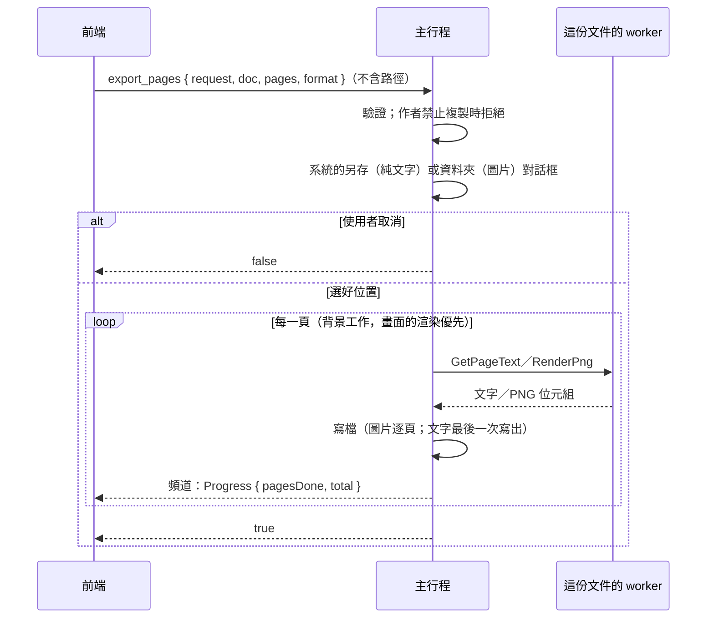

# 匯出純文字與頁面圖片（B2-04）

工作卡 [#93](https://github.com/winner0988/Pdf-reader/issues/93)；規格 §7「格式匯出」中的純文字與圖片（Word 另開 POC）。畫面見 [screen-map.md](../ux/screen-map.md)「匯出」。

## 流程

- **前端只說要匯出什麼**：
  - 文件、頁面（0 起算，最多 `LIMITS.maxExportPages`＝1,000 頁，不重複）、格式；
  - **不含路徑，也不經手檔案內容**。位置由主行程的系統對話框決定，內容由 worker 產生、主行程寫入。
- **對話框**（`src-tauri/src/file_dialog.rs`，與開啟對話框相同的做法）：
  - 純文字：`IFileSaveDialog`，建議檔名 `<原檔名>.txt`，已存在時由對話框本身詢問是否取代；
  - 圖片：`IFileOpenDialog` 的選擇資料夾模式；
  - 都有 `FOS_DONTADDTORECENT`：不加入 Windows 的「最近使用的項目」。
- **圖片的檔名**由主行程產生：`<原檔名>-p<頁碼>.png`（頁碼從 1 起算）。資料夾中已有同名檔案時，以原生訊息方塊詢問「已經有 N 個同名的檔案。要覆寫嗎？」，選「否」就什麼都不寫。
- **寫檔**：先寫新的暫存檔 `<檔名>.tmp` 再改名，匯出中斷時不會留下半個檔案。
  - 資料夾中已經有同名的暫存檔時改用 `<檔名>.<n>.tmp`，不會覆寫使用者其他的檔案；
  - 圖片逐頁寫入，停止或失敗時已寫好的頁面保留；
  - 純文字在最後一次寫出，停止時不寫任何東西。
- **進度與停止**：進度走頻道；`cancel(request)` 在下一頁之前停止（與搜尋相同的做法）。每一頁都是渲染執行緒上的背景工作，畫面的渲染優先。

## 內容

- **純文字**：
  - 依頁序，每一行之後 `\r\n`，每一頁之後換頁字元 `\f`（與 `pdftotext` 相同）；
  - UTF-8，沒有 BOM；
  - 沿用 `get_page_text` 的清理規則（MVP-15：不含控制字元、雙向文字控制與零寬字元）；
  - 沒有文字層的頁面寫「（此頁沒有文字層）」。
- **PNG**：
  - worker 以 MuPDF 渲染並編碼（`RenderPng`），不套用檢視的旋轉，白色背景、沒有透明；
  - 72、150 或 300 dpi；
  - 超過點陣上限（`LIMITS.maxRasterPixels`）的頁面以較低的解析度匯出，與畫面的渲染相同；
  - 單一檔案最多 64 MB（`MAX_PNG_BYTES`），主行程收到時檢查 PNG 的簽名。

## 權限

作者禁止複製（MVP-19）時，匯出一併停用，比照 Acrobat 的「內容複製」：

- 「⋯」→「匯出…」停用並標示「作者不允許」；
- 主行程也會拒絕 `export_pages`。

## 尚未處理

- **JPG**：`mupdf` 繫結的影像編碼只有 PNG 等格式，沒有 JPEG。要支援需要新的編碼器（例如純 Rust 的 JPEG 編碼套件），另開卡。
- **Word（.docx）**：需要 POC 與 ADR。
- 掃描頁的文字（OCR，B2-10）。

## 驗證

- Rust：
  - 對話框物件的選項（三種對話框都有 `FOS_DONTADDTORECENT`）；
  - 檔名、文字檔的格式；
  - 寫檔：整個檔案一次取代，不覆寫資料夾中同名的暫存檔；
  - worker 的 PNG（簽名、尺寸、比例上限）；
  - IPC 驗證：頁數上限、不重複、只接受 72／150／300 dpi、PNG 的簽名與大小。
- 前端（`ExportDialog.test.tsx`）：純文字與 PNG 的參數、進度與停止、關閉系統對話框後仍可再試、頁碼不在文件中、禁止複製時停用。
- E2E（`tests/e2e/export.spec.ts`，以 UI Automation 回答系統的對話框）：
  - 純文字寫到另存的檔案；
  - 兩頁 PNG 寫到選的資料夾（簽名、寬度）；
  - 取消時什麼都不寫。
