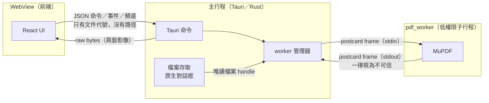

# IPC 合約 v0

前端（WebView）、主行程（Tauri／Rust）與 `pdf_worker` 之間所有跨行程訊息的規格。對應工作卡 MVP-02、ADR 0008。

**唯一定義處是 `crates/ipc_contract`**：Rust 型別就是規格，前端的 TypeScript 型別由它產生（`src/ipc/generated/contract.ts`）。本文件說明設計理由與規則；若與程式碼不一致，以程式碼為準並修正本文件。

## 行程模型與信任邊界

| 信任區 | 可以做 | 不可以做 |
|---|---|---|
| WebView | 顯示、互動、呼叫下表的命令 | 取得檔案路徑、讀檔、連網、直接開啟 URL |
| 主行程 | 取得使用者授權的檔案、驗證所有輸入、協調 worker | 自行解析 PDF |
| `pdf_worker` | 解析與渲染已交付的文件 | 開啟任意路徑、連網、產生子行程 |

## 前端 ↔ 主行程

前端呼叫 Tauri 命令，參數與回傳值為 camelCase JSON；型別見 `src/ipc/generated/contract.ts`。命令失敗時一律以 `IpcError` 拒絕。

| 命令 | 參數 | 回傳 | 可取消 | 實作卡 |
|---|---|---|---|---|
| `subscribe_open_events` | `{ onEvent: Channel<OpenEvent> }` | 無（事件走頻道，見下節） | 否 | MVP-06 |
| `open_document_dialog` | 無 | `boolean`：`false` 表示使用者取消（或已有對話框開著）；結果走開檔頻道 | 否 | MVP-06 |
| `retry_open` | 無 | 無（重新開啟最近一次嘗試的檔案，結果走開檔頻道） | 否 | MVP-06 |
| `close_document` | `{ doc: DocumentId }` | 無 | 否 | MVP-06 |
| `render_page` | `{ args: RenderPageArgs }` | `ArrayBuffer`（見「頁面影像」） | 是 | MVP-07 |
| `get_outline` | `{ doc: DocumentId }` | `OutlineResult` | 否 | MVP-09 |
| `get_page_links` | `{ doc: DocumentId, pageIndex: number }` | `PageLink[]` | 否 | MVP-12 |
| `search` | `{ args: SearchArgs, onEvent: Channel<SearchEvent> }` | 無（結果走頻道） | 是 | MVP-10 |
| `cancel` | `{ request: RequestId }` | 無（只取消還在佇列中的請求，見 [rendering.md](rendering.md#取消)） | — | MVP-07 |

### 開檔頻道（主行程 → 前端）

所有開檔結果（對話框、拖放、命令列參數）都經由前端呼叫 `subscribe_open_events` 時傳入的 Tauri `Channel` 送出，內容是 `OpenEvent`：

| `kind` | 欄位 | 意義 |
|---|---|---|
| `dragHover` | `active` | 檔案拖曳進入（`true`）或離開（`false`）視窗，畫布顯示拖放目標 |
| `opening` | `displayName` | 開始開檔，前端 300 ms 後顯示載入中 |
| `opened` | `info: DocumentInfo`、`ignoredFiles` | 開檔成功；`ignoredFiles > 0` 表示拖放了多個檔案，只開了第一個 |
| `failed` | `displayName`、`error: IpcError`、`ignoredFiles` | 開檔失敗 |

- **為什麼用 Channel 而不是 Tauri 事件**：前端要監聽事件就必須有 `core:event` 權限，而 Tauri 內建的拖放事件（`tauri://drag-drop`）會帶**完整路徑**，拿到權限的頁面也能收到。不授予任何 `core:event` 權限，路徑就不可能進入 WebView。
- 主行程只保留最新的頻道（頁面重新載入時取代舊的）。訂閱前的事件（例如啟動時由命令列開檔）會排隊，最多 16 個，訂閱時依序送出；沒有排隊事件但已有開啟的文件時，送出一次 `opened`，讓重新載入的頁面恢復顯示。
- 一個視窗一次只開一份文件：開新文件前，主行程先關閉目前的文件（worker `Close`）。開檔依序處理，兩次開檔的事件不會交錯。
- 驗證：MVP-06 以開發者工具在頁面重新載入時記錄所有 IPC 請求／回應、主行程注入的腳本（頻道訊息）、DOM、console 與 JS heap snapshot。從路徑含有特殊標記的資料夾開檔後，這些地方都找不到該標記，但都找得到檔名。

### 權限

`src-tauri/build.rs` 以 app manifest 宣告上述命令，因此每個命令都要在 `src-tauri/capabilities/main.json` 明確允許（`allow-subscribe-open-events` 等）。沒有授予任何 `core:*`、dialog、fs 權限；原生開檔對話框由 Rust 端的 `rfd` 顯示，前端無法指定路徑，也拿不到路徑。

規則：

- `RenderPageArgs`、`SearchArgs` 使用 `deny_unknown_fields`：多出的欄位視為錯誤，不會被忽略。
- `RequestId` 由前端產生，只用來取消；主行程另外配發送給 worker 的 `RequestId`，前端無法直接指定 worker 端的請求。
- 主行程收到命令後先以 `validate` 模組檢查參數（縮放範圍、查詢長度、頁碼是否在範圍內），不合格回傳 `invalidArgument`。
- `DocumentInfo.displayName` 只能是檔名；`validate` 會拒絕含有 `/`、`\`、`:` 的值。

### 頁面影像

`render_page` 的回傳值不是 JSON，而是 Tauri 的 raw binary response，前端拿到 `ArrayBuffer`，以 `src/ipc/raster.ts` 的 `decodeRaster` 解析：

| 位移 | 長度 | 欄位 |
|---|---|---|
| 0 | 4 | magic `PDFR` |
| 4 | 2 | 格式（u16 LE）：1 = RGBA8，不透明 |
| 6 | 2 | 保留（u16 LE），必須為 0 |
| 8 | 4 | 寬（u32 LE，像素） |
| 12 | 4 | 高（u32 LE，像素） |
| 16 | 寬 × 高 × 4 | 像素，由上到下逐列，無 padding |

主行程會把縮放比例降到點陣圖上限以內（`fit_scale`），所以回傳的寬高可能小於「頁面尺寸 × 縮放」；前端一律以回傳的寬高解碼，再縮放到頁面的顯示尺寸。排程、取消與快取見 [rendering.md](rendering.md)。

選擇理由：

| 方案 | 優點 | 缺點 | 結論 |
|---|---|---|---|
| **raw binary 命令回應** | 不經 JSON／base64；在 capability 系統內；可用 `RequestId` 取消 | 前端要自己畫到 canvas | ✅ 採用 |
| 自訂 URI scheme（``） | 瀏覽器自帶快取與解碼 | 繞過 capability、頁面內任何內容都能請求、無法取消、需放寬 CSP `img-src`、每張都要編碼 PNG | ✗ |
| JSON 內 base64 | 最簡單 | 體積 +33%、編解碼成本高 | ✗ |

像素選 RGBA8 而非 PNG：canvas 的 `ImageData` 直接吃 RGBA，省去編碼與解碼。代價是傳輸量大（A4 在 150% 為 893 × 1263 px，約 4.5 MB）。**量測計畫（MVP-07）**：在負責人的電腦上量測 1× 與 2× 縮放時 worker 渲染、跨行程傳輸、前端繪製各自的時間；若傳輸佔比過高，改評估分塊（tile）或壓縮，並更新本節。

## 主行程 ↔ `pdf_worker`

### Framing

- 每個 frame：4 bytes 小端序 `u32` 長度，後接 payload。
- payload 是以 [postcard](https://docs.rs/postcard) 編碼的 `WorkerRequest`（主 → worker，stdin）或 `WorkerResponse`（worker → 主，stdout）。
- **長度在配置記憶體之前就檢查**，超過 `MAX_FRAME_BYTES`（80 MiB）立即失敗；worker 無法用假的長度讓主行程配置大量記憶體。
- 解碼後若還有剩餘位元組，視為錯誤（`TrailingBytes`）。
- 任何 frame 錯誤都視為 worker 失控：主行程終止 worker 並回報 `protocolViolation`（MVP-04）。

### 版本握手

1. worker 啟動後的第一個 frame 必須是 `WorkerResponse::Hello { protocol_version, worker_version }`。
2. 主行程以 `check_hello` 檢查；版本不同或第一個訊息不是 `Hello`，就終止 worker，不送出任何請求。
3. `Hello` 必須永遠是 `WorkerResponse` 的第 0 個 variant（有測試保護），因此不同版本的 worker 送來的 `Hello` 仍可解碼，錯誤訊息會是「版本不符」而非「解碼失敗」。
4. 目前版本 `PROTOCOL_VERSION = 0`。v0 期間任何變更都可能不相容，主行程與 worker 一起發布。

### 訊息

| `WorkerRequest` | 欄位 | 預期回應 |
|---|---|---|
| `Open` | `request`, `doc`, `file: FileHandle` | `Opened` 或 `Error` |
| `Render` | `request`, `doc`, `page_index`, `scale`, `rotation` | `Rendered` 或 `Error` |
| `GetOutline` | `request`, `doc` | `Outline` 或 `Error` |
| `GetPageLinks` | `request`, `doc`, `page_index` | `PageLinks` 或 `Error` |
| `Search` | `request`, `doc`, `query`, `case_sensitive` | 0 個以上 `SearchHits`／`SearchProgress`，最後一個 `SearchDone` 或 `Error` |
| `Cancel` | `target` | 無（被取消的請求回 `Error { code: Cancelled }`，或已完成則照常回應） |
| `Close` | `doc` | 無 |
| `Shutdown` | — | worker 結束 |

`FileHandle` 是主行程以唯讀方式開檔後複製進 worker 行程的 handle 值（ADR 0008），**worker 永遠拿不到路徑**；實際交付方式由 MVP-04 實作並記錄在 `docs/architecture/worker-sandbox.md`。

`WorkerResponse` 的每個值在使用前都要通過 `Validate`：頁數、頁面尺寸、座標是否為有限數且在範圍內、點陣圖大小與像素長度是否一致、字串與清單長度、目錄是否為合法的前序結構、連結 id 是否屬於回報的頁面等。

## 取消與逾時

- 取消是盡力而為：worker 收到 `Cancel` 後，若目標請求尚未完成就丟棄，並回 `Error { code: Cancelled }`。
- 主行程對每個 worker 請求設逾時；逾時即終止並重啟 worker，前端收到 `workerTimeout`（逾時長度由 MVP-04 決定）。

## 錯誤

前端依 `ErrorCode` 顯示在地化文字；`IpcError.message` 只給日誌使用，不得包含路徑或文件內容。

| `ErrorCode` | 意義 |
|---|---|
| `unknownDocument` | 文件代號不存在或已關閉 |
| `invalidArgument` | 參數不合法（含頁碼超出範圍） |
| `cancelled` | 請求已取消 |
| `notPdf` | 不是 PDF |
| `corrupted` | PDF 損毀，無法解析 |
| `encrypted` | 加密文件（MVP 不支援） |
| `unreadable` | 無法讀取（權限不足等） |
| `tooLarge` | 檔案超過大小上限 |
| `limitExceeded` | 結果超過上限（例如渲染尺寸） |
| `workerCrashed` | worker 崩潰，已重啟 |
| `workerTimeout` | worker 逾時，已重啟 |
| `protocolViolation` | worker 送出不合法的訊息，已終止 |
| `internal` | 其他內部錯誤 |

worker 端的 `WorkerErrorCode` 以 `From` 轉換對應到上表。

## 上限

定義於 `crates/ipc_contract/src/limits.rs`，前端透過產生的 `LIMITS` 常數取得同一組數值。

| 上限 | 值 | 備註 |
|---|---|---|
| 單一 frame | 80 MiB | 足以容納一張最大點陣圖 |
| 頁數 | 100,000 | |
| 頁面邊長 | 1,000,000 pt | 只擋荒謬值；記憶體由點陣圖上限控制 |
| 渲染縮放 | 0.01 – 64 | 1.0 = 72 dpi |
| 點陣圖邊長 | 8,192 px | |
| 點陣圖面積 | 4096 × 4096 px（64 MiB RGBA） | MVP-07 可依量測調整 |
| 目錄項目／深度 | 10,000／64 | 超過時 worker 截斷並設 `truncated` |
| 每頁連結 | 2,000 | |
| URI | 32,768 bytes | MVP-12 須能完整顯示 10,000 字元的 URL |
| 短文字（目錄標題、被封鎖動作的目標） | 1,024 bytes | |
| 搜尋字串 | 1,024 bytes | |
| 搜尋結果 | 10,000 筆 | 超過時 `truncated` |
| 每筆結果的 quad | 64 | |
| 錯誤訊息／顯示名稱 | 1,024 bytes | |

## 座標系統

頁面空間：PDF point，原點在**未旋轉**頁面的左上角，y 向下（與 MuPDF 相同）。`Rect`、`Quad`、連結目的地都使用頁面空間；前端依目前縮放與旋轉自行轉換成螢幕座標。

## 刻意不存在的訊息

以下能力在合約中**不存在**，新增任何一項都必須先提 ADR：

- 以路徑開啟或讀取檔案（前端與 worker 都拿不到路徑）
- 執行指令或啟動程式
- 開啟任意 URL：外部連結由 MVP-12 以 `LinkId` 開啟，主行程從 worker 先前回報的連結表查出 URI、再次檢查 scheme，並經使用者確認；前端送來的 URI 字串一律不採信
- 任何連網請求

## 修改合約的流程

1. 修改 `crates/ipc_contract` 的 Rust 型別或上限。
2. 執行 `pnpm ipc:generate` 重新產生 `src/ipc/generated/contract.ts`（`cargo test` 中的 `generated_typescript_is_up_to_date` 會在忘記產生時失敗）。
3. 更新本文件。
4. PR 加上 `needs-security-review`（AGENTS.md：修改 IPC 協定屬於安全變更）。
