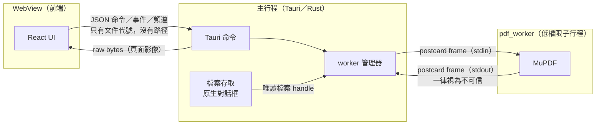

# IPC 合約 v0

前端（WebView）、主行程（Tauri／Rust）與 `pdf_worker` 之間所有跨行程訊息的規格。對應工作卡 MVP-02、ADR 0008。

**唯一定義處是 `crates/ipc_contract`**：Rust 型別就是規格，前端的 TypeScript 型別由它產生（`src/ipc/generated/contract.ts`）。本文件說明設計理由與規則；若與程式碼不一致，以程式碼為準並修正本文件。

## 行程模型與信任邊界

```mermaid
flowchart LR
  subgraph W[WebView（前端）]
    UI[React UI]
  end
  subgraph M[主行程（Tauri／Rust）]
    CMD[Tauri 命令]
    MGR[worker 管理器]
    FS[檔案存取<br/>原生對話框]
  end
  subgraph P[pdf_worker（低權限子行程）]
    MU[MuPDF]
  end
  UI -- "JSON 命令／事件／頻道<br/>只有文件代號，沒有路徑" --> CMD
  CMD -- "raw bytes（頁面影像）" --> UI
  CMD --> MGR
  FS -- "唯讀檔案 handle" --> MGR
  MGR -- "postcard frame（stdin）" --> MU
  MU -- "postcard frame（stdout）<br/>一律視為不可信" --> MGR
```

| 信任區 | 可以做 | 不可以做 |
|---|---|---|
| WebView | 顯示、互動、呼叫下表的命令 | 取得檔案路徑、讀檔、連網、直接開啟 URL |
| 主行程 | 取得使用者授權的檔案、驗證所有輸入、協調 worker | 自行解析 PDF |
| `pdf_worker` | 解析與渲染已交付的文件 | 開啟任意路徑、連網、產生子行程 |

## 前端 ↔ 主行程

前端呼叫 Tauri 命令，參數與回傳值為 camelCase JSON；型別見 `src/ipc/generated/contract.ts`。命令失敗時一律以 `IpcError` 拒絕。

| 命令 | 參數 | 回傳 | 可取消 | 實作卡 |
|---|---|---|---|---|
| `subscribe_open_events` | `{ onEvent: Channel<OpenEvent> }` | 無（事件走頻道，見下節） | 否 | MVP-06 |
| `open_document_dialog` | 無 | `boolean`：`false` 表示使用者取消（或已有對話框開著）；可以選多個檔案，每個一個分頁，結果走開檔頻道。選的檔案不會加進 Windows 的「最近使用的項目」 | 否 | MVP-06、14、#86 |
| `retry_open` | `{ tab: TabId }` | 無（在同一個分頁重新開啟開檔失敗的檔案，結果走開檔頻道） | 否 | MVP-06、14 |
| `pick_pages_source` | `{ doc: DocumentId }`（不含路徑：主行程顯示開啟對話框；作者不允許變更頁面時先拒絕，不問使用者） | `PagesSource`（`source`、`pages`）或 `null`（使用者關閉了對話框）；檔案在主行程以唯讀開啟、交給文件自己的 worker，做出乾淨的副本，由主行程保管；加密的檔案回 `encrypted`，`unlock_pages_source` 給密碼；作者不允許取出頁面回 `notAllowed`（B2-06，見 [merge.md](merge.md)） | 否 | B2-06 |
| `unlock_pages_source` | `{ args: UnlockSourceArgs }`：`doc` 與 `password` | `PagesSource`；對剛才選的加密檔案試這個密碼（路徑只在主行程）；密碼不對回 `encrypted`，檔案繼續等；沒有檔案在等回 `invalidArgument` | 否 | B2-06 |
| `unlock_tab` | `{ args: UnlockArgs }`：`tab` 與 `password` | 無；以密碼在新的 worker 開啟這個分頁的加密檔案，結果走開檔頻道（見 [encryption.md](encryption.md)） | 否 | MVP-16 |
| `close_tab` | `{ tab: TabId }` | 無；分頁的 worker 結束，主行程忘記它的路徑 | 否 | MVP-14 |
| `set_active_tab` | `{ tab: TabId \| null }` | 無；主行程以它記錄的檔名設定視窗標題 | 否 | MVP-14 |
| `render_page` | `{ args: RenderPageArgs }` | `ArrayBuffer`（見「頁面影像」） | 是 | MVP-07 |
| `get_outline` | `{ doc: DocumentId }` | `OutlineResult` | 否 | MVP-09 |
| `get_page_links` | `{ doc: DocumentId, pageIndex: number }` | `PageLink[]` | 否 | MVP-12 |
| `get_page_fields` | `{ doc: DocumentId, pageIndex: number }` | `FormField[]`：`id`、`group`、`kind`（`text`／`checkbox`／`radio`／`combo`／`list`）、`rect`、`label`、`value`、`onValue`、`options`、旗標（`readOnly`、`required`、`multiline`、`password`、`editable`、`multiSelect`）、`maxLen`、`hasScript`；不含隱藏的欄位、按鈕與簽章欄位，最多 `LIMITS.maxFieldsPerPage`（見 [forms.md](forms.md)） | 否 | B2-09 |
| `get_signatures` | `{ doc: DocumentId }` | `SignatureReport`：`signatures`（每個有簽章的簽章欄位一筆：`status`〔`valid`／`changedAfterSigning`／`invalid`／`unverifiable`〕、`signerTrusted`、`reason`、`fieldName`、`signer`、`claimedTime`、`certification`）與 `truncated`（超過 `MAX_SIGNATURES` 個欄位）；在該文件的 worker 離線驗證，見 [signatures.md](signatures.md) | 否 | B2-14 |
| `get_page_annotations` | `{ doc: DocumentId, pageIndex: number }` | `PageAnnotation[]`：`id`（文件中的物件編號）、`kind`（`highlight`／`note`／`ink`／`stamp`／`other`）、`rect`、`color`（螢光筆的四種顏色之一，或 `null`）、`text`（附註的文字，已清理）；不含連結、表單欄位與彈出視窗，最多 `LIMITS.maxAnnotationsPerPage`（見 [annotations.md](annotations.md)） | 否 | B2-07 |
| `get_page_text` | `{ doc: DocumentId, pageIndex: number }` | `PageText`：每一行的文字、四邊形與字元位置（見 [text-selection.md](text-selection.md)） | 否 | MVP-15 |
| `describe_link` | `{ args: LinkArgs }`（`{ doc, link: LinkId }`，其他欄位一律拒絕） | `LinkPreview`：原始 URI、實際開啟的 ASCII 形式、主機（Unicode）與 punycode | 否 | MVP-12 |
| `open_link` | `{ args: LinkArgs }` | 無；主行程從 worker 重新取得該連結、再次檢查後交給系統 | 否 | MVP-12 |
| `describe_outline_link` | `{ args: OutlineLinkArgs }`（`{ doc, item }`：目錄中的位置，其他欄位一律拒絕） | `LinkPreview` | 否 | #49 |
| `open_outline_link` | `{ args: OutlineLinkArgs }` | 無；主行程從 worker 重新取得目錄、再次檢查後交給系統 | 否 | #49 |
| `search` | `{ args: SearchArgs, onEvent: Channel<SearchEvent> }` | 無（結果走頻道：`hits`、`progress`，最後一個 `done`，含 `noTextLayer`）；以 `cancel(args.request)` 取消 | 是 | MVP-10 |
| `cancel` | `{ request: RequestId }` | 無（只取消還在佇列中的請求，見 [rendering.md](rendering.md#取消)） | — | MVP-07 |
| `get_recent_files` | 無 | `RecentFile[]`：`id` 與 `displayName`，最新的在前，最多 `LIMITS.maxRecentFiles`（20）筆；路徑留在主行程（見 [recent-files.md](recent-files.md)） | 否 | #73 |
| `open_recent_file` | `{ id: RecentId }` | 無；主行程以新分頁開啟，結果走開檔頻道。檔案已經不在時從清單移除並回傳 `unreadable` | 否 | #73 |
| `remove_recent_file` | `{ id: RecentId }` | `RecentFile[]`：移除後的清單 | 否 | #73 |
| `clear_recent_files` | 無 | 無；「不記錄此檔案」的選擇保留；一併刪除沒有分頁使用的復原日誌（B2-13） | 否 | #73 |
| `get_file_recording` | `{ doc: DocumentId }` | `boolean`：這份文件的檔案可不可以記錄（「不記錄此檔案」沒有勾選） | 否 | #73 |
| `set_file_recording` | `{ args: FileRecordingArgs }`（`{ doc, record }`，其他欄位一律拒絕） | 無；不記錄時從清單移除並記下加鹽的雜湊值 | 否 | #73 |
| `clear_recent_exclusions` | 無 | 無；忘記「不記錄此檔案」的選擇 | 否 | B2-12 |
| `get_settings` | 無 | `Settings`：`theme`（`system`／`light`／`dark`）、`recordRecentFiles`（見 [local-data.md](local-data.md)）、`ocrAuto`（開啟文件時自動辨識掃描頁的文字）、`ocrLanguage`（辨識用的語言代碼，`null` 表示由 app 依介面語言決定，見 [ocr.md](ocr.md)） | 否 | B2-12、B2-10 |
| `set_settings` | `{ settings: Settings }`（完整的一組，其他欄位一律拒絕） | 無；立即套用並寫入 `settings.json`，寫不進去時回傳 `unreadable`（仍然套用）；關閉最近開啟的檔案時一併清除清單 | 否 | B2-12 |
| `export_pages` | `{ args: ExportArgs, onEvent: Channel<ExportEvent> }`：`request`、`doc`、`pages`（最多 `LIMITS.maxExportPages`）、`format`（`text`；`png`／`jpg` 與 `dpi`；`pdf`；`pdfEvery` 與 `count`，B2-06）；`pdf` 與 `pdfEvery` 的 `pages` 可以到 `LIMITS.maxPageCount`，`pdfEvery` 最多 `LIMITS.maxSplitFiles` 個檔案；不含路徑，其他欄位一律拒絕 | `boolean`：`false` 表示使用者關閉了系統的對話框；進度走頻道；以 `cancel(args.request)` 停止。作者禁止複製時拒絕（見 [export.md](export.md)） | 是 | B2-04 |
| `apply_edit` | `{ args: EditArgs }`：`doc`、`edit`（`Edit`：`rotatePages { pages, by }`、`deletePages { pages }`、`movePages { pages, before }`、`insertBlankPage { at, like }`，見 [page-management.md](page-management.md)；註解：`addHighlight { marks, color }`（`marks`：每頁的 `{ page, quads }`）、`addNote { page, at, text }`、`deleteAnnotation { page, annotation }`、`setHighlightColor { page, annotation, color }`、`setNoteText { page, annotation, text }`、`addInk { page, strokes, color, width }`、`addStamp { page, rect, stamp }`、`addImageStamp { page, rect, image }`、`setAnnotationRect { page, annotation, rect }`，見 [annotations.md](annotations.md)）；表單：`setFieldValue { page, field, value }`、`flattenForm`，見 [forms.md](forms.md)；其他欄位一律拒絕 | 無；文件換新的 `DocumentId`，分頁的新狀態（`opened`，`unsaved: true`）走開檔頻道。作者禁止時拒絕（見 [saving.md](saving.md)） | 否 | B2-02、B2-05 |
| `undo_edit` | `{ args: UndoArgs }`：`doc`、`password`（以密碼開啟的文件才需要，否則 `null`；驗證同 `unlock_tab`；其他欄位一律拒絕） | 無；復原最後一個編輯，文件換新的 `DocumentId`，分頁的新狀態走開檔頻道。沒有可復原的編輯時拒絕；以密碼開啟的文件沒有帶密碼或密碼錯誤時回 `encrypted`（見 [page-management.md](page-management.md)） | 否 | B2-05 |
| `redo_edit` | `{ doc: DocumentId }` | 無；重做最後一個復原掉的編輯，不需要密碼，其餘同 `undo_edit` | 否 | B2-05 |
| `recover_edits` | `{ doc: DocumentId }` | 無；重新套用上一次執行留下的編輯（`recovery` 為 `available` 時），文件換新的 `DocumentId`，分頁的新狀態走開檔頻道。文件已有自己的編輯、或沒有可還原的編輯時回 `invalidArgument`（見 [crash-recovery.md](crash-recovery.md)） | 否 | B2-13 |
| `discard_recovered_edits` | `{ doc: DocumentId }` | 無；刪除上一次執行留下的復原日誌，分頁的新狀態（`recovery: none`）走開檔頻道 | 否 | B2-13 |
| `save_document` | `{ doc: DocumentId }` | `SaveResult`（`incremental`）；分頁的新狀態走開檔頻道。檔案在開啟後被改過時回 `changedOnDisk` | 否 | B2-02 |
| `save_document_as` | `{ doc: DocumentId }`（不含路徑：主行程顯示另存對話框） | `SaveResult \| null`：`null` 表示使用者關閉了對話框；之後分頁指向新檔 | 否 | B2-02 |
| `close_window` | `{ discard: boolean }` | 無；有未儲存的文件時，只有 `discard: true` 才關閉 | 否 | B2-02 |
| `pick_stamp_image` | `{ doc: DocumentId }`（不含路徑：主行程顯示開啟對話框，檔案由主行程開啟並交給文件自己的 worker） | `StampImageInfo`（`image`、`width`、`height`）或 `null`（使用者關閉了對話框）。圖片只留下像素，見 [annotations.md](annotations.md)；作者禁止註解、圖片不能用、太大時拒絕 | 否 | B2-08 |
| `privacy_export` | `{ doc: DocumentId }`（不含路徑：主行程顯示另存對話框，不能選原檔） | `boolean`：`false` 表示使用者關閉了對話框。寫出清除中繼資料的副本，文件與原檔不變；加密的文件拒絕（見 [privacy-export.md](privacy-export.md)） | 否 | B2-03 |
| `get_ocr_languages` | 無 | `OcrLanguages`：`languages`（`code`、`bundled`、`bytes`；內附的在前，匯入的在後）與 `automatic`（`ocrLanguage: null` 代表的語言，沒有任何語言時為 `null`） | 否 | B2-10 |
| `import_ocr_language` | 無（不含路徑：主行程顯示開啟對話框，只能選一個 `.traineddata`） | `LanguageImport`：`imported`（帶最新的 `languages`）、`cancelled`，或 `refused`（`reason`：`unreadable`、`tooLarge`、`notLanguageData`、`badName`、`nameTaken`、`tooMany`）；檢查名稱、大小（`LIMITS.maxLanguageDataBytes`）與格式後複製到 app 的資料資料夾，什麼都不下載 | 否 | B2-10 |
| `remove_ocr_language` | `{ args: RemoveLanguageArgs }`：`code` | `OcrLanguages`；只能移除匯入的語言，內附的不能 | 否 | B2-10 |
| `start_ocr` | `{ args: OcrArgs }`：`doc` | 無；現在就辨識這份文件的掃描頁，不管設定是否自動；進度走開檔頻道（`ocr` 事件） | 否 | B2-10 |
| `stop_ocr` | `{ args: OcrArgs }`：`doc` | 無；停止辨識，已辨識的文字保留 | 否 | B2-10 |
| `set_ocr_focus` | `{ args: OcrFocusArgs }`：`doc`、`pageIndex` | 無；使用者正在看的頁面，優先辨識（頁碼超出範圍時回 `invalidArgument`） | 否 | B2-10 |
| `check_for_updates` | 無 | `UpdateCheck`：`upToDate`、`available`（`latest`）或 `noRelease`，都帶 `current`；主行程向固定的 GitHub 位址送出 app 唯一的網路請求，得不到可用的回答時回 `networkFailed`；查詢中再呼叫回 `invalidArgument`（見 [update-check.md](update-check.md)） | 否 | #64 |
| `describe_releases_page` | 無 | `LinkPreview`：固定的 GitHub Releases 頁面 | 否 | #64 |
| `open_releases_page` | 無 | 無；把固定的 GitHub Releases 頁面交給系統瀏覽器（前端先顯示連結確認） | 否 | #64 |

### 開檔頻道（主行程 → 前端）

所有開檔結果（對話框、拖放、命令列參數、第二次啟動）都經由前端呼叫 `subscribe_open_events` 時傳入的 Tauri `Channel` 送出，內容是 `OpenEvent`。每個檔案一個分頁（MVP-14，ADR 0012），`TabId` 由主行程配發、不重複使用：

| `kind` | 欄位 | 意義 |
|---|---|---|
| `dragHover` | `active` | 檔案拖曳進入（`true`）或離開（`false`）視窗，畫布顯示拖放目標 |
| `opening` | `tab`、`displayName` | 新增分頁並開始開檔（或重試失敗的分頁）；前端 300 ms 後顯示載入中 |
| `opened` | `tab`、`info: DocumentInfo` | 開檔成功 |
| `passwordNeeded` | `tab`、`displayName`、`wrong` | 檔案加密，分頁詢問密碼；`wrong` 表示剛才的密碼不對（MVP-16） |
| `failed` | `tab`、`displayName`、`error: IpcError` | 開檔失敗，分頁顯示錯誤 |
| `tabLimit` | `ignoredFiles` | 已有 `LIMITS.maxTabs`（20）個分頁，這幾個檔案沒有開啟 |
| `closeRequested` | `tabs` | 使用者要關閉視窗，但這些分頁有未儲存的變更（B2-02）：視窗先不關，前端詢問後呼叫 `close_window` |
| `ocr` | `tab`、`progress: OcrProgress` | 辨識這個分頁掃描頁文字的進度：`doc`（分頁現在的文件）、`run`（`idle`、`running`、`done`、`stopped`、`noLanguage`、`failed`）、`pages`、`checked`（已看過的頁數）、`scans`（其中的掃描頁）、`recognised`、`failed`（B2-10，見 [ocr.md](ocr.md)）；有變化時送出，訂閱時也送出目前的進度 |
| `ocrPage` | `tab`、`doc`、`pageIndex` | 這一頁的文字辨識好了（或放棄了）：頁面關於文字的說法（選取、搜尋）變了，前端重新取得（B2-10） |

- **為什麼用 Channel 而不是 Tauri 事件**：前端要監聽事件就必須有 `core:event` 權限，而 Tauri 內建的拖放事件（`tauri://drag-drop`）會帶**完整路徑**，拿到權限的頁面也能收到。不授予任何 `core:event` 權限，路徑就不可能進入 WebView。
- 主行程只保留最新的頻道（頁面重新載入時取代舊的）。訂閱時送出**所有分頁目前的狀態**（`Documents::snapshot`，每個分頁一個 `opening`、`opened` 或 `failed`），讓重新載入的頁面恢復全部分頁；快照在事件佇列的鎖內取得，所以不會漏掉任何事件。訂閱前排隊的 `tabLimit` 提示也會送出。
- **每份文件有自己的 worker**（ADR 0012）：一份惡意 PDF 就算攻陷它的 worker，也碰不到其他分頁的文件。各分頁的開檔、渲染與搜尋互不等待；關閉分頁就結束它的 worker。
- **`DocumentId` 由主行程配發**，在所有分頁中不重複；它與 worker 內部的文件代號無關，worker 重新啟動後前端看到的 `DocumentId` 不變。每次編輯後文件換新的 id（B2-02）：id 代表內容，舊 id 的頁面、文字、連結不再提供。
- **單一執行個體**：app 已開啟時再次啟動（例如從檔案總管開啟 PDF），新的執行個體把命令列上的檔案交給第一個，然後結束；路徑只在兩個主行程之間傳遞。
- 驗證：MVP-06 以開發者工具在頁面重新載入時記錄所有 IPC 請求／回應、主行程注入的腳本（頻道訊息）、DOM、console 與 JS heap snapshot。從路徑含有特殊標記的資料夾開檔後，這些地方都找不到該標記，但都找得到檔名。

### 權限

`src-tauri/build.rs` 以 app manifest 宣告上述命令，因此每個命令都要在 `src-tauri/capabilities/main.json` 明確允許（`allow-subscribe-open-events` 等）。沒有授予任何 `core:*`、dialog、fs 權限；檔案對話框（開啟、匯出）由主行程顯示，前端無法指定路徑，也拿不到路徑（見下方「檔案對話框」）。

規則：

- `RenderPageArgs`、`SearchArgs` 使用 `deny_unknown_fields`：多出的欄位視為錯誤，不會被忽略。
- `RequestId` 由前端產生，只用來取消；主行程另外配發送給 worker 的 `RequestId`，前端無法直接指定 worker 端的請求。
- 主行程收到命令後先以 `validate` 模組檢查參數（縮放範圍、查詢長度、頁碼是否在範圍內），不合格回傳 `invalidArgument`。
- `DocumentInfo.displayName` 只能是檔名；`validate` 會拒絕含有 `/`、`\`、`:` 的值。
- `DocumentInfo.permissions`（MVP-19）：文件作者是否允許複製文字、列印、高品質列印、修改（`modify`）、組合文件（`assemble`，插入、刪除、旋轉頁面）、註解（`annotate`，B2-07）與填寫表單（`fillForms`，B2-09），由 worker 從加密字典讀取；未加密的文件全部為 `true`。見 [encryption.md](encryption.md)「權限」。
- `DocumentInfo.unsaved`（B2-02）：文件在開啟或上次存檔後有變更，檔案還沒有這些變更。
- `DocumentInfo.canUndo`／`canRedo`（B2-05）：有可以復原或重做的編輯。以密碼開啟的文件復原時要再輸入密碼。
- `DocumentInfo.recovery`（B2-13）：上一次執行留下、還沒回答的編輯：`none`、`available`（可以還原）或 `stale`（檔案已改變，不能還原）。見 [crash-recovery.md](crash-recovery.md)。
- `DocumentInfo.hasForm`（B2-09）：文件有表單，且沒有被扁平化。見 [forms.md](forms.md)。
- `DocumentInfo.encrypted`（B2-03）：文件有加密（有開啟密碼，或只有權限密碼）；沒有隱私匯出。

### 檔案對話框（MVP-06、#86、B2-04）

`src-tauri/src/file_dialog.rs` 直接使用 Windows 的 `IFileOpenDialog`（開啟 PDF；原本由 `rfd` 顯示同一個對話框）、`IFileSaveDialog`（匯出純文字）與選擇資料夾模式的 `IFileOpenDialog`（匯出頁面圖片）：

- **不加入「最近使用的項目」**：加上 `FOS_DONTADDTORECENT`。沒有這個選項時，Windows 會把選到的檔案加進檔案總管的「最近」與工作列的跳躍清單，在 app 之外留下開過哪些檔案的紀錄；`rfd` 無法設定這個選項（#86）。
- 其餘沿用系統的預設選項（不改變行程的工作資料夾、只能選已存在的檔案），另外加上可以多選、只接受檔案系統中的檔案。
- 對話框在自己的執行緒上執行（單執行緒 COM），擁有者是 app 的視窗，在使用者完成前 app 的視窗不能操作，與 `rfd` 相同。
- 不在控制範圍內：
  - 在檔案總管中按兩下開啟 PDF 時，是檔案總管自己記錄；
  - 對話框本身會記得上次開啟的資料夾（Windows 以 app 的執行檔名稱保存），方便下次開啟。
- `rfd` 仍用來顯示缺少 WebView2 時的訊息框。
- 測試：
  - Rust 單元測試建立真正的對話框物件，讀回它的選項確認 `FOS_DONTADDTORECENT` 已設定，系統的預設選項也還在；
  - E2E 以 `file-dialog.ps1` 透過 UI Automation 找到對話框並回答：
    - `open.spec.ts`：先取消（沒有分頁），再輸入語料的路徑並按「開啟」（開啟分頁並渲染第一頁）；
    - `export.spec.ts`：另存純文字、選擇圖片的資料夾、取消。
  - 另存對話框出現後才填入建議的檔名：腳本等檔名框不再變動才輸入路徑，讀回確認後才按確定；確認不到就按取消並失敗，檔案不會存到別的地方。
  - 路徑要像使用者輸入的一樣：只設定檔名框的文字時，另存對話框（CI 上）仍以它建議的檔名存到它目前的資料夾。所以腳本放入「路徑＋一個字元」，再送一次真正的退格鍵。

### 目錄與 PDF 提供的文字（MVP-09）

`get_outline` 回傳 `OutlineResult`：依閱讀順序（父項在子項之前）排列的扁平清單，每項有 `depth`（0 為最上層）與 `target`，前端自行組成樹。

- **worker 自己走訪目錄物件**，不使用 MuPDF 的目錄載入器，原因有兩個：
  - MuPDF 的載入器每一層巢狀都遞迴一次，深層巢狀的惡意檔案可以耗盡堆疊。實測 20,000 層會讓 worker 崩潰。
  - 只要有一個目的地錯誤（例如指向不存在的頁面），MuPDF 就拒絕整份目錄。
- **走訪方式**：
  - 使用明確的堆疊，不遞迴。
  - 同一個物件第二次出現（循環）時截斷該分支。
  - 項目數與深度的上限分別是 `MAX_OUTLINE_ITEMS`、`MAX_OUTLINE_DEPTH`，超過時 `truncated = true`。
  - 單一項目的錯誤只讓該項目沒有 `target`。
- **目標**：
  - `/Dest` 與 `/GoTo` 解析成頁碼；主行程再檢查頁碼小於頁數，超出範圍視為協定違規。
  - `/URI` 由 `ipc_contract::text::classify_uri` 分類：
    - 只有 `http`、`https`、`mailto`（最長 `MAX_URI_BYTES`）是 `uri`，其餘一律是 `blocked`：
      - `javascript:` → `javaScript`；
      - 網路路徑（`\伺服器`、`smb:`、有主機的 `file://`）→ `networkShare`；
      - 其他 `file:` → `localFile`；
      - 其他 scheme → `other`。
    - `uri` **保留 PDF 原本的字元**，包括雙向控制與其他隱藏字元：確認對話框要把它們以 `[U+XXXX]` 標示並警示（MVP-12），不能悄悄移除。前端顯示任何 URI 時都先經過 `revealHidden`（`src/features/links/text.ts`）。
    - URI 字串的位元組：有 BOM 時是 UTF-16，合法的 UTF-8 就當 UTF-8，其他逐位元組對應。這樣以 UTF-8 寫入的 IDN 不會變成亂碼，偽裝的網域才看得出來。
  - `/Launch`、`/GoToR`、`/GoToE`、`/JavaScript`、`/SubmitForm`、`/ImportData` 都是 `blocked`，並記下動作種類。`target` 最多只帶檔名，不帶腳本內容。
  - 前端點擊 `uri` 項目時，以它在目錄中的位置確認並開啟（`describe_outline_link`／`open_outline_link`，#49）；點擊 `blocked` 項目時說明封鎖原因。
- **頁面連結**（`get_page_links`，MVP-12a）：見 [links.md](links.md)。
- **頁面文字**（`get_page_text`，MVP-15）：見 [text-selection.md](text-selection.md)。要複製的文字以 `copy_text_char` 處理：控制字元與空白改成空白，移除雙向文字控制與零寬字元，但不合併空白（每個字元都要保持在頁面上的位置）；主行程以 `is_clean_copy_text` 拒絕不符合的行。
- **PDF 提供的文字**（目錄標題、`blocked` 的 `target`）在 worker 內以 `clean_display_text` 處理：
  - 控制字元與換行改成空白；
  - 移除雙向文字控制（U+202A–U+202E、U+2066–U+2069 等）、零寬字元與 BOM，避免「exe.pdf」這類偽裝；
  - 合併連續空白，並截斷到 `MAX_TEXT_BYTES`。

  主行程的 `Validate` 會拒絕任何仍含這些字元的文字（`is_clean_display_text`）。前端一律以純文字顯示。
- **`LinkTarget` 的序列化**：JSON（給前端）用 `kind` 標籤；主行程與 worker 之間的 postcard 無法解碼 internally tagged enum，所以在非 human-readable 的格式改用 externally tagged。兩種格式都有 round-trip 測試（`ipc_contract::worker::tests`）。

### 頁面影像

`render_page` 的回傳值不是 JSON，而是 Tauri 的 raw binary response，前端拿到 `ArrayBuffer`，以 `src/ipc/raster.ts` 的 `decodeRaster` 解析：

| 位移 | 長度 | 欄位 |
|---|---|---|
| 0 | 4 | magic `PDFR` |
| 4 | 2 | 格式（u16 LE）：1 = RGBA8，不透明 |
| 6 | 2 | 保留（u16 LE），必須為 0 |
| 8 | 4 | 寬（u32 LE，像素） |
| 12 | 4 | 高（u32 LE，像素） |
| 16 | 寬 × 高 × 4 | 像素，由上到下逐列，無 padding |

主行程會把縮放比例降到點陣圖上限以內（`fit_scale`），所以回傳的寬高可能小於「頁面尺寸 × 縮放」；前端一律以回傳的寬高解碼，再縮放到頁面的顯示尺寸。排程、取消與快取見 [rendering.md](rendering.md)。

選擇理由：

| 方案 | 優點 | 缺點 | 結論 |
|---|---|---|---|
| **raw binary 命令回應** | 不經 JSON／base64；在 capability 系統內；可用 `RequestId` 取消 | 前端要自己畫到 canvas | ✅ 採用 |
| 自訂 URI scheme（``） | 瀏覽器自帶快取與解碼 | 繞過 capability、頁面內任何內容都能請求、無法取消、需放寬 CSP `img-src`、每張都要編碼 PNG | ✗ |
| JSON 內 base64 | 最簡單 | 體積 +33%、編解碼成本高 | ✗ |

像素選 RGBA8 而非 PNG：canvas 的 `ImageData` 直接吃 RGBA，省去編碼與解碼。代價是傳輸量大（A4 在 150% 為 893 × 1263 px，約 4.5 MB）。**量測計畫（MVP-07）**：在負責人的電腦上量測 1× 與 2× 縮放時 worker 渲染、跨行程傳輸、前端繪製各自的時間；若傳輸佔比過高，改評估分塊（tile）或壓縮，並更新本節。

## 主行程 ↔ `pdf_worker`

### Framing

- 每個 frame：4 bytes 小端序 `u32` 長度，後接 payload。
- payload 是以 [postcard](https://docs.rs/postcard) 編碼的 `WorkerRequest`（主 → worker，stdin）或 `WorkerResponse`（worker → 主，stdout）。
- **長度在配置記憶體之前就檢查**，超過 `MAX_FRAME_BYTES`（80 MiB）立即失敗；worker 無法用假的長度讓主行程配置大量記憶體。
- 解碼後若還有剩餘位元組，視為錯誤（`TrailingBytes`）。
- 任何 frame 錯誤都視為 worker 失控：主行程終止 worker 並回報 `protocolViolation`（MVP-04）。

### 版本握手

1. worker 啟動後的第一個 frame 必須是 `WorkerResponse::Hello { protocol_version, worker_version }`。
2. 主行程以 `check_hello` 檢查；版本不同或第一個訊息不是 `Hello`，就終止 worker，不送出任何請求。
3. `Hello` 必須永遠是 `WorkerResponse` 的第 0 個 variant（有測試保護），因此不同版本的 worker 送來的 `Hello` 仍可解碼，錯誤訊息會是「版本不符」而非「解碼失敗」。
4. 目前版本 `PROTOCOL_VERSION = 0`。v0 期間任何變更都可能不相容，主行程與 worker 一起發布。

### 訊息

| `WorkerRequest` | 欄位 | 預期回應 |
|---|---|---|
| `Open` | `request`, `doc`, `file: FileHandle`, `password: Option<Password>` | `Opened` 或 `Error`；加密文件沒有密碼時是 `Encrypted`，密碼不對時是 `WrongPassword`（MVP-16） |
| `Render` | `request`, `doc`, `page_index`, `scale`, `rotation` | `Rendered` 或 `Error` |
| `GetOutline` | `request`, `doc` | `Outline` 或 `Error` |
| `GetPageLinks` | `request`, `doc`, `page_index` | `PageLinks` 或 `Error` |
| `GetPageText` | `request`, `doc`, `page_index` | `PageText`（`lines`、`truncated`、`recognised`）或 `Error`；沒有文字的掃描頁在辨識之後回傳辨識出的文字，`recognised` 為 true（B2-10） |
| `VerifySignatures` | `request`, `doc` | `Signatures`（`report: SignatureReport`，最多 `MAX_SIGNATURES` 筆；沒有簽署者的簽章不會有名字，主行程檢查）或 `Error`；驗證的是 worker 保存的檔案位元組，不是編輯後的文件（B2-14） |
| `RenderPng` | `request`, `doc`, `page_index`, `scale` | `Png`（PNG 位元組，最多 `MAX_PNG_BYTES`，主行程檢查簽名）或 `Error`；不旋轉，匯出用（B2-04） |
| `SearchPage` | `request`, `doc`, `page_index`, `query`, `case_sensitive`, `max_hits` | `PageSearched`（`hits`、`has_text`）或 `Error`；整份文件的搜尋由主行程逐頁驅動，見 [search.md](search.md) |
| `Edit` | `request`, `doc`, `edit`（`WorkerEdit`：`RotatePages { pages, degrees }`、`DeletePages { pages }`、`MovePages { pages, before }`、`InsertBlankPage { at, like }`、`InsertPages { at, source }`：`source` 是 `PrepareSource` 做出來的檔案，B2-06，見 [merge.md](merge.md)） | `Edited`（套用後的 `pages`）或 `Error`；只改記憶體中的文件（B2-02） |
| `Revert` | `request`, `doc`, `edits`（`WorkerEdit` 的清單，最多 `MAX_UNDO_EDITS` 個）, `password`（以密碼開啟的文件才有，用完即清除） | `Edited`（套用後的 `pages`）或 `Error`；從保留的位元組重新開啟並依序套用，全部成功才取代文件（復原，B2-05） |
| `Rebase` | `request`, `doc`, `file`（唯讀 handle：剛存好的檔案） | `Rebased`；之後復原從這個檔案的位元組重新開啟。不解析檔案，不需要密碼 |
| `Save` | `request`, `doc`, `file`（**只能寫入**的 handle，指向主行程建立的新暫存檔） | `Saved`（`bytes`、`incremental`）或 `Error`（`DiskFull`、`Unwritable`、`LimitExceeded` 等）；逾時 5 分鐘，見 [saving.md](saving.md) |
| `PrivacyCopy` | `request`, `doc`, `file`（同 `Save`）, `id`（16 bytes，主行程產生的亂數） | `Saved`（`incremental` 一律為 false）或 `Error`（加密的文件：`InvalidRequest`；太多物件：`LimitExceeded`）；寫出清除中繼資料的副本，worker 中的文件不變（B2-03，見 [privacy-export.md](privacy-export.md)） |
| `PrepareSource` | `request`, `file`（**唯讀** handle：使用者選的 PDF）, `password`（加密的檔案才有，用完即清除） | `Source`（`bytes`：乾淨、沒有加密的 PDF，最多 `MAX_SOURCE_BYTES`；`pages`；`security`：這個檔案的主動內容掃描）或 `Error`（要密碼：`Encrypted`；密碼不對：`WrongPassword`；作者不允許取出頁面：`NotAllowed`；太大：`LimitExceeded`）；worker 不保留任何東西（B2-06，見 [merge.md](merge.md)） |
| `PrepareStampImage` | `request`, `file`（唯讀 handle：使用者選的圖片，PNG 或 JPEG） | `StampImage`（`png`：只含像素的 PNG，最多 `MAX_STAMP_PNG_BYTES`；`width`、`height`，每邊最多 `MAX_STAMP_SIDE_PX`；主行程檢查簽名、標頭與它們一致）或 `Error`（不是可用的圖片：`InvalidRequest`；太大：`LimitExceeded`）；自訂圖片印章用，見 [annotations.md](annotations.md)（B2-08） |
| `SavePages` | `request`, `doc`, `pages`（不重複，檔案裡依文件的順序）, `file`（**只能寫入**的 handle） | `Saved`（`incremental` 一律為 false）或 `Error`（加密的文件：`InvalidRequest`；頁碼不存在：`PageOutOfRange`）；寫出這些頁面組成的文件，worker 中的文件不變（B2-06，見 [split.md](split.md)） |
| `OcrLoad` | `request`, `language`（`eng`、`chi_tra`…）, `data`（`.traineddata` 的位元組，最多 `MAX_LANGUAGE_DATA_BYTES`） | `OcrLoaded` 或 `Error`（不是語言資料：`InvalidRequest`）；取代已載入的語言，丟掉排隊中的頁面（B2-10，見 [ocr.md](ocr.md)） |
| `OcrPage` | `request`, `doc`, `page_index`, `max_millis` | `OcrChecked`（`state`：`NotScan`、`Recognised`、`Queued`、`Failed`、`Full`、`NoLanguage`）或 `Error`；看這一頁是不是掃描頁，是就畫成灰階圖放進佇列，由 worker 自己的辨識執行緒在背景辨識，立刻回應。判斷不需要語言：不是掃描頁就回 `NotScan`；掃描頁而還沒載入語言時回 `NoLanguage`，主行程這時才送 `OcrLoad`（B2-10） |
| `OcrPoll` | `request` | `OcrPolled`（`finished`：最多 `MAX_OCR_RESULTS` 個 `{ doc, page_index, outcome }`，`waiting`）；取走上次之後辨識完的頁面。`outcome` 是 `Recognised { chars }`、`TimedOut` 或 `Failed` |
| `OcrStop` | `request` | `OcrStopped`；丟掉排隊中的頁面，停止正在辨識的那一頁 |
| `Cancel` | `target` | 無（被取消的請求回 `Error { code: Cancelled }`，或已完成則照常回應） |
| `Close` | `doc` | 無 |
| `Shutdown` | — | worker 結束 |

`FileHandle` 是主行程複製進 worker 行程的 handle 值（ADR 0008）：`Open`、`Rebase` 與 `PrepareStampImage` 是唯讀開啟的檔案，`Save` 與 `PrivacyCopy` 是只能寫入的新暫存檔（B2-02、B2-03、B2-08）。**worker 永遠拿不到路徑**；交付方式記錄在 `docs/architecture/worker-sandbox.md`。

`WorkerResponse` 的每個值在使用前都要通過 `Validate`：頁數、頁面尺寸、座標是否為有限數且在範圍內、點陣圖大小與像素長度是否一致、字串與清單長度、目錄是否為合法的前序結構、連結 id 是否屬於回報的頁面等。

## 取消與逾時

- 取消是盡力而為：worker 收到 `Cancel` 後，若目標請求尚未完成就丟棄，並回 `Error { code: Cancelled }`。
- 主行程對每個 worker 請求設逾時；逾時即終止並重啟 worker，前端收到 `workerTimeout`（逾時長度由 MVP-04 決定）。

## 錯誤

前端依 `ErrorCode` 顯示在地化文字；`IpcError.message` 只給日誌使用，不得包含路徑或文件內容。

| `ErrorCode` | 意義 |
|---|---|
| `unknownDocument` | 文件代號不存在或已關閉 |
| `invalidArgument` | 參數不合法（含頁碼超出範圍） |
| `cancelled` | 請求已取消 |
| `notPdf` | 不是 PDF |
| `corrupted` | PDF 損毀，無法解析 |
| `encrypted` | 需要密碼（分頁會詢問，MVP-16） |
| `unsupportedEncryption` | 加密方式不支援（例如以憑證加密） |
| `notAllowed` | 文件的作者不允許（MVP-19）：目前只有「取出檔案的頁面」（B2-06） |
| `unreadable` | 無法讀取（權限不足等） |
| `tooLarge` | 檔案超過大小上限 |
| `limitExceeded` | 結果超過上限（例如渲染尺寸） |
| `workerCrashed` | worker 崩潰，已重啟 |
| `workerTimeout` | worker 逾時，已重啟 |
| `protocolViolation` | worker 送出不合法的訊息，已終止 |
| `readOnly` | 存檔：檔案或資料夾唯讀、拒絕寫入（B2-02） |
| `diskFull` | 存檔：磁碟已滿 |
| `fileInUse` | 存檔：其他程式開著檔案而不允許取代 |
| `changedOnDisk` | 存檔：檔案在開啟後被其他程式修改過，不覆寫 |
| `unwritable` | 存檔：其他寫入失敗 |
| `networkFailed` | 檢查更新：GitHub 沒有給出可用的回答（離線、被擋，或不是預期的回應）（#64） |
| `internal` | 其他內部錯誤 |

worker 端的 `WorkerErrorCode` 以 `From` 轉換對應到上表。

## 上限

定義於 `crates/ipc_contract/src/limits.rs`，前端透過產生的 `LIMITS` 常數取得同一組數值。

| 上限 | 值 | 備註 |
|---|---|---|
| 單一 frame | 80 MiB | 足以容納一張最大點陣圖 |
| 頁數 | 100,000 | |
| 頁面邊長 | 1,000,000 pt | 只擋荒謬值；記憶體由點陣圖上限控制 |
| 渲染縮放 | 0.01 – 64 | 1.0 = 72 dpi |
| 點陣圖邊長 | 8,192 px | |
| 點陣圖面積 | 4096 × 4096 px（64 MiB RGBA） | MVP-07 可依量測調整 |
| 目錄項目／深度 | 10,000／64 | 超過時 worker 截斷並設 `truncated` |
| 每頁連結 | 2,000 | |
| URI | 32,768 bytes | MVP-12 須能完整顯示 10,000 字元的 URL |
| 短文字（目錄標題、被封鎖動作的目標） | 1,024 bytes | |
| 搜尋字串 | 1,024 bytes | |
| 密碼 | 1,024 bytes | 不可為空、不可含 NUL；PDF 本身最多用到 127 bytes（MVP-16） |
| 搜尋結果 | 10,000 筆 | 超過時 `truncated` |
| 每筆結果的 quad | 64 | |
| 每頁文字（選取與複製） | 100,000 字元 | 超過時 worker 截斷並設 `truncated`（MVP-15） |
| 錯誤訊息／顯示名稱 | 1,024 bytes | |
| 分頁 | 20 | 每個分頁一個 worker（MVP-14，ADR 0012） |

## 座標系統

頁面空間：PDF point，原點在**未旋轉**頁面的左上角，y 向下（與 MuPDF 相同）。`Rect`、`Quad`、連結目的地都使用頁面空間；前端依目前縮放與旋轉自行轉換成螢幕座標。

## 刻意不存在的訊息

以下能力在合約中**不存在**，新增任何一項都必須先提 ADR：

- 以路徑開啟或讀取檔案（前端與 worker 都拿不到路徑）
- 執行指令或啟動程式
- 開啟任意 URL：外部連結以 `LinkId` 開啟（`open_link`），主行程向 worker 重新取得該頁的連結、找出這個 id、再次檢查 scheme 並正規化，再交給系統；`LinkArgs` 沒有任何 URI 欄位，多出的欄位會被拒絕。前端送來的 URI 字串一律不採信
- 任何連網請求

## 修改合約的流程

1. 修改 `crates/ipc_contract` 的 Rust 型別或上限。
2. 執行 `pnpm ipc:generate` 重新產生 `src/ipc/generated/contract.ts`（`cargo test` 中的 `generated_typescript_is_up_to_date` 會在忘記產生時失敗）。
3. 更新本文件。
4. PR 加上 `needs-security-review`（AGENTS.md：修改 IPC 協定屬於安全變更）。
