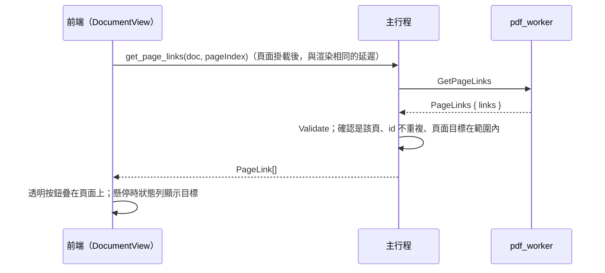

# 頁面連結

對應工作卡 MVP-12。本文件說明連結的擷取與顯示（12a）；外部連結的確認與開啟在 12b。

## 流程

## worker：擷取（`PdfDocument::page_links`）

- 自己讀頁面的 `/Annots`，只取 `/Subtype /Link`。
  - 不用 MuPDF 的連結清單：它把動作轉成 URI（`/Launch` 變成 `file:` 連結），就分不出是哪一種動作了。
  - 讀不了的註解跳過；每頁最多 `MAX_LINKS_PER_PAGE`（2,000）個。
- **位置**：`/Rect` 的四個角以頁面的轉換矩陣（`page_ctm`，包含 `/Rotate`、CropBox 與 y 軸翻轉）換到頁面空間，取外接矩形。
  - 頁面空間與文字位置、搜尋結果相同。
  - 測試以「連結框住它上面的字」驗證旋轉 90°／180°／270° 與位移的 MediaBox／CropBox。
- **目標**：與目錄共用 `action_target`（先 `/Dest`，再 `/A`），再轉成合約的 `LinkTarget`：
  - 頁面目標必須在文件內，否則這個連結不回報（沒有可點的地方）；
  - `/URI` 由 `classify_uri` 分類，見 [ipc-contract.md](ipc-contract.md)；
  - 其他動作一律 `blocked`，並附原因。
- **id**：`LinkId { pageIndex, index }`，index 是該頁回報順序。12b 的「開啟連結」只接受這個 id，不接受前端傳來的 URI 字串。

## 前端：疊加層（`src/features/links/`、`DocumentView`）

- `createLinkSource`：每份文件每頁只問一次。失敗不記住，下次顯示這頁時再問。
- 每個掛載的頁面有一層透明按鈕，位置以 `rectToBox` 依縮放與旋轉換算。
  - 按鈕放在頁面元素**旁邊**而不是裡面：頁面對輔助技術是一張圖（`role="img"`），裡面的按鈕會被隱藏。
  - 按鈕可用鍵盤聚焦，聚焦時與懸停一樣在狀態列顯示目標。
- **說明文字**（狀態列與按鈕的無障礙名稱，`linkHoverText`）：
  - 內部：「前往第 n 頁」；
  - 外部：完整 URL，隱藏字元以 `[U+XXXX]` 標示，狀態列最多 300 字；
  - 封鎖：「已封鎖：<原因>」。
- **點擊**：內部連結直接跳頁。外部與封鎖的連結在 12b 開啟對應的對話框；在那之前點擊沒有任何作用。**前端本身永遠不開啟任何東西。**
