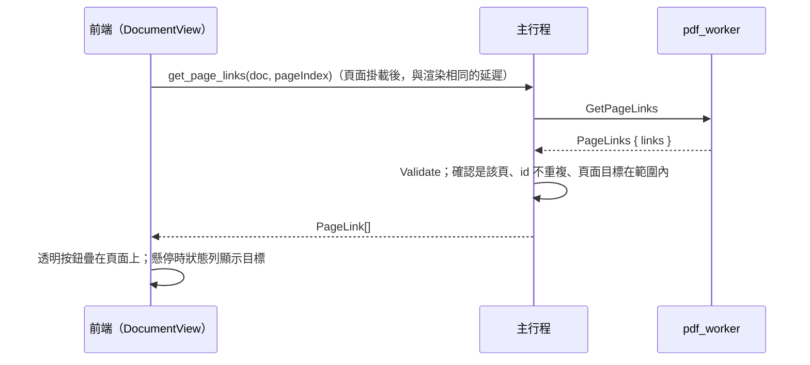
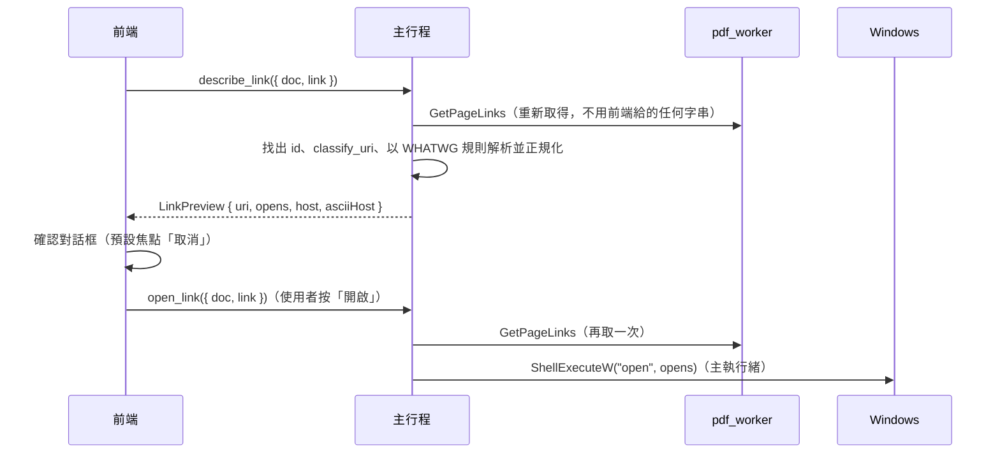

# 頁面連結

對應工作卡 MVP-12：連結的擷取與顯示（12a），以及外部連結的確認與開啟（12b）。

## 流程

## worker：擷取（`PdfDocument::page_links`）

- 自己讀頁面的 `/Annots`，只取 `/Subtype /Link`。
  - 不用 MuPDF 的連結清單：它把動作轉成 URI（`/Launch` 變成 `file:` 連結），就分不出是哪一種動作了。
  - 讀不了的註解跳過；每頁最多 `MAX_LINKS_PER_PAGE`（2,000）個。
- **位置**：`/Rect` 的四個角以頁面的轉換矩陣（`page_ctm`，包含 `/Rotate`、CropBox 與 y 軸翻轉）換到頁面空間，取外接矩形。
  - 頁面空間與文字位置、搜尋結果相同。
  - 測試以「連結框住它上面的字」驗證旋轉 90°／180°／270° 與位移的 MediaBox／CropBox。
- **目標**：與目錄共用 `action_target`（先 `/Dest`，再 `/A`），再轉成合約的 `LinkTarget`：
  - 頁面目標必須在文件內，否則這個連結不回報（沒有可點的地方）；
  - `/URI` 由 `classify_uri` 分類，見 [ipc-contract.md](ipc-contract.md)；
  - 其他動作一律 `blocked`，並附原因。
- **id**：`LinkId { pageIndex, index }`，index 是該頁回報順序。12b 的「開啟連結」只接受這個 id，不接受前端傳來的 URI 字串。

## 前端：疊加層（`src/features/links/`、`DocumentView`）

- `createLinkSource`：每份文件每頁只問一次。失敗不記住，下次顯示這頁時再問。
- 每個掛載的頁面有一層透明按鈕，位置以 `rectToBox` 依縮放與旋轉換算。
  - 按鈕放在頁面元素**旁邊**而不是裡面：頁面對輔助技術是一張圖（`role="img"`），裡面的按鈕會被隱藏。
  - 按鈕可用鍵盤聚焦，聚焦時與懸停一樣在狀態列顯示目標。
- **說明文字**（狀態列與按鈕的無障礙名稱，`linkHoverText`）：
  - 內部：「前往第 n 頁」；
  - 外部：完整 URL，隱藏字元以 `[U+XXXX]` 標示，狀態列最多 300 字；
  - 封鎖：「已封鎖：<原因>」。
- **點擊**：內部連結直接跳頁；外部連結開啟確認對話框；封鎖的連結開啟「已封鎖的連結」對話框。**前端本身永遠不開啟任何東西。**

## 開啟外部連結（12b）

- **只以 id 指名**：`LinkArgs` 只有 `doc` 與 `link`，其他欄位（例如 `uri`）會被拒絕。主行程每次都向 worker 重新取得該頁的連結，所以前端無法要求開啟任意網址；連結 id 不存在或不是網頁連結時回傳 `invalidArgument`。
- **再次檢查與正規化**（`src-tauri/src/links.rs`）：
  - `classify_uri`：只允許 `http`、`https`、`mailto`；
  - 以 WHATWG URL 規則解析（`url` crate，與瀏覽器相同）。解析不了的網址，在 `get_page_links` 時就改成「已封鎖：不支援的連結類型」，讓狀態列的說明與點擊結果一致；
  - `opens`：主機轉成 punycode，其餘非 ASCII 百分比編碼；另外把空白、`"`、`<`、`>`、`\`、`^`、`` ` ``、`{`、`|`、`}` 也編碼。交給系統的只有可列印 ASCII，沒有任何命令列可能誤讀的字元；
  - `host` 是解析後實際會連線的主機（`https://bank.example@evil.example/` 的主機是 `evil.example`），以 Unicode 顯示；與 punycode 不同時一併提供 `asciiHost`，前端顯示 IDN 警示。
- **交給系統**（`src-tauri/src/opener.rs`）：
  - `ShellExecuteW(NULL, "open", opens, NULL, NULL, SW_SHOWNORMAL)`，網址是唯一的檔案參數，不組任何命令列。
  - 在主執行緒執行，那裡的 COM 已經依 Shell 的需求初始化。
  - 這是主行程唯一的 `unsafe`（工作區預設 `deny`，此模組明確允許並附 SAFETY 說明）。
- **確認對話框**（`LinkDialogs.tsx`，screen-map 第 4 節）：
  - 內容：粗體主機；IDN 警示附 punycode；隱藏字元警示；完整網址放在可捲動、可選取、固定由左到右的區塊，隱藏字元以 `[U+XXXX]` 標示，絕不截斷。
  - 按鈕：「複製連結」（複製 `opens`）、「取消」（預設焦點；`Esc` 等同取消）、「開啟」。
  - 系統無法開啟時，對話框留著並顯示錯誤。
- **已封鎖的連結**：
  - 內容：原因說明，以及 PDF 提供的內容（worker 已整理成純文字，僅供檢視）。
  - 只有「複製內容」與「關閉」兩個按鈕。

### 已知限制

- 目錄（側欄）裡的外部連結與封鎖項目仍然不能點：目錄項目沒有 `LinkId`（#49）。
