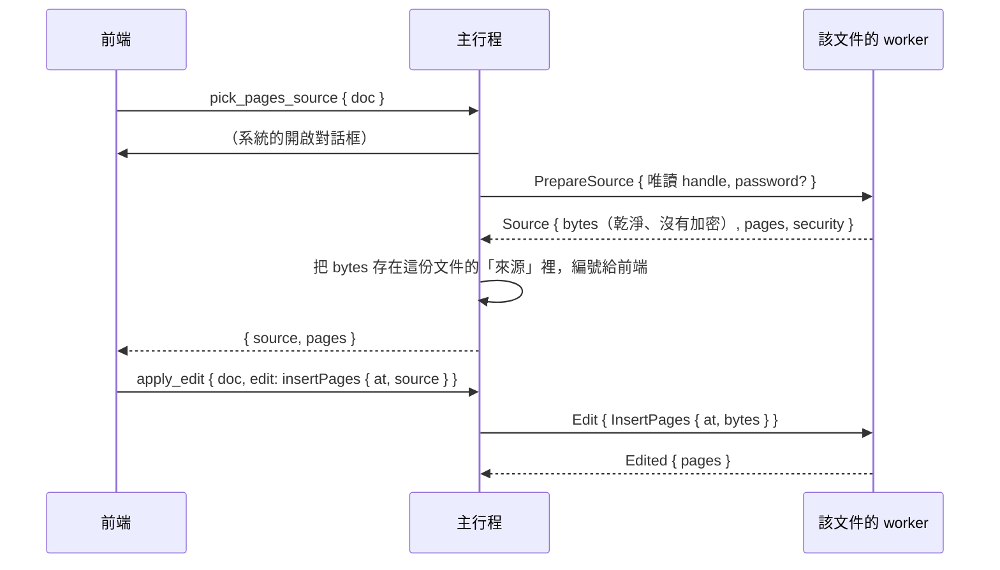

# 合併文件：插入其他檔案的頁面（B2-06）

工作卡 [#95](https://github.com/winner0988/Pdf-reader/issues/95) 的第二部分（第一部分是[拆分](split.md)）；規格 §6「拆分／合併 PDF」。這份文件描述整個功能；**worker 這一端**（`PrepareSource`、`InsertPages`）先到，主行程（來源檔的保管、編輯歷史、崩潰復原、警示橫幅）與畫面在之後的 PR，各節標出是哪一個。

## 使用者做什麼

縮圖的右鍵功能表：「在這一頁之前（之後）插入其他檔案的頁面…」。主行程顯示系統的開啟對話框，選好 PDF 之後，那個檔案的**全部頁面**依原來的順序插入。加密的檔案先問密碼（與開啟檔案相同的對話框，MVP-16）。插入是一個編輯：可以復原、重做，存檔時才寫進檔案。

## 流程

- 路徑只在主行程；worker 只拿到來源檔的唯讀 handle（ADR 0008）。每個來源檔都在目前文件的沙盒 worker 中開啟。
- 前端只拿到編號與頁數，拿不到路徑或檔案內容。

## 來源檔怎麼處理（worker：`PdfDocument::prepare_source`）

來源檔是不受信任的 PDF，**這一步就在沙盒中完成**，之後的每一次都只用這一步做出來的乾淨副本：

- 以 MuPDF 開啟（加密的檔案用使用者給的密碼；密碼不留）；沒有頁面或超過 `MAX_PAGE_COUNT` 頁的拒絕。
- **作者的權限**：有密碼保護、且沒有「複製／取出」（`/P` 第 5 位元，Acrobat 稱為「擷取頁面」）的檔案不能取出頁面（`NotAllowed`）；用擁有者密碼開啟時沒有限制，與 Acrobat 相同（#88）。
- **掃描主動內容**（MVP-11 的掃描）：結果隨副本回來，由主行程併入文件的警示橫幅（見下方「之後的 PR」）。
- **寫出乾淨、沒有加密的副本**：MuPDF 重新寫一次（回收沒有用到的物件，並明確指定不加密），所以之後不需要密碼，也不必再修復一次損毀的檔案。副本最多 `MAX_SOURCE_BYTES`（64 MiB），超過時 `LimitExceeded`；來源檔本身也最多這麼大（主行程在 worker 讀取之前就檢查）。

## 頁面怎麼放進來（worker：`PdfDocument::insert_pages`）

用 MuPDF 的 `insert_pdf`（graft）把來源檔的頁面放到第 `at` 頁之前（`at` 等於頁數時放在最後）。放進來的是**頁面上的內容**：內容串流與它用到的資源（字型、圖片、表單 XObject）。

- **不會帶來的**：頁面的註解、連結與表單欄位（MuPDF 的 graft 不複製）；整份文件層級的東西：`/OpenAction`、文件的 JavaScript、`/AcroForm`、XFA、嵌入的檔案、書籤（目錄）、標籤。所以來源檔的書籤與連結不會出現在合併後的文件。
- **主動內容與外部資料**：`scrub.rs` 再檢查一次放進來的頁面用到的所有物件（只看 graft 新做出來的物件，文件原有的絕不碰）：串流的資料在別的檔案或網址（`/F`、`/FFilter`、`/FDecodeParms`；`malicious/remote-filespec.pdf` 的圖片就是這樣）、顯示別的檔案的頁面的表單（`/Ref`）、動作的觸發（`/AA`）一律拿掉；頁面本身的 `/AA`、`/Annots`、`/B` 也拿掉（graft 本來就沒有做出它們，這是防止 graft 以後改變行為）。
- 來源檔損毀、位置或頁數不合時文件維持原樣：先檢查，MuPDF 的 graft 在一個操作中完成，失敗就整個放棄。放進來之後檢查的物件太多（`TooComplex`，超過 200 萬個）而失敗時，文件已經多了這些頁面：回 `LimitExceeded`，主行程（與其他編輯中途失敗相同）把文件從檔案與編輯歷史重新開啟。

## 上限

| 上限 | 值 | 在哪裡檢查 |
|---|---|---|
| 一個來源檔 | `MAX_SOURCE_BYTES`（64 MiB） | 主行程（檔案大小）與 worker（讀取與副本） |
| 一份文件保管的來源（之後的 PR） | `MAX_SOURCES_BYTES`（128 MiB） | 主行程 |
| 頁數 | 合併後最多 `MAX_PAGE_COUNT` | worker（`TooManyPages`） |

## 測試

- worker 單元測試（`crates/pdf_worker/src/engine.rs`）：頁面放在指定的位置（中間、最前、最後）、頁面的大小與順序、存檔後重新開啟畫出來的與原來的頁面一樣；加密的檔案：沒有密碼、密碼不對、密碼正確（副本沒有加密、可以不用密碼開啟）；作者不允許取出頁面、擁有者密碼解除；**十三種惡意語料**（`malicious/` 的 `openaction-js`、`js-document-level`、`page-aa`、`field-aa`、`launch`、`submitform`、`importdata`、`gotor-unc`、`gotoe`、`xfa`、`embedded-file`、`remote-filespec`、`openaction-uri`）：掃描有發現、合併存檔後的檔案（串流資料以外）找不到對應的名稱（`/JavaScript`、`/OpenAction`、`/AA`、`/Launch`、`/FS`…），重新開啟再掃描沒有任何發現；來源檔不是 PDF、位置不存在時，文件不變。
- 沙盒中的 worker（`crates/pdf_worker/tests/merge.rs`）：加密檔案以密碼做出乾淨副本、插入、再以 `Revert` 重做；不允許、不是 PDF、太大的來源被拒絕，worker 繼續運作；惡意來源的頁面插入、存檔後掃描沒有發現。
- 合約（`crates/ipc_contract`）：`Source` 回應的驗證、模糊測試的種子。

## 之後的 PR

- **主行程**：`pick_pages_source` 與（加密時）`unlock_pages_source` 命令；每份文件保管來源的位元組（`Sources`，經過檢查的副本，每份最多 `MAX_SOURCES_BYTES`）；`Edit::InsertPages { at, source }` 經過 `apply_edit`，復原與重做、worker 重啟時再把來源送給 worker；警示橫幅併入來源的掃描結果（插入的編輯還在歷史裡時）；崩潰復原日誌放不下來源，所以日誌只記到第一個插入之前，提示列說明之後的變更無法還原（擁有者 2026-10-07 的決定）。
- **畫面**：縮圖右鍵功能表、密碼對話框、E2E。
