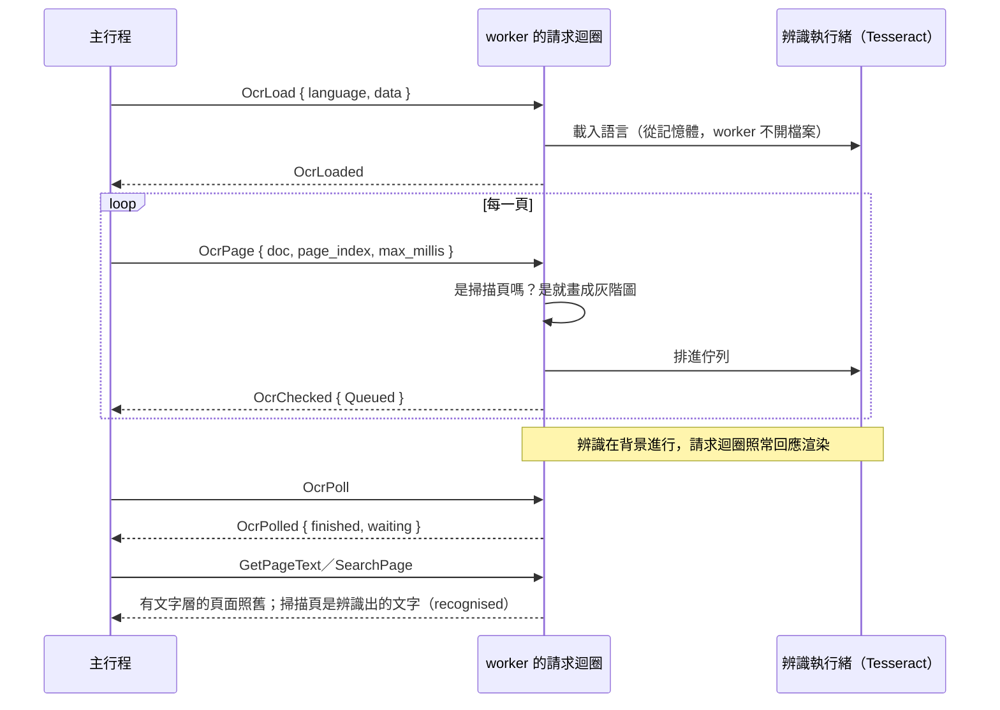

# 掃描頁的文字辨識（B2-10）

工作卡 [#142](https://github.com/winner0988/Pdf-reader/issues/142)；規格 §2「OCR 引擎」；決定見 [ADR 0015](../adr/0015-ocr.md)（Tesseract，用 MuPDF 內建、worker 已經連結的那一份，在該文件自己的 worker 中辨識，沙盒不放寬）。

這份文件說明 worker 的部分：辨識的做法、worker 與主行程之間的訊息、結果放在哪裡、各項上限。主行程（語言資料、排程）與畫面（狀態列、「此頁文字由 OCR 辨識」）接在後面的卡片裡，做好時補在這裡。

## 流程

語言要到第一個掃描頁出現時才載入（`OcrPage` 對掃描頁回 `NoLanguage`，主行程這時才送 `OcrLoad`）：大多數文件沒有掃描頁，它們的 worker 不載入任何語言（約 40 MB 與一次載入的時間）。

## 掃描頁

`PdfDocument::ocr_is_scan`：頁面**沒有文字**（文字層裡沒有空白以外的字元），且**圖片涵蓋至少一半的頁面**（MuPDF 的文字抽取以 `PRESERVE_IMAGES` 回報圖片區塊與位置）。兩者都符合才辨識：

- 有隱藏文字層的掃描檔（別的軟體辨識過）有文字，不再辨識；
- 只有向量圖形或文字轉成外框的頁面不是掃描頁（沒有圖片），不辨識；
- 判斷「不是」的頁面會記起來，不再重複檢查。

## 辨識

`crates/pdf_worker/src/ocr.rs` 是 OCR 唯一有 `unsafe` 的模組：Tesseract 的 C API（只用 LSTM，`OEM_LSTM_ONLY`、`PSM_AUTO`）與 MuPDF 的四個函式（`fz_new_context_imp`、`fz_drop_context`、`fz_set_leptonica_mem`、`fz_clear_leptonica_mem`，讓 Leptonica 用 MuPDF 的 context 配置記憶體）；每個 `unsafe` 區塊都寫了為什麼安全。

- **一次一個**：MuPDF 以一個全域變數記住 Leptonica 用的 context，所以一個行程同時只有一個 `Recogniser`（第二個得到 `Busy`）。
- **語言資料從記憶體載入**（`TessBaseAPIInit5`），Tesseract 不開任何檔案。
- **圖片**：頁面（不含註解與表單欄位，那些不是掃描的內容）以灰階、200 dpi 畫出；太大的頁面縮小到不超過 1,600 萬像素、一邊不超過 12,000 像素（`engine/ocr.rs`）。辨識器本身也拒絕大於 4,000 萬像素或一邊超過 12,000 的圖片。
- **時間**：每頁最多 `max_millis`（上限 `MAX_OCR_PAGE_MILLIS`，5 分鐘），用 Tesseract 的 monitor 的 deadline；逾時的頁面回 `TimedOut`，不保留部分結果。另有取消旗標：`OcrStop`、換語言、關閉時，Tesseract 在下一個字就停。
- **每個字元的位置**：以結果迭代器逐字取得文字與外框（像素），除以解析度、加上頁面的左上角，換成頁面座標（原點在左上、y 向下，與文字層、搜尋相同）。LSTM 的字元外框是估計的，寬度不精準，但由左至右不倒退；選取與搜尋標示夠用。
- **空白**：字詞之間補一個空白（寬度為字詞間的空隙）。Tesseract 把中日韓的文字切成「詞」，詞之間並沒有空隙；有中日韓字元的交界，空隙小於行高的四分之一就不補空白，所以「隱私優先的 PDF 閱讀器」不會變成「隱 私 優 先 的…」。
- 辨識出的行交給與一般文字層相同的 `TextLayerBuilder`（清除控制字元與雙向文字控制、限制字數 `MAX_PAGE_TEXT_CHARS`），所以主行程用同一套 `validate` 檢查。

## 在獨立的執行緒中

請求迴圈一次處理一個請求；辨識一頁（密集的頁面要幾秒）若在迴圈裡做，這份文件的渲染就會卡住。所以：

- 迴圈只做快的部分：判斷是不是掃描頁、把頁面畫成灰階圖（約幾十毫秒），排進 `OcrWorker` 的佇列，立刻回 `OcrChecked`。
- Tesseract 與 Leptonica 只在 `ocr_worker.rs` 的執行緒裡被呼叫；它擁有那一個 `Recogniser`（堆疊 16 MiB，優先權低於一般）。
- 結果放在佇列旁，由 `OcrPoll` 取走；主行程輪詢（沒有主動送出的訊息，所以 `worker_host` 與請求／回應的協定不變）。
- 佇列最多放 `MAX_OCR_QUEUE`（4）頁，**包括已完成但還沒被取走的**：主行程不取，就排不進新的頁面（`Full`），記憶體因此有上限（一張圖最多 16 MB）。

## 結果放在哪裡

只在該文件的 worker 的記憶體中（`PdfDocument` 的 `OcrPages`）；不寫進 PDF、不進最近開啟的檔案或復原日誌，關閉文件就丟棄（ADR 0015）。

- **以頁面物件的編號為鍵**，不是頁碼：頁面會被刪除、移動、插入，辨識出的文字跟著頁面走。刪除與新插入的頁面清掉它的鍵。
- **轉動頁面**（`RotatePages`）清掉那些頁面的結果（它們是以轉動前的樣子辨識的），並換新的 `epoch`：正在辨識的結果到了也丟掉，因為 `epoch` 不同。
- **復原**（`Revert`）重新開啟文件：新的 `PdfDocument`、新的 `epoch`，之前的結果都不在，主行程再要求辨識一次。
- `OcrPoll` 回報完成的頁面時，用 MuPDF 的頁面查詢取得它**現在**的頁碼；頁面已經被刪除的結果直接丟掉。
- **誰用它**：`GetPageText` 與 `SearchPage` 在頁面本身沒有文字時，用辨識出的文字（`PageText.recognised` 為真，畫面據此標示「此頁文字由 OCR 辨識，可能有誤」；搜尋的 `has_text` 也為真，所以不會說「沒有文字層」）。有文字的頁面一律用它自己的文字。辨識後沒有任何字元的頁面（例如一張漸層圖）維持沒有文字，也不標示為辨識的結果。
- 搜尋的每個字元位置由文字行的外框與各字元的起點還原（`char_quads`）。

## 語言資料

- 一份 Tesseract 的 `.traineddata`，最多 `MAX_LANGUAGE_DATA_BYTES`（64 MiB），名稱 `is_language_name`（字母開頭，最多 32 個字母、數字、`_`、`-`）。
- **Tesseract 不防禦壞掉的檔案**：空的緩衝區會被當成資料夾名稱去讀，位移倒退會讓它配置不存在的記憶體。所以 `ipc_contract::ocr::check_language_data` 在資料靠近 Tesseract 之前檢查檔頭：項目數 23–64、各項位移從表的結尾開始、不倒退、不超出檔案，並且有 LSTM 模型、字元集與 recoder 三項（沒有的是舊的非 LSTM 檔，Tesseract 初始化會失敗）。主行程在使用者匯入時檢查，worker 收到時再檢查（`Recogniser::new` 也檢查）。再往裡面（模型本身）由 Tesseract 讀：壞掉的模型最壞是 worker 崩潰，主行程重啟它，不影響其他文件。
- 內附的 `eng` 與 `chi_tra`（`src-tauri/resources/tessdata`，見該資料夾的 README）：測試檢查它們的大小、雜湊值與格式。

## 升級 MuPDF 時

Tesseract 與 Leptonica 隨 `mupdf-sys` 建置，版本由固定的 `mupdf` =0.8.0（MuPDF 1.27.2，Artifex 維護的分支）決定。升級（本來就是安全變更）要確認：

- 上面那些 C API 函式與 `fz_new_context_imp`／`fz_set_leptonica_mem`／`fz_clear_leptonica_mem` 的簽章沒變（編譯、連結會先失敗）；
- `FZ_VERSION`（`ocr.rs`）改成新版本，否則 MuPDF 拒絕建立 context，`ocr` 的測試全部失敗；
- `ocr.rs`、`ocr_worker.rs` 與 `tests/ocr.rs` 都通過。

## 已知限制

- 直書的文字需要 `*_vert` 的語言資料（匯入後可以用）；沒有偵測頁面方向，轉了 90 度的掃描檔要先轉正再辨識（轉動頁面會重新辨識）。
- 一次只用一種語言；繁體中文的資料也認得英文與數字，英文的資料不認得中文。
- 搜尋「PDF閱讀器」找不到辨識結果「PDF 閱讀器」：中日韓字元與英文字母之間有沒有空白，辨識無從得知，依空隙大小猜。
- 字元外框只是估計，選取時的標示邊緣可能差幾個像素。

## 測試

- `ocr.rs`：英文與中文的辨識、每個字元都有在圖片內的外框、空白圖片、尺寸不合的圖片、壞的語言資料（空的、全零、全 255、檔名文字）、一次一個、逾時與取消後可以再辨識。
- `ocr_worker.rs`：頁面座標的換算、背景辨識、佇列與取走、換語言、停止、逾時。
- `ipc_contract` 的 `ocr`：語言資料格式的各種壞法、內附資料的雜湊值；`validate`：`OcrPolled` 的上限。
- `crates/pdf_worker/tests/ocr.rs`：真正的 worker 在沙盒中（停用 win32k 的 AppContainer），辨識掃描頁並提供文字與搜尋、不是掃描頁的頁面、沒有文字的圖片、中文、轉動與復原、刪除／移動／插入頁面、壞的語言檔、辨識時渲染照常回應、停止。
