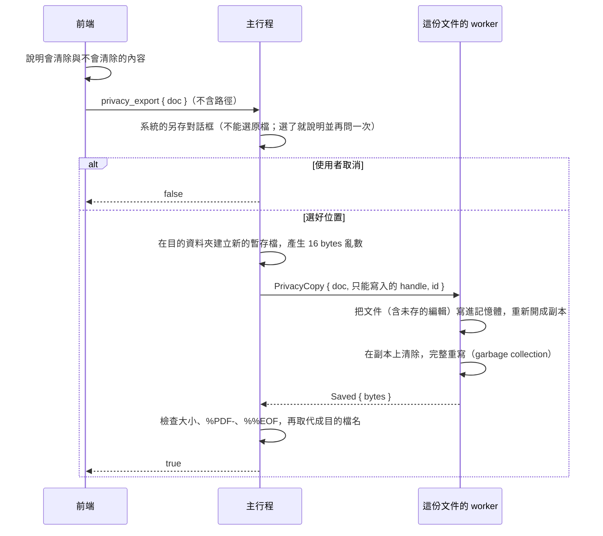

# 隱私匯出（B2-03）

工作卡 [#92](https://github.com/winner0988/Pdf-reader/issues/92)；規格 §3「中繼資料清除」。「⋯」→「隱私匯出…」另存一份清除中繼資料的副本，方便分享；**原本的檔案、開著的文件與它未儲存的變更都不受影響**。

## 流程

- **worker 開著的文件完全不變**：清除只在副本上做。副本是把目前的文件（包含尚未儲存的編輯）寫進記憶體後重新開啟的另一份文件，所以使用者之後按「儲存」，存的仍是原本的中繼資料。
- **寫檔**沿用存檔（B2-02，[saving.md](saving.md)）的做法：worker 只拿到新暫存檔的只寫 handle，主行程檢查後才取代成目的檔名；失敗時目的檔不會出現半個檔案。
- **不能覆寫原檔**：主行程以系統解析後的路徑比對（大小寫、短檔名、連結都算同一個檔案）；對話框選到原檔時說明原因並再問一次，`privacy_export` 本身也再檢查一次。
- **不加入最近開啟的檔案**，分頁仍然顯示原本的文件。

## 清除什麼

| 項目 | 位置 | 做法 |
|---|---|---|
| 文件資訊字典 | trailer 的 `/Info`：作者、標題、主旨、關鍵字、建立者、產生器、建立與修改日期 | 移除 |
| XMP 中繼資料 | 任何物件的 `/Metadata`：文件（catalog）、頁面、圖片、字型等。可能含有 GPS 位置、建立工具、修改時間 | 移除 |
| 應用程式私有資料 | 任何物件的 `/PieceInfo` | 移除 |
| 修改時間 | 任何物件的 `/LastModified` | 移除 |
| 頁面縮圖 | 頁面的 `/Thumb` | 移除 |
| 註解的作者與日期 | 註解的 `/T`（作者）、`/M`、`/CreationDate`。表單欄位的 widget 不動：它的 `/T` 是欄位名稱 | 移除；註解本身與內容保留 |
| 文件識別碼 | trailer 的 `/ID`：原本的可能含有建立時間與路徑的雜湊 | 換成主行程以系統亂數產生的新值。MuPDF 寫檔時會照例把第二半換成它自己的值（每次存檔都會這樣） |
| 本 app 的文件識別碼（ADR 0010） | 依 CONTEXT.md，寫在文件的中繼資料中 | 隨 `/Info` 與 XMP 一起清除。實作文件識別碼時要確認位置仍在其中 |

- **走訪方式**：xref 中的每個物件，以及直接寫在物件裡的字典與陣列（例如直接放在 `/Annots` 中的註解、`/Properties` 中的屬性清單）；參照會在輪到它時處理。最多 2,000 萬個節點，超過就整個失敗，**不會輸出只清除一半的檔案**。
- **完整重寫**（不是增量更新），並移除沒有用到的物件：只被上述項目參照的串流（舊的 XMP、縮圖、舊的 `/Info`）都不會寫進檔案。
- **畫面相同**：只移除中繼資料，頁面內容、字型、圖片、連結、表單都不變。測試逐像素比對。

## 不清除什麼

副本不等於匿名。對話框也會列出這些，提醒使用者分享前自行檢查：

- 頁面上的文字與圖片、註解的內容文字、書籤標題；
- **圖片本身的 EXIF**（例如 JPEG 相片中的 GPS 位置）：要重新編碼圖片串流，另開卡（與規格 §5 的 EXIF 清除一起）；
- 附加的檔案（與它們的日期）、表單欄位的值、JavaScript 等其他內容；
- MuPDF 在檔案開頭寫入的 PDF 版本與二進位註解。

## 限制

- **加密的文件不提供**（選單停用，標示「加密的文件不適用」；主行程與 worker 也都拒絕）：
  - worker 開檔後就丟掉密碼（[encryption.md](encryption.md)），無法把副本重新加密；
  - 不加密的副本會拿掉作者設定的保護與權限，不應該在隱私匯出中默默發生；
  - 修訂版 2 到 4 的加密金鑰由 `/ID` 的第一半推導，換掉 `/ID` 又保留加密，副本就打不開。
- **數位簽章**：完整重寫後，副本中的簽章一定失效；對話框會說明。原檔的簽章不受影響。
- **記憶體**：副本在記憶體中多一份，很大的文件可能超出 worker 的記憶體上限而失敗（檔案不會寫出）。
- 批次處理（ADR 0005）另開卡。

## 驗證

- **worker**（`engine.rs`）：
  - 語料 `benign/metadata-full.pdf` 的每一種中繼資料都寫著同一個作者名稱。匯出後：
    - 整個檔案的位元組，以及每個串流解碼後的內容，都找不到這個名稱；
    - 沒有 `/Info`；任何字典都沒有 `Metadata`、`PieceInfo`、`LastModified`、`Thumb`；
    - `/ID` 的第一半是給的新值；
    - 便利貼註解保留內容、沒有作者與日期；
    - 渲染結果與原檔逐像素相同；
    - worker 開著的文件仍有 `/Info`，可以再匯出一次。
  - 表單欄位名稱保留；直接寫在 `/Annots` 中的註解也清除作者；加密的文件被拒絕。
- **主行程**（`documents.rs`，真正的 worker）：
  - 原檔的位元組與修改時間不變，沒有未儲存的變更；
  - 以大寫拼寫原檔路徑也被認出、拒絕；
  - 加密的文件被拒絕，也不會產生檔案。
- **前端**（`PrivacyExport.test.tsx`）：
  - 對話框列出會清除與不會清除的內容，取消時什麼都不做；
  - 匯出後關閉並顯示完成；關閉系統對話框時留著可以再試，失敗時說明；
  - 加密的文件與 demo 資料時選單停用。
- **E2E**（`privacy-export.spec.ts`）：在真正的 app 中匯出，副本沒有作者名稱，以開啟對話框重新開啟後可以顯示；原檔的 SHA-256 不變。
