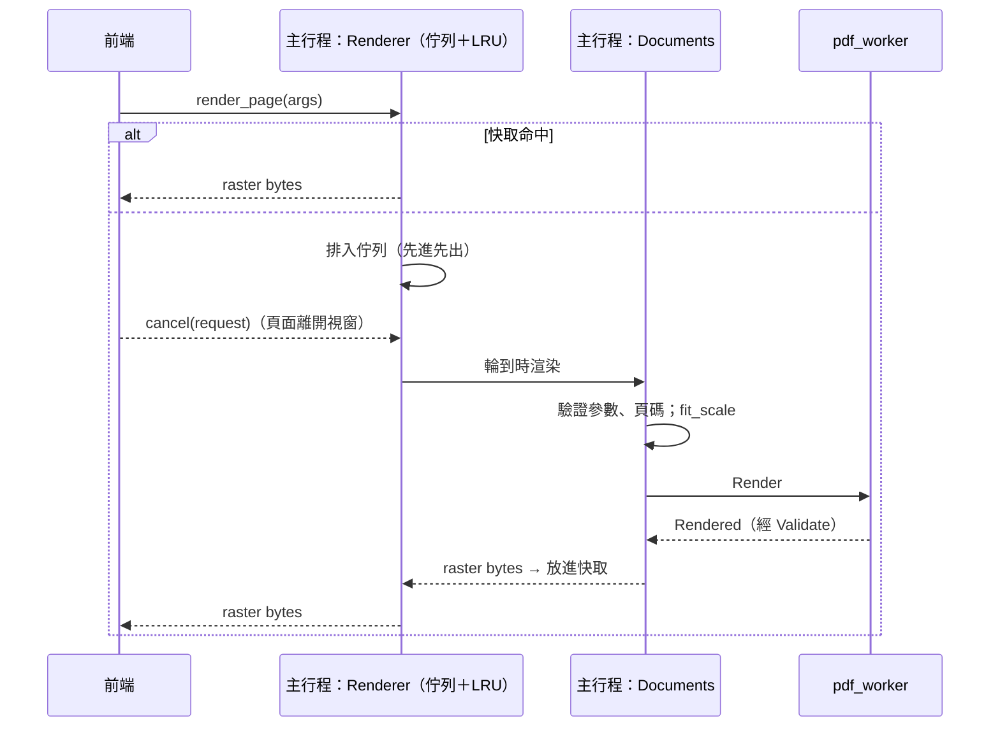

# 頁面渲染管線

對應工作卡 MVP-07。本文件說明前端如何只渲染看得到的頁面（07b），以及主行程如何排程、快取、限制頁面渲染（07a）。

## 流程



| 元件 | 位置 | 職責 |
|---|---|---|
| `Renderer` | `src-tauri/src/render.rs` | 一條渲染執行緒、先進先出佇列、取消、以位元組為上限的 LRU 快取 |
| `Documents::render` | `src-tauri/src/documents.rs` | 驗證參數、頁碼、縮放上限；送出 `Render`；worker 崩潰後重新開啟文件 |
| `fit_scale` | `crates/ipc_contract/src/raster.rs` | 計算不超過點陣圖上限的最大縮放比例 |

## 前端：虛擬滾動

程式碼在 `src/features/viewer/`：`layout.ts`（純函式）、`renderer.ts`（呼叫 `render_page`／`cancel`）、`DocumentView.tsx`（元件）。

- **版面**：每頁依頁面尺寸與縮放計算占位框（100% = 以 96 dpi 顯示實際大小，即每 pt 96/72 CSS px）。內容高度等於整份文件，捲軸長度從一開始就正確；「符合寬度／符合頁面」以最大的頁面計算，捲動時縮放比例不會跳動。
- **可視範圍**：以二分搜尋找出與視窗相交的頁面，上下各多保留 2 頁（`OVERSCAN_PAGES`）。只有這些頁面掛載成 DOM；1000 頁或 100,000 頁的文件都只有約 5 個頁面元素。
- **解析度**：`render scale = 縮放 × 96/72 × devicePixelRatio`，四捨五入到千分之一（與主行程快取的 key 一致），並限制在合約範圍內。canvas 以回傳的原生解析度繪製，再由 CSS 縮放到占位框，所以 HiDPI 螢幕是清晰的，被降低解析度的超大頁面也能正確填滿。
- **先量測再掛載**：視窗大小在第一次 commit 後才量測，在那之前不掛載任何頁面。否則第一輪會在側欄出現前、以錯誤的寬度算出縮放比例，渲染兩次。
- **縮放穩定後才重繪**：縮放比例變動（例如調整視窗大小）時，舊的點陣圖先被拉伸，比例穩定 150 ms 後才以新解析度重新渲染（`RESCALE_DELAY_MS`）。
- **延遲送出請求**：頁面掛載 100 ms 後才送出渲染請求（`REQUEST_DELAY_MS`）。快速捲動時一閃而過的頁面不會花一次渲染與一次數 MB 的傳輸。正常捲動時頁面會提前 2 頁掛載，所以這個延遲看不出來（見下方量測）。
- **畫面上的頁面優先**：可視範圍外、只是預先保留的頁面再多等 150 ms（`NEARBY_EXTRA_DELAY_MS`）才送出，讓正在看的頁面先進入先進先出的佇列。大幅放大時一頁可能要渲染數百毫秒，這點特別重要。
- **取消**：頁面離開保留範圍、或縮放／旋轉改變時，元件卸載或 effect 清除會取消請求（前端立刻放棄等待，主行程移除佇列中的請求）。
- **單頁失敗**：該頁占位框顯示「這一頁無法顯示」與「重試」，其他頁面照常渲染。被取消（`cancelled`）或文件已關閉（`unknownDocument`）不算失敗。
- **目前頁碼**：視窗高度 30% 處所在的頁面；捲到底時為最後一頁。狀態列與頁碼欄位跟著捲動更新；跳頁時直接設定捲動位置。

## 縮放與旋轉（MVP-08）

規格見 [screen-map.md](../ux/screen-map.md) 第 7 節：級距 25%～800%、符合寬度／符合頁面（兩者都不超過 200%），`Ctrl+滾輪` 以游標為錨點，按鈕與快捷鍵以畫布中心為錨點，旋轉只改檢視。

- **錨點**：縮放、旋轉或視窗大小改變（符合寬度會跟著變）時，先記下錨點下的文件位置：第幾頁、在頁面上的相對位置（`anchorAt`）。再算出在新版面中讓這個位置回到錨點下的捲動位置（`scrollForAnchor`，限制在可捲動範圍內）。旋轉時，頁面上的點跟著轉：順時針 90° 時 `(fx, fy) → (1 − fy, fx)`（`rotateAnchor`）。
- **在 render 中算好**：新的捲動位置在 render 時就算出來，並以「render 中調整 state」的方式同步更新。任何一次 commit 都不會把新版面配上舊的捲動位置，所以正在看的頁面不會卸載，會保留舊的點陣圖並被拉伸，直到清晰版本畫好（漸進式重繪）。接著由 layout effect 把捲軸移到那裡。
- **連續縮放**：縮放比例還在變時，頁面不送出任何新的渲染請求，已送出的請求會被取消；比例穩定 150 ms 後才以新解析度渲染。
- **`Ctrl+滾輪`**：累積 50 px 的滾動量算一級，觸控板的小幅滾動也能用。事件會 `preventDefault`，不會觸發 WebView 本身的頁面縮放。
- **從符合模式縮放**：從「符合寬度」按放大，會從目前實際顯示的比例（例如 137%）走到下一級（150%），而不是從 100% 開始。
- **水平捲動**：頁面比畫布寬時，內容寬度加大並出現水平捲軸，頁面仍置中。
- **垂直捲軸的空間一直保留**（`scrollbar-gutter: stable`）：
  - 否則畫布高度剛好落在「有捲軸時的頁高」與「沒有捲軸時的頁高」之間時，會不停震盪：
    1. 頁面略高於畫布，出現捲軸；
    2. 畫布變窄，符合寬度把頁面縮小；
    3. 捲軸消失，畫布變寬，頁面又放大，回到第 1 步。
  - 保留空間後，捲軸出現與否都不改變畫布寬度（#46）。
  - E2E 測試 `tests/e2e/viewer.spec.ts` 把視窗調到這個高度區間，確認頁面寬度不再改變。
- **上限**：縮放最高 800%。實際的渲染解析度再由主行程的 `fit_scale` 限制在單頁像素上限內（見「點陣圖上限」），前端無法繞過。
- **不寫入檔案**：縮放與旋轉只存在前端狀態，關閉文件後就消失；主行程沒有任何寫入 PDF 的程式碼路徑。

量測（release、devicePixelRatio 2、`large-1000-pages.pdf`）：

| 驗收情境 | 結果 |
|---|---|
| 在第 50 頁放大到 400% 再縮回 100% | 過程中與結束時都停在第 50 頁（狀態列「第 50 / 1000 頁」），400% 時出現水平捲軸 |
| 放大過程中正在看的頁面 | 一直保持掛載，顯示拉伸的舊影像；400% 的清晰版本（達到像素上限，約 64 MB）在最後一次按鍵後 1.3 秒畫好 |
| 快速連續 `Ctrl+滾輪`（30 格，約 0.5 秒） | 捲動期間 **0** 個渲染請求；停止後 7 個請求，約 0.4～0.5 秒後所有頁面都清晰 |
| 旋轉 90° | 頁面尺寸互換（269×348 → 348×269），捲軸長度隨之改變（360,500 → 281,300 px），仍在第 50 頁 |
| 縮放、旋轉後關閉文件 | 檔案的 SHA-256 不變 |

## 取消

- 前端為每個請求產生 `RequestId`；頁面離開可視範圍（含預載範圍）時呼叫 `cancel(request)`。
- **還在佇列中**的請求會被移除，並以 `cancelled` 失敗，不會送到 worker。
- **已經在渲染**的請求無法中斷（worker 一次只處理一個請求），完成後照樣放進快取，前端忽略回應即可。一頁通常在 15 ms（1.5×）～60 ms（3×）內完成，見下方量測。中斷進行中的渲染需要 MuPDF cookie 與 worker 內的第二條讀取執行緒，列為之後的工作。
- 佇列選擇先進先出而不是後進先出：前端依畫面由上而下送出請求，並取消離開畫面的請求，先進先出能讓最上面的頁面先出現。

## 縮圖（MVP-18）

側欄的縮圖（`src/features/thumbnails/`）走同一條路：
- 以 `render_page` 渲染，寬 128 CSS px 乘上裝置像素比，不套用檢視的旋轉；
- 同樣虛擬化（只掛載畫面附近的縮圖，上下各多 3 張）、延遲 100 ms 才送出請求、離開時取消；
- 縮圖很小，主行程的快取可以保留很多張；只有「縮圖」分頁打開時才會渲染。

## 快取

- key：文件、頁碼、旋轉、縮放比例（精確到千分之一）。前端的縮放比例已包含裝置像素比，所以不同 DPI 的螢幕各自快取。
- 上限以位元組計算，預設 `DEFAULT_CACHE_BYTES = 256 MB`（`render.rs`，之後可做成設定）；超過時淘汰最久沒用到的頁面。單頁超過整個上限時不快取。
- 開啟新文件或關閉文件時，清掉其他文件的快取與佇列中的請求（`unknownDocument`）。
- 渲染失敗不快取，重試會重新渲染。

## 點陣圖上限

- 單頁上限寫在 `ipc_contract::limits`：最長邊 `MAX_RASTER_SIDE_PX = 8192`、面積 `MAX_RASTER_PIXELS = 4096 × 4096`（RGBA 約 64 MB）。worker 與主行程都會檢查。
- 超過上限時**降低解析度**，不回報錯誤：`fit_scale` 取「不超過要求、且符合上限」的最大縮放比例，前端把結果拉伸到頁面的顯示尺寸。例：Letter 頁面要求 8×，實際約 6.5×。
- 連 `MIN_RENDER_SCALE` 都放不下的頁面（例如宣告 1,000,000 pt 見方的惡意頁面）回報 `limitExceeded`。
- worker 回報的頁數與頁面尺寸在開檔時就經過 `Validate`（頁數 ≤ 100,000、邊長 ≤ 1,000,000 pt），惡意 PDF 無法藉此讓主行程配置大量記憶體。

## worker 崩潰

1. 渲染中 worker 崩潰、逾時或回傳無效訊息時，該頁以 `workerCrashed`／`workerTimeout`／`protocolViolation` 失敗，前端顯示錯誤占位與重試。
2. `Documents` 把文件標為遺失。下一個渲染請求會啟動新的 worker，並以同一個路徑**重新開啟文件**，前端看到的 `DocumentId` 不變。
3. 重新開啟時檢查頁面清單與原本相同；檔案已被修改時回報 `corrupted`，不會默默換成另一份內容。

測試：`a_crashed_worker_fails_one_render_then_the_document_is_reopened`、`a_file_changed_on_disk_is_not_silently_swapped_in`（以真正的 worker 執行，並用 `taskkill` 結束它）。

## 量測

`crates/worker_host/src/bin/render_bench.rs` 在沙盒中開啟文件，依捲動順序渲染（往下 N 頁再回到第一頁），回報開檔時間、渲染時間與 worker 記憶體峰值（Job Object 的 `PeakProcessMemoryUsed`）。

```bash
python tests/corpus/generate.py --large        # 產生 large/output/large-1000-pages.pdf（約 200 MB）
cargo build --release -p pdf_worker -p worker_host
target/release/render_bench.exe tests/corpus/large/output/large-1000-pages.pdf 200 1.5
```

開發者電腦（Windows 11）的結果，release 建置：

| 項目 | 1.5× | 3×（HiDPI 200%） | 預算 |
|---|---|---|---|
| 開檔（197 MB、1000 頁） | 210～340 ms | 210 ms | — |
| 開檔＋第一頁 | 250～360 ms | 270 ms | < 1.5 s（含前端，07b 量測） |
| 每頁渲染（中位數／p95） | 15 ms／20 ms | 60 ms／70 ms | 空白不超過 300 ms |
| 往下 1000 頁再回到第一頁（1998 次渲染） | 中位數 14 ms，最大 34 ms | — | 內容正確 |
| worker 記憶體峰值 | 470～490 MB | 470 MB | 主行程＋worker < 1 GB |

worker 的記憶體大部分是整份檔案（197 MB，讀入記憶體後交給 MuPDF）與 MuPDF 的解析資料；捲動 1000 頁只增加約 20 MB，不會持續成長。主行程的快取最多再加 256 MB。

### 端對端量測

`scripts/perf/viewer-perf.mjs` 驅動**手動啟動**的 release 版 app：以 WebView2 的遠端偵錯埠（只連 127.0.0.1）操作頁面，並以 `Get-Process` 取樣記憶體。使用方式寫在腳本開頭。這個腳本只用於開發，不會打包，也不連網。

開發者電腦：Windows 11，視窗 1200 × 800，devicePixelRatio 2，側欄開啟，符合寬度。每頁點陣圖約 1745 × 2258 px（16 MB）。QA-01 `large-1000-pages.pdf`（197 MB），連續三次執行：

| 驗收情境 | 結果 | 預算 |
|---|---|---|
| 開檔到第一頁顯示（`retry_open` 到第 1 頁 canvas 畫好） | 846～898 ms；先結束 worker（含啟動新 worker）時 561～564 ms | < 1.5 s |
| 正常速度捲動（每 100 ms 捲 200 px，約每秒 2 頁）時，頁面**出現在畫面上**仍是空白的時間 | 0 ms（頁面在進入畫面前就畫好了）；從掛載到畫好 p95 327～366 ms | ≤ 300 ms |
| 快速捲動 10 秒（每 16 ms 捲 3000 px）時主行程＋worker 的 private bytes | 最高 582～661 MB，結束後回到約 460 MB，不持續成長 | < 1 GB |
| 捲到最後一頁再回到第一頁 | 兩者都正確畫出，狀態列分別為第 1000 頁、第 1 頁 | 內容正確 |
| 渲染中 worker 崩潰 | 崩潰後第一個請求的那一頁顯示錯誤與重試；其他頁面照常渲染（在新的 worker 中重新開啟文件）；按重試後該頁正常 | 其他功能正常 |

調整過程中的對照：沒有延遲送出請求時，快速捲動的記憶體最高到 1052 MB。延遲 40 ms 時為 868～1034 MB。改為 100 ms 後降到 582～661 MB，看得到的空白時間仍然是 0。「先量測再掛載」讓開檔到第一頁從 1367 ms 降到約 850 ms。MVP-08 加上「畫面上的頁面優先」後重新量測：開檔到第一頁 549 ms，快速捲動的記憶體最高 544 MB，看得到的空白時間仍然是 0。
