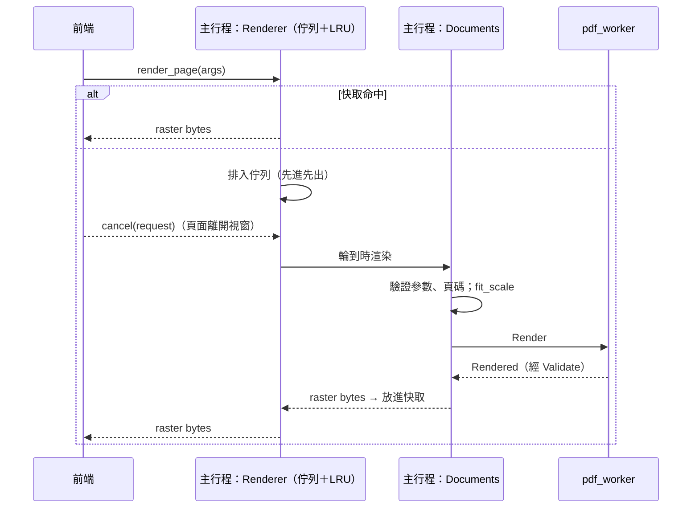

# 頁面渲染管線

對應工作卡 MVP-07。本文件說明主行程如何排程、快取、限制頁面渲染（07a），前端的虛擬滾動見 07b。

## 流程



| 元件 | 位置 | 職責 |
|---|---|---|
| `Renderer` | `src-tauri/src/render.rs` | 一條渲染執行緒、先進先出佇列、取消、以位元組為上限的 LRU 快取 |
| `Documents::render` | `src-tauri/src/documents.rs` | 驗證參數、頁碼、縮放上限；送出 `Render`；worker 崩潰後重新開啟文件 |
| `fit_scale` | `crates/ipc_contract/src/raster.rs` | 計算不超過點陣圖上限的最大縮放比例 |

## 取消

- 前端為每個請求產生 `RequestId`；頁面離開可視範圍（含預載範圍）時呼叫 `cancel(request)`。
- **還在佇列中**的請求會被移除，並以 `cancelled` 失敗，不會送到 worker。
- **已經在渲染**的請求無法中斷（worker 一次只處理一個請求），完成後照樣放進快取，前端忽略回應即可。一頁通常在 15 ms（1.5×）～60 ms（3×）內完成，見下方量測。中斷進行中的渲染需要 MuPDF cookie 與 worker 內的第二條讀取執行緒，列為之後的工作。
- 佇列選擇先進先出而不是後進先出：前端依畫面由上而下送出請求，並取消離開畫面的請求，先進先出能讓最上面的頁面先出現。

## 快取

- key：文件、頁碼、旋轉、縮放比例（精確到千分之一）。前端的縮放比例已包含裝置像素比，所以不同 DPI 的螢幕各自快取。
- 上限以位元組計算，預設 `DEFAULT_CACHE_BYTES = 256 MB`（`render.rs`，之後可做成設定）；超過時淘汰最久沒用到的頁面。單頁超過整個上限時不快取。
- 開啟新文件或關閉文件時，清掉其他文件的快取與佇列中的請求（`unknownDocument`）。
- 渲染失敗不快取，重試會重新渲染。

## 點陣圖上限

- 單頁上限寫在 `ipc_contract::limits`：最長邊 `MAX_RASTER_SIDE_PX = 8192`、面積 `MAX_RASTER_PIXELS = 4096 × 4096`（RGBA 約 64 MB）。worker 與主行程都會檢查。
- 超過上限時**降低解析度**，不回報錯誤：`fit_scale` 取「不超過要求、且符合上限」的最大縮放比例，前端把結果拉伸到頁面的顯示尺寸。例：Letter 頁面要求 8×，實際約 6.5×。
- 連 `MIN_RENDER_SCALE` 都放不下的頁面（例如宣告 1,000,000 pt 見方的惡意頁面）回報 `limitExceeded`。
- worker 回報的頁數與頁面尺寸在開檔時就經過 `Validate`（頁數 ≤ 100,000、邊長 ≤ 1,000,000 pt），惡意 PDF 無法藉此讓主行程配置大量記憶體。

## worker 崩潰

1. 渲染中 worker 崩潰、逾時或回傳無效訊息時，該頁以 `workerCrashed`／`workerTimeout`／`protocolViolation` 失敗，前端顯示錯誤占位與重試。
2. `Documents` 把文件標為遺失。下一個渲染請求會啟動新的 worker，並以同一個路徑**重新開啟文件**，前端看到的 `DocumentId` 不變。
3. 重新開啟時檢查頁面清單與原本相同；檔案已被修改時回報 `corrupted`，不會默默換成另一份內容。

測試：`a_crashed_worker_fails_one_render_then_the_document_is_reopened`、`a_file_changed_on_disk_is_not_silently_swapped_in`（以真正的 worker 執行，並用 `taskkill` 結束它）。

## 量測

`crates/worker_host/src/bin/render_bench.rs` 在沙盒中開啟文件，依捲動順序渲染（往下 N 頁再回到第一頁），回報開檔時間、渲染時間與 worker 記憶體峰值（Job Object 的 `PeakProcessMemoryUsed`）。

```bash
python tests/corpus/generate.py --large        # 產生 large/output/large-1000-pages.pdf（約 200 MB）
cargo build --release -p pdf_worker -p worker_host
target/release/render_bench.exe tests/corpus/large/output/large-1000-pages.pdf 200 1.5
```

開發者電腦（Windows 11）的結果，release 建置：

| 項目 | 1.5× | 3×（HiDPI 200%） | 預算 |
|---|---|---|---|
| 開檔（197 MB、1000 頁） | 210～340 ms | 210 ms | — |
| 開檔＋第一頁 | 250～360 ms | 270 ms | < 1.5 s（含前端，07b 量測） |
| 每頁渲染（中位數／p95） | 15 ms／20 ms | 60 ms／70 ms | 空白不超過 300 ms |
| 往下 1000 頁再回到第一頁（1998 次渲染） | 中位數 14 ms，最大 34 ms | — | 內容正確 |
| worker 記憶體峰值 | 470～490 MB | 470 MB | 主行程＋worker < 1 GB |

worker 的記憶體大部分是整份檔案（197 MB，讀入記憶體後交給 MuPDF）與 MuPDF 的解析資料；捲動 1000 頁只增加約 20 MB，不會持續成長。主行程的快取最多再加 256 MB。整體（含主行程與 WebView）的量測在 07b 接上前端後進行。
