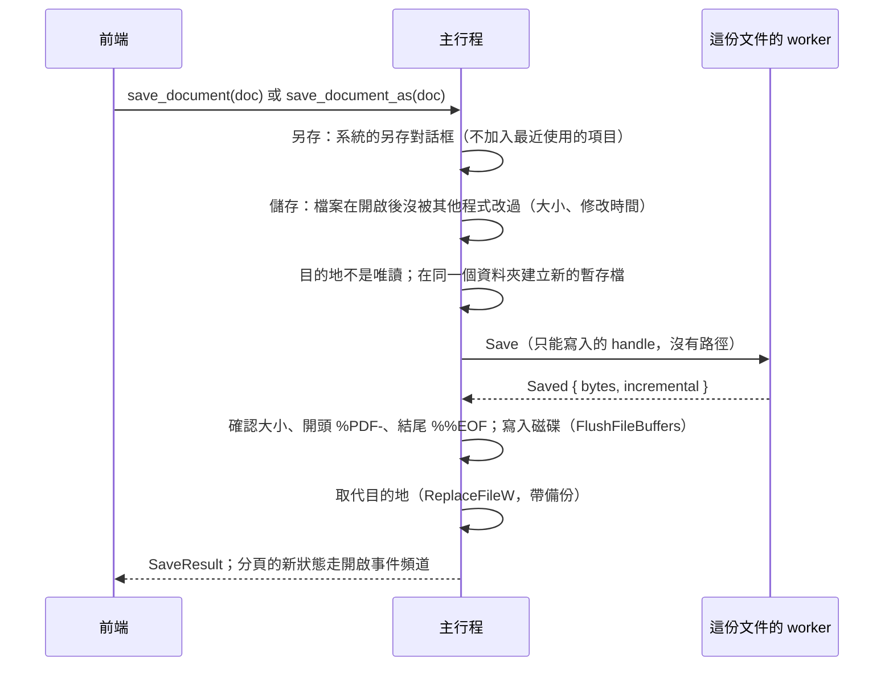

# 儲存與另存新檔（B2-02）

工作卡 [#91](https://github.com/winner0988/Pdf-reader/issues/91)；依 [ADR 0013](../adr/0013-editing-and-saving.md)。畫面見 [screen-map.md](../ux/screen-map.md)「儲存」。

## 編輯

- 編輯是型別化的指令（`Edit`，`ipc_contract`）。前端只送指令，**不送任何 PDF 物件或內容**：
  - `rotatePages`（頁面順時針轉 90／180／270 度，疊加在原本的旋轉上），本卡作為存檔的測試用編輯；
  - 頁面管理（B2-05）的 `deletePages`、`movePages`、`insertBlankPage`，見 [page-management.md](page-management.md)。
- `apply_edit`（`EditArgs`，其他欄位一律拒絕）：
  1. 主行程驗證：頁碼存在、不重複、數量有上限；
  2. 作者的權限（MVP-19）：頁面管理（旋轉、刪除、移動、插入空白頁）需要 `/P` 的第 11 位元（組合文件）或第 4 位元（修改）；修訂版 2 沒有第 11 位元，只看第 4 位元；
  3. 在**該文件自己的 worker** 中對記憶體裡的文件套用（`WorkerRequest::Edit`），worker 回報套用後的頁面尺寸；
  4. 文件換一個**新的 `DocumentId`**，並標示 `unsaved`。
- **新的文件 id**：id 代表文件的內容。舊 id 的渲染、文字、連結都不再提供，前端也就不會把編輯前的頁面當成現在的；前端的檢視（頁碼、縮放）不重設（`ShellDocument.session` 在同一次開啟中不變）。新文件的狀態在開啟事件頻道上送達，畫面繪製它要再一瞬間；連續的命令（表單的下一個欄位、儲存、關閉分頁）所以用 `useTabs.latestInfo` 的代號，而不是畫面還顯示的（見 [forms.md](forms.md)「一個值接著一個值、存檔與關閉」）。
- 主行程保留**尚未寫入檔案的編輯**，也就是復原與重做的歷程（B2-05，見 [page-management.md](page-management.md)「復原與重做」）；存檔後歷程清空。worker 當掉或逾時而重新啟動時，開啟檔案後依序重新套用，變更不會遺失（以密碼開啟的文件例外：密碼沒有保留，要重新輸入，未儲存的變更會遺失；崩潰復原見 B2-13）。

## 存檔

- **路徑只在主行程**：前端只送文件 id；另存的位置由主行程的系統對話框決定（`IFileSaveDialog`，`FOS_DONTADDTORECENT`，已存在時由對話框詢問是否取代，另存到原檔也一樣）。
- **worker 只拿到暫存檔的寫入 handle**（`Sandboxed::duplicate_write_only`）：不能讀、刪除或改名，也沒有路徑。
- **暫存檔**：`<檔名>.<隨機>.tmp`，在目的地的資料夾（同一個磁碟區，取代才能一步完成），一定是新建的檔案，不會覆寫使用者其他的檔案。
- **寫出**（worker，`PdfDocument::save`）：
  - 一般文件：完整重寫並清除未使用的物件（`garbage`），刪除的內容真的離開檔案；
  - **已簽章的文件**（`/SigFlags` 第 1 位元，或有值的簽章欄位）：以**增量更新**附加在原本的位元組後面，簽章仍涵蓋原內容；狀態列說明「刪除的內容仍會留在檔案中」；
  - 加密的文件維持原本的加密；
  - 最多 512 MB（`MAX_DOCUMENT_BYTES`），超過就停止寫入；存檔的逾時是 5 分鐘（`SAVE_TIMEOUT`），不套用一般請求的 30 秒。
- **確認**：主行程不解析 PDF，只確認大小等於 worker 回報的位元組數、開頭是 `%PDF-`、結尾是 `%%EOF`，並寫入磁碟後才取代。
- **取代**：
  - 目的地已存在：`ReplaceFileW` 保留原檔的屬性與權限。一定帶備份檔名：不帶備份時，`ReplaceFileW` 可能在原檔已刪除後才失敗（`ERROR_UNABLE_TO_MOVE_REPLACEMENT`）。成功後刪除備份（也就是被取代的原檔）；原檔已移到備份、新檔卻無法就位時（`ERROR_UNABLE_TO_MOVE_REPLACEMENT_2`），把備份移回原位；
  - 目的地不存在：`MoveFileExW`（不取代已存在的檔案）。
  - 任何一步失敗：刪除暫存檔，**目的地不變，變更仍保留在 app 中**。
  - **長路徑**（#207）：標準函式庫自己的檔案函式遇到超過 `MAX_PATH`（260）的路徑會自動加 `\\?\` 前綴，所以開檔與建暫存檔都沒問題；`ReplaceFileW` 與 `MoveFileExW` 是原始呼叫，拿到什麼用什麼，會因此失敗（程式的 manifest 沒有要求長路徑，Windows 預設也沒開）。`saving.rs` 的 `extended` 在路徑達 240 個 UTF-16 單位時先正規化（`std::path::absolute`），再加 `\\?\`（網路路徑加 `\\?\UNC\`）；240 讓加上 13 個字元的 `.tmp`／`.bak` 後仍在 260 以內的路徑維持原樣。E2E：`tests/e2e/unicode-paths.spec.ts`。
- **原地儲存（Ctrl+S）**：開啟或上次存檔時記下檔案的大小與修改時間；存檔前不同，就表示其他程式改過檔案，回報 `changedOnDisk`，請使用者改用另存新檔，不覆寫。沒有變更時不寫檔。
- **另存新檔之後**：分頁改指向新檔（檔名、之後的原地儲存、worker 重新啟動時開啟的檔案），新檔依設定加入最近開啟的檔案（#73）。
- **文件識別碼**：一般存檔不寫入（ADR 0010）。

## 錯誤

| `ErrorCode` | 情況 |
|---|---|
| `readOnly` | 檔案是唯讀，或檔案、資料夾拒絕寫入（`ERROR_ACCESS_DENIED`、`ERROR_WRITE_PROTECT`） |
| `diskFull` | 磁碟已滿（worker 寫入時，或主行程寫入磁碟時） |
| `fileInUse` | 其他程式開著檔案而不允許取代（`ERROR_SHARING_VIOLATION`、`ERROR_LOCK_VIOLATION`、`ERROR_UNABLE_TO_REMOVE_REPLACED`） |
| `changedOnDisk` | 原地儲存時，檔案在開啟後被其他程式修改過 |
| `unwritable` | 其他寫入失敗，或寫出的檔案不完整 |

前端說明原因、「變更仍保留在這裡」，並在可能有幫助時提供「另存新檔…」。

## 未儲存的變更

- **標示**：分頁名稱前有「•」（螢幕報讀：「有未儲存的變更」），視窗標題也是「• 檔名 — PDF Reader」。
- **關閉分頁**（按鈕、`Ctrl+W`、中鍵）：詢問「儲存／不儲存／取消」。存檔失敗時說明原因，分頁不關閉。
- **關閉視窗**：主行程攔截視窗的關閉要求（`CloseRequested`），一律不關閉，改送 `OpenEvent::CloseRequested { tabs }`（`tabs` 是它知道有未儲存變更的分頁，可以是空的：正在輸入、還沒送出的表單欄位的值只有頁面知道，見 [forms.md](forms.md)，#153）。`tabs` 不是空的時，前端詢問「全部儲存／不儲存／取消」後呼叫 `close_window`；`tabs` 是空的時，前端先把正在輸入的值送出，再呼叫 `close_window(false)`：
  - `close_window(false)` 只在已經沒有未儲存的文件時關閉；有的話不關閉，並再送一次帶著分頁的 `closeRequested`（前端因此詢問，並回傳錯誤 `invalidArgument`，前端忽略它）；
  - `close_window(true)` 捨棄變更並關閉；
  - 沒有頁面在聽（例如 WebView 當掉）時直接關閉，否則視窗永遠關不掉；有頁面在聽、但 5 秒內沒有回應，而且仍沒有未儲存的分頁，也關閉。
- 同一個檔案再開一次時，會開在另一個分頁（顯示檔案目前的內容）。兩個分頁都存檔時，後存的一方會因為檔案已被改過而收到 `changedOnDisk`，不會互相覆寫。
- **崩潰復原**（B2-13）：未儲存的編輯也寫在 app 本機資料資料夾的日誌中；存檔、選擇「不儲存」或關閉分頁後刪除。app 沒有正常結束時，下次開啟同一個檔案會提示還原，見 [crash-recovery.md](crash-recovery.md)。

## 驗證

- worker：旋轉（含範圍檢查、失敗時不留半套）、重寫、已簽章文件的增量存檔、加密文件存檔後仍需密碼、512 MB 上限、磁碟已滿的辨識；經由真正沙盒的存檔（`crates/pdf_worker/tests/saving.rs`）。
- 主行程：
  - `saving.rs`：取代與清理、不完整的檔案被拒絕、檔案被占用時原檔不變、唯讀、檔案識別、錯誤對應；
  - `documents.rs`（真正的 worker）：新 id 與另存副本、原地儲存、被其他程式修改時不覆寫、失敗時檔案與變更都保留、worker 當掉後重新套用編輯、作者禁止時拒絕。
- 前端：選單與快速鍵、成功與失敗的說明、關閉分頁與視窗的詢問、分頁的狀態。
- E2E（`tests/e2e/saving.spec.ts`）：另存新檔後重新開啟新檔（第 1 頁已旋轉、原檔不變）、`Ctrl+S`、關閉分頁的詢問、關閉視窗（`WM_CLOSE`）的詢問並儲存。
