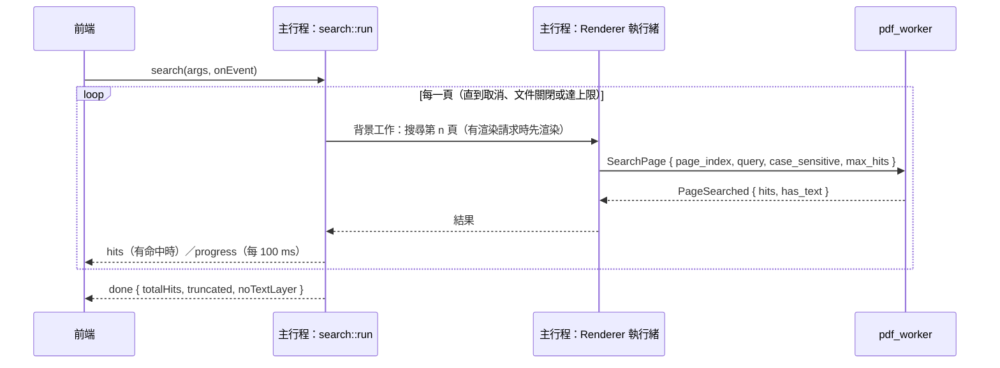

# 全文搜尋

對應工作卡 MVP-10。本文件說明主行程與 worker 端的搜尋（10a），以及前端的搜尋列與高亮（10b）。

## 流程



- **逐頁搜尋，由主行程驅動**：worker 一次只處理一個請求。若用單一個長時間的搜尋請求，搜尋期間無法渲染頁面，也不容易取消。所以主行程一頁一頁送 `SearchPage`，每頁是一個獨立請求。
- **渲染優先**：每一頁的搜尋以「背景工作」排在渲染執行緒上（`Renderer::in_background`），只有在沒有等待中的渲染請求時才執行。搜尋長文件時，捲動與縮放仍然順暢。
- **取消**：`cancel(request)` 設定該次搜尋的旗標，搜尋在下一頁之前停止（`Searches`）。前端開始新搜尋、修改關鍵字或關閉搜尋列時會取消舊的搜尋，並忽略舊搜尋的所有結果。文件關閉時，下一頁的搜尋會以 `unknownDocument` 結束。
- **上限**：查詢最長 `MAX_QUERY_BYTES`（1,024 bytes）；整份文件最多 `MAX_SEARCH_HITS`（10,000）筆，達到時停止並標記 `truncated`；每筆命中最多 `MAX_QUADS_PER_HIT`（64）個區塊。worker 每頁最多只回傳「剩餘可用」的筆數。
- **沒有文字層**：所有頁面都沒有任何文字時，`done.noTextLayer = true`，前端提示「此文件沒有文字層，目前版本尚不支援 OCR」。

## 比對方式（`crates/pdf_worker/src/search.rs`）

- 從 MuPDF 的文字層（structured text）逐行取出字元與其四邊形位置。
- 比對前「摺疊」：
  - 各種空白與控制字元都當成一個空格，連續空格合併；
  - 行與行之間以一個空格相接，片語可以跨行；
  - 不分大小寫時轉成小寫（只用一對一的對應，確保字元與位置對得上）。
  - 查詢字串用同樣方式處理，前後空白去掉。
- 以 **KMP** 比對，時間與頁面文字量成線性：惡意 PDF 放入大量文字加上長查詢，也不會變成平方時間（測試：100 萬字元的頁面、1,000 字元的查詢，2 秒內完成）。
- 命中不重疊。每筆命中在每一行產生一個四邊形，從該行第一個字元到最後一個字元。座標是頁面座標（point，原點在左上），與頁面尺寸一致；縮放與旋轉由前端換算。
- 中文不需要特別處理：比對的是文字層的 Unicode。

## 限制：未內嵌的 CJK 字型

worker 的 MuPDF 不含 CJK 字型（見 [mupdf-binding.md](mupdf-binding.md)）。遇到**未內嵌**的 CJK Type0 字型時，MuPDF 無法載入字型，連字碼解碼也一併失去，文字層變成亂碼，所以搜尋不到。QA-01 的 `benign/mixed-text-zh-en.pdf` 就是這種檔案。

有內嵌字型、或有 ToUnicode 的文件，中文搜尋正常（`searches_chinese_text_from_the_to_unicode_map`）。字型來源是 DEC-03（#31）的決策；決定後補上這個檔案的端對端測試。

## 量測

`crates/worker_host/src/bin/search_bench.rs` 在沙盒中開啟文件，以主行程相同的方式逐頁搜尋。

```bash
cargo build --release -p pdf_worker -p worker_host
target/release/search_bench.exe tests/corpus/large/output/large-1000-pages.pdf privacy
```

開發者電腦（Windows 11）、release 建置、QA-01 `large-1000-pages.pdf`（197 MB，每頁一行可搜尋的文字）：

| 查詢 | 命中 | 第一筆 | 前 500 頁 | 全部 1000 頁 | 預算 |
|---|---|---|---|---|---|
| `privacy`（每頁都有） | 1000 | 4 ms | 75 ms | 145 ms | 第一筆 < 1 s、500 頁 < 5 s |
| `needle-0500`（只在第 500 頁） | 1 | 68 ms | 68 ms | 143 ms | |
| `PRIVACY`（區分大小寫） | 0 | — | 61 ms | 122 ms | |

以上是 worker 端的時間。經過主行程排程與前端之後的時間見下一節。

## 前端：搜尋列與高亮（10b）

程式在 `src/features/search/`（`model.ts` 是純函式的狀態，`useSearch.ts` 負責啟動與取消），高亮在 `src/features/viewer/highlights.ts` 與 `DocumentView`。

- **何時搜尋**：輸入停止 250 ms 後自動搜尋；`Enter` 立即搜尋，已搜尋過同樣的字就跳到下一筆（`Shift+Enter` 上一筆）。`F3`／`Shift+F3` 在任何地方都可用，包括搜尋框內；搜尋列關著時會打開它並立即搜尋。`Aa` 切換後立即重新搜尋。
- **輸入法**：組字中（注音、倉頡等）不搜尋，`Enter` 選字也不算搜尋；組字結束後才開始計時。
- **取消與過期結果**：
  - 改字、開始新搜尋、關閉搜尋列時，前端呼叫 `cancel(request)`，並清除畫面上的結果。
  - 每次搜尋有新的請求編號；狀態只接受目前這次搜尋的事件。已取消的搜尋即使還有事件在路上，也不會混進新結果（`reduceSearch`）。
  - 請求編號與頁面渲染共用同一個計數器（`src/ipc/requests.ts`），因為主行程的 `cancel` 同時作用於渲染與搜尋，兩者的編號不能重複。
- **狀態文字**（取代「第 n／N 筆」的位置）：搜尋中顯示進度；完成後依序判斷沒有文字層、找不到、結果被截斷，否則顯示「第 n／N 筆」。進度每 100 ms 更新一次，所以只有最後結果會由螢幕報讀器朗讀（另一個 `role="status"` 區域）。
- **高亮**：
  - 命中的四邊形是頁面座標（point）。`pageToBox` 依旋轉與縮放換算成頁面方框內的 CSS px，畫成 SVG 多邊形，疊在該頁的畫布上，所以縮放、旋轉後仍對準文字。
  - 所有結果是黃色（`mix-blend-mode: multiply`，像螢光筆，底下的字仍清楚），目前結果另加橘色外框。
  - 只有已掛載的頁面（可見範圍附近）才會畫高亮。每頁用二分搜尋在依頁序排列的結果中找出自己的命中，1 萬筆結果也不需要逐筆掃描。
- **跳到結果**：選到的結果改變時，捲動讓它的頂端位於畫布高度 1/3 處；結果在畫面左右之外時才水平捲動。

### 端對端量測

release 建置，開發者電腦（Windows 11），以 CDP 操作真實視窗；時間從按下 `Enter` 起算，到畫面上出現標示／狀態變成完成：

| 文件 | 查詢 | 第一個標示 | 完成 | 結果 |
|---|---|---|---|---|
| `large-1000-pages.pdf` | `privacy` | 12 ms | 233 ms | 第 1／1000 筆 |
| `large-1000-pages.pdf` | `needle-0500` | — | 68 ms | 跳到第 500 頁 |
| `large-1000-pages.pdf` | `PRIVACY`（不分大小寫） | 13 ms | 138 ms | 第 1／1000 筆 |
| `multi-page-10.pdf` | `needle` | — | — | 跳到第 7 頁；縮放、旋轉後標示仍在字上 |
| `rotated-page.pdf`（第 2 頁 `/Rotate 90`） | `page` | — | — | 兩頁的標示都對準文字 |
| `image-only.pdf` | `text` | — | — | 「此文件沒有文字層，目前版本尚不支援 OCR」 |

搜尋 `privacy` 進行到第 29 ms 時改成 `privacyx`：舊搜尋被取消，最後畫面是「找不到「privacyx」」，沒有任何舊結果。搜尋 1000 頁後主行程的記憶體約 163 MB。

截圖見 [docs/ux/screenshots/mvp-10/](../ux/screenshots/mvp-10/)。
