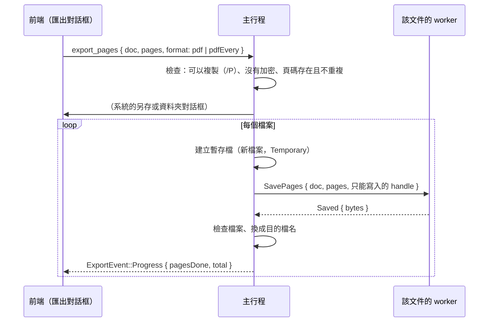

# 拆分文件：把頁面存成新檔（B2-06）

工作卡 [#95](https://github.com/winner0988/Pdf-reader/issues/95) 的第一部分；規格 §6「拆分／合併 PDF」。**合併**（插入其他檔案的頁面）是另一個功能，見 [merge.md](merge.md)：它需要復原、崩潰復原時重新取得來源檔，另有設計。

## 使用者做什麼

匯出對話框（「⋯」→「匯出…」，見 [export.md](export.md)）多兩種格式：

- **PDF 檔案（選的頁面存成一個新檔案）**：頁面範圍與其他格式相同（全部、目前頁、頁碼），主行程顯示系統的另存對話框，建議檔名 `<原檔名>-p2-4.pdf`（頁面連續時是頁碼範圍，只有一頁是 `-p5`，不連續時是 `<原檔名>（選取的頁面）.pdf`）。
- **PDF 檔案（每幾頁存成一個檔案）**：選擇資料夾，每個檔案最多所填的頁數，檔名同上（頁面不連續時改用第幾個檔案，`-01`、`-02`…）；已有同名檔案時先詢問是否覆寫。

也可以在縮圖選好頁面（`Ctrl`／`Shift` 多選），右鍵「將選取的頁面另存為新檔…」：開啟匯出對話框，格式與頁面範圍都已填好。

## 流程

- 路徑只在主行程；worker 只拿到只能寫入的 handle（同存檔與隱私匯出，ADR 0013、ADR 0008）。
- 取消（`cancel`）在檔案之間生效；已寫好的檔案留著。一個檔案一次寫好：先寫暫存檔，檢查之後才換成目的檔名，所以不會留下寫到一半的檔案。
- 不會取代文件自己的檔案（選到時以訊息方塊說明，可以再選）。

## 頁面怎麼拆出來

worker 的 `PdfDocument::pages_copy`：把**目前的文件**（含還沒存檔的編輯）存進記憶體、重新開啟，再把其他頁面從這份副本拿掉（與刪除頁面相同，見 [page-management.md](page-management.md)：只有那些頁面有的內容與表單欄位一併拿掉，指向它們的目錄項目、連結變成不指向任何地方），寫出。開啟中的文件不變。

- **為什麼不是把頁面「複製」進一個新文件**（MuPDF 的 `insert_pdf`／graft）：它只複製頁面的內容與資源，**不複製註解**，也就是連結、使用者標示的螢光筆與附註、表單欄位都會不見（worker 測試一開始就抓到這一點）。拿掉其他頁面則保留頁面上的一切。
- 所以整份文件共有的東西也跟著：文件資訊與 XMP 中繼資料、書籤（指向被拿掉的頁面的項目還在，點了沒有反應）。要沒有中繼資料的檔案，對結果再做「隱私匯出」。
- 新檔的頁面一律是**文件裡的順序**，即使頁碼是以別的順序輸入的。
- 每個檔案都從目前的文件重新存一次、重新開啟，所以把很大的文件拆成很多檔案會花時間（進度與「停止」可用）。

## 限制

- **加密的文件不能拆分**：worker 不保存密碼，拆出來的檔案無法再加密；不加密就會丟掉作者要求的保護（同隱私匯出）。對話框停用這兩個格式並說明原因，主行程也拒絕。
- **作者禁止複製（`/P`）時不能拆分**（MVP-19：拆分是複製內容；與匯出相同）。
- 一次最多 `LIMITS.maxSplitFiles`（1,000）個檔案；頁面數最多一份文件有的（其他格式是 `LIMITS.maxExportPages`，1,000）。

## 測試

- worker（`crates/pdf_worker/src/engine.rs`）：拆出的檔案頁數、順序、內容正確，沒有其他頁面的文字與位元組；開啟中的文件不變；含未存檔的編輯（刪除、旋轉）；頁面大小與頁面上的註解保留；不存在、重複、沒有頁面的清單與加密文件被拒絕且不寫任何東西。
- 經過真正的沙盒（`crates/pdf_worker/tests/saving.rs`）：以只能寫入的 handle 寫出，重新開啟有那幾頁，原文件仍可用；錯誤的清單寫入 0 位元組。
- 主行程（`documents.rs`、`export.rs`、`strings.rs`）：`save_pages` 含編輯、不改變文件；不存在的頁碼、重複、沒有頁面、文件自己的檔案、加密的文件、禁止複製的文件被拒絕；檔名與每個檔案的頁面。
- 合約（`ipc_contract`）：PDF 格式接受的頁數、每個檔案的頁數、檔案數上限。
- 前端：匯出對話框（格式、每個檔案的頁數與錯誤、檔案數上限、加密時停用、縮圖選好的頁面）、縮圖的右鍵項目（選好的頁面、沒有選項時不出現、禁止複製時停用）。
- E2E（`tests/e2e/split.spec.ts`）：選頁面存成新檔，重新開啟有那幾頁、順序對、沒有其他頁面的字；每 4 頁一個檔案，檔名與頁數對；從縮圖選頁面開啟對話框。
