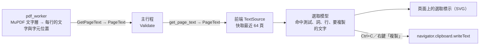

# 選取與複製文字（MVP-15）

工作卡 [#70](https://github.com/winner0988/Pdf-reader/issues/70)。使用者可以在頁面上選取文字並複製；畫面行為見 [screen-map.md](../ux/screen-map.md) §7「選取與複製文字」。

## 做法

選取由 app 自己處理，不交給 WebView：

- **worker**（`crates/pdf_worker/src/text_layer.rs`）：用搜尋同一個文字層（MuPDF 的 structured text），每一行產生一個 `TextLine`：
  - `text`：這一行的文字；
  - `quad`：涵蓋整行的四邊形，`ul → ur` 是書寫方向（直書時向下），`ul → ll` 是行高；
  - `edges`：每個字元從行首算起的起點，最後再加上最後一個字元的終點，所以比字元數多一個。字元之間的空隙算前一個字元的，選取標示因此是連續的。
- **主行程**只轉交並檢查（`Validate`），不快取。
- **前端**：
  - `src/features/text/source.ts`：每個分頁一個快取，保留最近用到的 64 頁；複製時讀取的頁面不放進快取，免得擠掉正在看的頁面。
  - `src/features/text/model.ts`：純函式，全部在頁面空間（PDF point，未旋轉頁面的左上角為原點，y 向下）。
    - 命中測試：先比「跨行方向」的距離，再比沿著行的距離，所以游標和哪一行等高就選哪一行，多欄排版時選較近的那一欄。
    - 游標（caret）落在最接近的兩個字元之間。
    - 雙擊的「詞」使用 `Intl.Segmenter`，中文也會斷詞。
  - `src/features/text/useTextSelection.ts`：滑鼠操作，拖到畫布邊緣時每個畫格自動捲動。
  - `DocumentView` 的 `PageSelection`：每一頁在畫面上停留片刻後才讀取文字（與渲染、連結相同），並畫出選取標示。

### 為什麼不用透明的 DOM 文字層

PDF.js 的做法是在頁面上疊一層透明文字，讓瀏覽器處理選取。我們沒有這樣做：

- **對齊**：瀏覽器用自己的字型排列透明文字，只能整段縮放，字元位置和 PDF 不會完全一致；旋轉 90°、放大到 400% 時更明顯。現在標示直接來自 MuPDF 的字元位置，永遠對齊。
- **選取跳動**：透明文字層在行與行之間的空白處，瀏覽器常把選取範圍跳到整頁開頭或結尾，需要額外的補救。
- **文件內容不進 DOM**：頁面文字只在選取模型裡，不會出現在 DOM 或無障礙樹中；頁面對輔助技術仍是一張圖（`role="img"`）。

代價是雙擊、三擊、拖曳、Shift+點擊都要自己實作，而且都有單元測試；E2E 在真正的 WebView2 裡驗證複製與對齊。

## 複製

- 一行一個換行，跨頁也換行；只選到某行開頭（索引 0）時不會多出空行。
- `Ctrl+C` 是登錄在快捷鍵表的 `copy`，但：
  - 焦點在文字欄位（搜尋框、頁碼）時不作用，欄位自己複製；
  - WebView 本身有選取的文字時（例如對話框裡的網址）不作用，由 WebView 複製；
  - 沒有選取任何 PDF 文字時不作用，按鍵照常交給 WebView。
- 寫入剪貼簿用 `navigator.clipboard.writeText`，和連結對話框的「複製連結」相同；沒有 Tauri 剪貼簿外掛，也沒有新的權限。
- **右鍵功能表**：開啟文件時，在畫布上按右鍵顯示 app 自己的功能表（Base UI Context Menu），目前只有「複製」，沒有選取時停用。它也取代了 WebView2 的預設功能表（重新整理、另存新檔、列印網頁等），那些對 app 沒有意義。

## 安全

- **文字只是文字**：前端只拿到字串與座標，以 React 文字節點或 SVG 多邊形呈現，不執行任何內容。
- **貼上的文字看起來就是頁面上的文字**：worker 以 `copy_text_char` 處理每個字元：
  - 控制字元與各種空白改成一般空白；
  - 移除雙向文字控制（U+202A–U+202E、U+2066–U+2069）、零寬字元與 BOM，避免貼到別處時文字順序被改變或藏了看不見的內容；
  - 與顯示用的 `clean_display_text` 不同，連續空白不合併，每個字元保持它在頁面上的位置。

  主行程的 `Validate` 會拒絕仍含這些字元的行（`is_clean_copy_text`）。
- **上限**：每頁最多 `MAX_PAGE_TEXT_CHARS`（100,000）個字元，超過時截斷並設 `truncated`；座標都必須是有限數且在頁面空間的範圍內，`edges` 必須比字元數多一個且不遞減。離頁面極遠的字元（超過 ±250,000 pt）在 worker 內就略過。
- **沒有路徑**：`get_page_text` 只收文件代號與頁碼。

## 尚未處理

- **掃描件（沒有文字層）**不能選取：在上面拖曳時狀態列提示；OCR 另開工作卡。
- **「禁止複製」權限**：加密 PDF 可以只設權限密碼、禁止複製文字。目前沒有加密文件能開啟（MVP-16 之前一律回報 `encrypted`，只有使用者密碼為空的文件例外）；要不要遵守這個權限，已在 #70 請負責人決定，決定後在 MVP-16（#71）一併處理。
- **機敏文件的剪貼簿保護**（ADR 0004）之後才做。
- 全選（`Ctrl+A`）、鍵盤延伸選取（`Shift+方向鍵`）。
