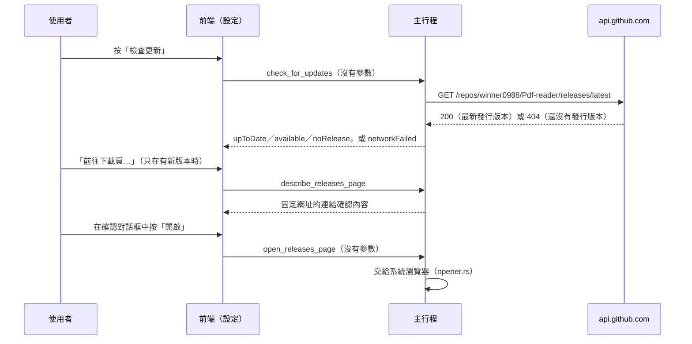

# 檢查更新

工作卡 [#64](https://github.com/winner0988/Pdf-reader/issues/64)。依 [ADR 0009](../adr/0009-default-network-policy.md) 選項 B，這是 app **唯一的連網**：使用者在設定中按下「檢查更新」時，主行程向 GitHub 查詢一次最新的版本號碼。

## 流程

## 限制（ADR 0009）

| 項目 | 做法 |
|---|---|
| 何時 | 只在按下按鈕時，每按一次一個請求。不在啟動時、不定期、失敗不重試。主行程同一時間只允許一個查詢，按鈕在查詢期間也停用。 |
| 誰發出 | 只有主行程（`src-tauri/src/update_check.rs`）。WebView 的 CSP 與 capability 不變，沒有任何網路能力；`pdf_worker` 在沒有網路 capability 的 AppContainer 中。 |
| 連到哪裡 | 固定的 `https://api.github.com/repos/winner0988/Pdf-reader/releases/latest`（443 埠）。三個命令都沒有參數，前端給不了網址。 |
| 送出什麼 | 一個 GET：`User-Agent: Pdf-reader`、`Accept: application/vnd.github+json`，以及 HTTP 本身需要的 `Host`、`Connection`。沒有 cookie、權杖、識別碼、版本號、文件或使用紀錄。 |
| 讀取什麼 | 只讀 `tag_name`，必須是 `主.次.修訂`（可以有 `v`，每個數字最多 5 位）；其他格式一律當成失敗。畫面上的版本號由這三個數字重新組成，回應的其他內容都不會到前端。回應最多讀 1 MB。 |
| 下載頁 | 固定為 `https://github.com/winner0988/Pdf-reader/releases/latest`，**不使用**回應中的網址。與文件中的外部連結一樣，先顯示確認對話框與完整網址，使用者確認後才交給系統瀏覽器。不自動下載、不自動安裝。 |
| 說明 | 按鈕旁說明「GitHub 會看到你的 IP 位址與查詢的時間」，這是連網本身無法避免的。 |

## 實作：WinHTTP

請求使用 Windows 內建的 WinHTTP（透過專案已有的 `windows-sys`），**沒有新增任何 HTTP 或 TLS crate**：`deny.toml` 照樣禁用 `reqwest`、`ureq`、`hyper`、`rustls`、`native-tls` 等。

- **TLS**：由 Windows 的 SChannel 與系統憑證庫處理；只允許 TLS 1.2 與 1.3（Windows 10 的 WinHTTP 沒有 1.3，只用 1.2）。
- **每次都是新的 session**，並且：
  - 停用 cookie（`WINHTTP_DISABLE_COOKIES`）：WinHTTP 本來就不保存 cookie，也不與瀏覽器共用；
  - 停用驗證與自動登入（`WINHTTP_DISABLE_AUTHENTICATION`，自動登入政策設為最高）：伺服器要求 NTLM／Negotiate 時也不會送出 Windows 認證；
  - 不跟隨重新導向（`WINHTTP_DISABLE_REDIRECTS`）：只連固定的主機；
  - 不保持連線（`WINHTTP_DISABLE_KEEP_ALIVE`）：回應後就關閉。
- **Proxy**：只用系統管理員為 WinHTTP 設定的 proxy（`netsh winhttp`，`WINHTTP_ACCESS_TYPE_DEFAULT_PROXY`）。不做自動偵測（WPAD）或 PAC：它們會在區域網路上另外發出請求。所以只在瀏覽器設定 proxy 的環境可能無法檢查更新，使用者仍可自己到 GitHub 查看。
- **逾時**：名稱解析、連線、送出、每次等待資料各 15 秒。
- `unsafe` 只在 WinHTTP 的呼叫，集中在這個模組；handle 以 RAII 關閉（子 handle 先於父 handle）。
- `scripts/ci/forbidden-patterns.txt` 的 `WinHttp @only …` 規則讓 WinHTTP 只能出現在這個模組、`src-tauri/Cargo.toml` 的 feature，以及確認 worker 不載入它的隔離測試中。

## 測試

- `update_check.rs` 的單元測試：
  - 版本號的解析與比較（數字比較，`0.10.0` 比 `0.9.0` 新）；
  - 404 是「還沒有發行版本」；403、500、302、不是 JSON、沒有 `tag_name`、不是版本號的標籤都是失敗；
  - 同一時間只有一個查詢（被拒絕的第二個不會解除第一個的鎖）；
  - 位址與下載頁固定，下載頁可以通過連結檢查。
- **WinHTTP 的實際行為**（`tests::wire`，連到測試自己在 `127.0.0.1` 開的伺服器，不連外）：
  - 送出的請求只有上表的四個標頭；第二次查詢不帶第一次回應的 `Set-Cookie`；
  - 不跟隨 302；伺服器要求 NTLM／Negotiate 時不送 `Authorization`；
  - 超過 1 MB 的回應會停止讀取；連不上就是失敗。
- 前端：`UpdatesSection.test.tsx`（每按一次呼叫一次、查詢中停用、各種結果、下載頁經過確認對話框才開啟）。
- E2E：設定中有「更新」與說明（不按按鈕，測試不連外）。
- 連網的手動驗證見 [offline-verification.md](../security/offline-verification.md)。
