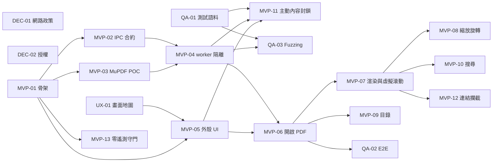

# 工作卡（Backlog）

每張卡都要能交給**單一 agent、在單一 PR 內完成**，並包含：需求 ID、目標、範圍、不做什麼、可動的模組、驗收情境、必跑測試、資安限制。格式與 [Issue 表單](../../.github/ISSUE_TEMPLATE/task.yml) 相同。

卡片檔案開頭的 front matter（`title`、`labels`）供 [`scripts/backlog-to-issues.sh`](../../scripts/backlog-to-issues.sh) 轉成 GitHub Issue。**轉成 Issue 之後，以 Issue 為準**，這裡的檔案不再同步更新。

## MVP 需求 ID

| ID | 需求 | 來源 |
|---|---|---|
| MVP-R1 | 開啟本機 PDF（對話框、拖放、命令列參數） | 規格 §6、§1 |
| MVP-R2 | MuPDF 在隔離子行程中解析與渲染 | 規格 §2、§3；ADR 0003、0008 |
| MVP-R3 | 虛擬滾動與懶加載 | 規格 §2 |
| MVP-R4 | 縮放與旋轉（只改檢視，不改檔案） | 規格 §6 |
| MVP-R5 | 目錄導覽 | 規格 §6 |
| MVP-R6 | 全文搜尋（文字層，不含 OCR） | 規格 §6 |
| MVP-R7 | 主動內容封鎖（JavaScript、OpenAction、AA、Launch 等） | 規格 §3；ADR 0001 |
| MVP-R8 | 遠端資源預設封鎖並提示（不含信任例外） | 規格 §3；ADR 0002 |
| MVP-R9 | 外部連結攔截，顯示完整 URL 並確認 | 規格 §3 |
| MVP-R10 | 離線運作、零遙測 | 規格 §3；ADR 0009 |
| MVP-R11 | 基本閱讀器 UI（深色模式、載入／錯誤／空狀態） | 規格 §6；ADR 0007 |

## 第一批工作卡（[mvp-batch-1/](mvp-batch-1/)）

| 卡片 | 標題 | 角色 | 相依 |
|---|---|---|---|
| [DEC-01](mvp-batch-1/DEC-01-network-policy.md) | 決定預設網路政策（ADR 0009） | 負責人 | — |
| [DEC-02](mvp-batch-1/DEC-02-license-and-visibility.md) | 決定授權與 repo 可見性（MuPDF AGPL） | 負責人 | — |
| [UX-01](mvp-batch-1/UX-01-screen-map-wireframes.md) | 閱讀器畫面地圖、wireframe 與 UI 行為 | 負責人＋前端 | — |
| [QA-01](mvp-batch-1/QA-01-test-corpus.md) | 測試 PDF 語料庫（良性、惡意、損毀、超大） | QA／安全 | — |
| [MVP-01](mvp-batch-1/MVP-01-project-scaffold.md) | 專案骨架與啟用 CI | Release | — |
| [MVP-02](mvp-batch-1/MVP-02-ipc-contract.md) | IPC 合約 v0 與行程模型文件 | 核心 | MVP-01 |
| [MVP-03](mvp-batch-1/MVP-03-mupdf-build-poc.md) | MuPDF 建置與渲染 POC | 核心 | MVP-01 |
| [MVP-13](mvp-batch-1/MVP-13-offline-zero-telemetry-gate.md) | 離線與零遙測守門 | Release | MVP-01 |
| [MVP-05](mvp-batch-1/MVP-05-reader-shell-ui.md) | 閱讀器外殼 UI | 前端 | MVP-01、UX-01 |
| [MVP-04](mvp-batch-1/MVP-04-pdf-worker-isolation.md) | `pdf_worker` 隔離子行程 | 核心 | MVP-02、MVP-03 |
| [MVP-06](mvp-batch-1/MVP-06-open-local-pdf.md) | 開啟本機 PDF | 核心＋前端 | MVP-04、MVP-05 |
| [MVP-07](mvp-batch-1/MVP-07-render-pipeline-virtual-scroll.md) | 頁面渲染管線與虛擬滾動 | 核心＋前端 | MVP-06 |
| [MVP-09](mvp-batch-1/MVP-09-outline-sidebar.md) | 目錄側欄 | 前端 | MVP-06 |
| [MVP-11](mvp-batch-1/MVP-11-active-content-blocking.md) | 主動內容與遠端引用：封鎖與偵測提示 | 核心 | MVP-04、MVP-05、QA-01 |
| [QA-02](mvp-batch-1/QA-02-e2e-framework.md) | E2E 測試框架 | QA／安全 | MVP-06 |
| [QA-03](mvp-batch-1/QA-03-fuzzing.md) | Fuzzing 基礎 | QA／安全 | MVP-04、QA-01 |
| [MVP-08](mvp-batch-1/MVP-08-zoom-rotate.md) | 縮放與旋轉 | 前端 | MVP-07 |
| [MVP-10](mvp-batch-1/MVP-10-full-text-search.md) | 全文搜尋 | 核心＋前端 | MVP-07 |
| [MVP-12](mvp-batch-1/MVP-12-external-link-interception.md) | 外部連結攔截 | 前端＋核心 | MVP-07 |

## 相依關係

## 建議開工順序

| 波次 | 可平行進行 |
|---|---|
| 1 | MVP-01、UX-01、QA-01、DEC-01、DEC-02 |
| 2 | MVP-02、MVP-03、MVP-13、MVP-05 |
| 3 | MVP-04 |
| 4 | MVP-06 |
| 5 | MVP-07、MVP-09、MVP-11、QA-02、QA-03 |
| 6 | MVP-08、MVP-10、MVP-12 |

## MVP 完成定義

- 上表所有卡片關閉，且 CI（含 E2E）在 `main` 上全綠。
- 依 `docs/security/offline-verification.md`（MVP-13 產出）手動驗證一次：開檔、捲動、搜尋、點連結（取消）期間沒有任何對外連線。
- QA-01 惡意語料全部開過一次：沒有執行任何腳本、沒有連網、沒有啟動外部程式。
- DEC-02 已定案（任何形式的發布之前）。

## 下一批候選（不在 MVP）

縮圖側欄、最近開啟清單（依 ADR 0004 的規則）、SQLite 設定儲存、檔案關聯註冊、信任清單（ADR 0002）、安裝包簽章、文字選取與複製。OCR、Word 轉檔、編輯、簽章、加密、批次背景服務、表單腳本沙盒都要先做 POC 並寫 ADR。
