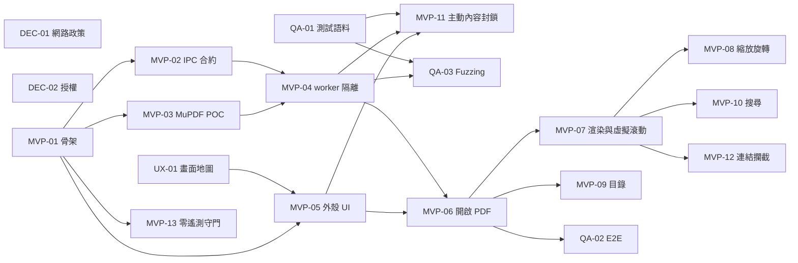
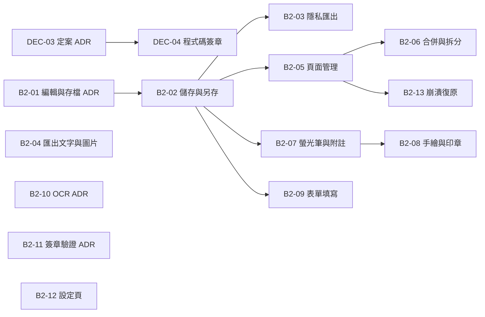

# 工作卡（Backlog）

每張卡都要能交給**單一 agent、在單一 PR 內完成**，並包含：需求 ID、目標、範圍、不做什麼、可動的模組、驗收情境、必跑測試、資安限制。格式與 [Issue 表單](../../.github/ISSUE_TEMPLATE/task.yml) 相同。

卡片檔案開頭的 front matter（`title`、`labels`）供 [`scripts/backlog-to-issues.sh`](../../scripts/backlog-to-issues.sh) 轉成 GitHub Issue。**轉成 Issue 之後，以 Issue 為準**，這裡的檔案不再同步更新。

## MVP 需求 ID

| ID | 需求 | 來源 |
|---|---|---|
| MVP-R1 | 開啟本機 PDF（對話框、拖放、命令列參數） | 規格 §6、§1 |
| MVP-R2 | MuPDF 在隔離子行程中解析與渲染 | 規格 §2、§3；ADR 0003、0008 |
| MVP-R3 | 虛擬滾動與懶加載 | 規格 §2 |
| MVP-R4 | 縮放與旋轉（只改檢視，不改檔案） | 規格 §6 |
| MVP-R5 | 目錄導覽 | 規格 §6 |
| MVP-R6 | 全文搜尋（文字層，不含 OCR） | 規格 §6 |
| MVP-R7 | 主動內容封鎖（JavaScript、OpenAction、AA、Launch 等） | 規格 §3；ADR 0001 |
| MVP-R8 | 遠端資源預設封鎖並提示（不含信任例外） | 規格 §3；ADR 0002 |
| MVP-R9 | 外部連結攔截，顯示完整 URL 並確認 | 規格 §3 |
| MVP-R10 | 離線運作、零遙測 | 規格 §3；ADR 0009 |
| MVP-R11 | 基本閱讀器 UI（深色模式、載入／錯誤／空狀態） | 規格 §6；ADR 0007 |

## 第一批工作卡（[mvp-batch-1/](mvp-batch-1/)）

| 卡片 | 標題 | 角色 | 相依 |
|---|---|---|---|
| [DEC-01](mvp-batch-1/DEC-01-network-policy.md) | 決定預設網路政策（ADR 0009） | 負責人 | — |
| [DEC-02](mvp-batch-1/DEC-02-license-and-visibility.md) | 決定授權與 repo 可見性（MuPDF AGPL） | 負責人 | — |
| [UX-01](mvp-batch-1/UX-01-screen-map-wireframes.md) | 閱讀器畫面地圖、wireframe 與 UI 行為 | 負責人＋前端 | — |
| [QA-01](mvp-batch-1/QA-01-test-corpus.md) | 測試 PDF 語料庫（良性、惡意、損毀、超大） | QA／安全 | — |
| [MVP-01](mvp-batch-1/MVP-01-project-scaffold.md) | 專案骨架與啟用 CI | Release | — |
| [MVP-02](mvp-batch-1/MVP-02-ipc-contract.md) | IPC 合約 v0 與行程模型文件 | 核心 | MVP-01 |
| [MVP-03](mvp-batch-1/MVP-03-mupdf-build-poc.md) | MuPDF 建置與渲染 POC | 核心 | MVP-01 |
| [MVP-13](mvp-batch-1/MVP-13-offline-zero-telemetry-gate.md) | 離線與零遙測守門 | Release | MVP-01 |
| [MVP-05](mvp-batch-1/MVP-05-reader-shell-ui.md) | 閱讀器外殼 UI | 前端 | MVP-01、UX-01 |
| [MVP-04](mvp-batch-1/MVP-04-pdf-worker-isolation.md) | `pdf_worker` 隔離子行程 | 核心 | MVP-02、MVP-03 |
| [MVP-06](mvp-batch-1/MVP-06-open-local-pdf.md) | 開啟本機 PDF | 核心＋前端 | MVP-04、MVP-05 |
| [MVP-07](mvp-batch-1/MVP-07-render-pipeline-virtual-scroll.md) | 頁面渲染管線與虛擬滾動 | 核心＋前端 | MVP-06 |
| [MVP-09](mvp-batch-1/MVP-09-outline-sidebar.md) | 目錄側欄 | 前端 | MVP-06 |
| [MVP-11](mvp-batch-1/MVP-11-active-content-blocking.md) | 主動內容與遠端引用：封鎖與偵測提示 | 核心 | MVP-04、MVP-05、QA-01 |
| [QA-02](mvp-batch-1/QA-02-e2e-framework.md) | E2E 測試框架 | QA／安全 | MVP-06 |
| [QA-03](mvp-batch-1/QA-03-fuzzing.md) | Fuzzing 基礎 | QA／安全 | MVP-04、QA-01 |
| [MVP-08](mvp-batch-1/MVP-08-zoom-rotate.md) | 縮放與旋轉 | 前端 | MVP-07 |
| [MVP-10](mvp-batch-1/MVP-10-full-text-search.md) | 全文搜尋 | 核心＋前端 | MVP-07 |
| [MVP-12](mvp-batch-1/MVP-12-external-link-interception.md) | 外部連結攔截 | 前端＋核心 | MVP-07 |

## 相依關係

```mermaid
flowchart LR
  DEC01[DEC-01 網路政策]
  DEC02[DEC-02 授權]
  UX01[UX-01 畫面地圖] --> M05
  QA01[QA-01 測試語料] --> M11
  QA01 --> Q03
  M01[MVP-01 骨架] --> M02[MVP-02 IPC 合約]
  M01 --> M03[MVP-03 MuPDF POC]
  M01 --> M13[MVP-13 零遙測守門]
  M01 --> M05[MVP-05 外殼 UI]
  M02 --> M04[MVP-04 worker 隔離]
  M03 --> M04
  M04 --> M06[MVP-06 開啟 PDF]
  M05 --> M06
  M04 --> M11[MVP-11 主動內容封鎖]
  M05 --> M11
  M04 --> Q03[QA-03 Fuzzing]
  M06 --> M07[MVP-07 渲染與虛擬滾動]
  M06 --> M09[MVP-09 目錄]
  M06 --> Q02[QA-02 E2E]
  M07 --> M08[MVP-08 縮放旋轉]
  M07 --> M10[MVP-10 搜尋]
  M07 --> M12[MVP-12 連結攔截]
```

## 建議開工順序

| 波次 | 可平行進行 |
|---|---|
| 1 | MVP-01、UX-01、QA-01、DEC-01、DEC-02 |
| 2 | MVP-02、MVP-03、MVP-13、MVP-05 |
| 3 | MVP-04 |
| 4 | MVP-06 |
| 5 | MVP-07、MVP-09、MVP-11、QA-02、QA-03 |
| 6 | MVP-08、MVP-10、MVP-12 |

## MVP 完成定義

- 上表所有卡片關閉，且 CI（含 E2E）在 `main` 上全綠。
- 依 `docs/security/offline-verification.md`（MVP-13 產出）手動驗證一次：開檔、捲動、搜尋、點連結（取消）期間沒有任何對外連線。
- QA-01 惡意語料全部開過一次：沒有執行任何腳本、沒有連網、沒有啟動外部程式。
- DEC-02 已定案（任何形式的發布之前）。

## MVP 之後追加的卡片

負責人在第一批之後直接以 Issue 追加的卡片：

| 卡片 | Issue | 內容 |
|---|---|---|
| MVP-14 | #69 | 分頁：同時開啟多份文件 |
| MVP-15 | #70 | 選取與複製文字 |
| MVP-16 | #71 | 開啟加密 PDF |
| MVP-17 | #72 | 列印 |
| MVP-18 | #73 | 縮圖側欄與最近開啟的檔案 |
| MVP-19 | #82 | 遵守 PDF 的權限 |
| REL-03 | #68 | 註冊為 PDF 程式、設為預設 |

## 第二批工作卡（[batch-2/](batch-2/)）

方向：從閱讀器走向編輯器。先定案**編輯與存檔**的共同做法（B2-01、B2-02），其他編輯功能都建立在上面；OCR 與簽章依本頁原本的規定先做 POC 與 ADR。

| 卡片 | Issue | 標題 | 角色 | 相依 |
|---|---|---|---|---|
| [DEC-03](batch-2/DEC-03-accept-pending-adrs.md) | #103 | 定案提議中的 ADR 0009–0012 | 負責人 | — |
| [DEC-04](batch-2/DEC-04-installer-code-signing.md) | #104 | 決定安裝檔與執行檔的程式碼簽章 | 負責人 | DEC-03 |
| [B2-01](batch-2/B2-01-edit-and-save-architecture.md) | #90 | ADR 0013：編輯與存檔架構（含 POC） | 核心 | — |
| [B2-02](batch-2/B2-02-save-and-save-as.md) | #91 | 儲存與另存新檔 | 核心＋前端 | B2-01 |
| [B2-03](batch-2/B2-03-privacy-export.md) | #92 | 隱私匯出：清除中繼資料後另存 | 核心＋前端 | B2-02 |
| [B2-04](batch-2/B2-04-export-text-and-images.md) | #93 | 匯出純文字與頁面圖片 | 核心＋前端 | — |
| [B2-05](batch-2/B2-05-page-management.md) | #94 | 頁面管理：旋轉、刪除、排序、插入空白頁 | 前端＋核心 | B2-02 |
| [B2-06](batch-2/B2-06-merge-and-split.md) | #95 | 合併與拆分 PDF | 核心＋前端 | B2-05 |
| [B2-07](batch-2/B2-07-highlights-and-notes.md) | #96 | 註解：螢光筆與文字附註 | 前端＋核心 | B2-02 |
| [B2-08](batch-2/B2-08-ink-and-stamps.md) | #97 | 註解：手繪線條與印章 | 前端＋核心 | B2-07 |
| [B2-09](batch-2/B2-09-form-filling.md) | #98 | 表單填寫與扁平化（不含腳本） | 前端＋核心 | B2-02 |
| [B2-10](batch-2/B2-10-ocr-architecture.md) | #99 | ADR 0015：OCR（含 POC） | 核心 | — |
| [B2-11](batch-2/B2-11-signature-verification.md) | #100 | ADR 0014：數位簽章驗證（唯讀，含 POC） | 核心 | — |
| [B2-12](batch-2/B2-12-settings.md) | #101 | 設定頁與設定儲存 | 前端＋核心 | — |
| [B2-13](batch-2/B2-13-crash-recovery.md) | #102 | 本地崩潰復原 | 核心＋前端 | B2-02、B2-05 |

```mermaid
flowchart LR
  D03[DEC-03 定案 ADR] --> D04[DEC-04 程式碼簽章]
  B01[B2-01 編輯與存檔 ADR] --> B02[B2-02 儲存與另存]
  B02 --> B03[B2-03 隱私匯出]
  B02 --> B05[B2-05 頁面管理]
  B05 --> B06[B2-06 合併與拆分]
  B02 --> B07[B2-07 螢光筆與附註]
  B07 --> B08[B2-08 手繪與印章]
  B02 --> B09[B2-09 表單填寫]
  B05 --> B13[B2-13 崩潰復原]
  B04[B2-04 匯出文字與圖片]
  B10[B2-10 OCR ADR]
  B11[B2-11 簽章驗證 ADR]
  B12[B2-12 設定頁]
```

| 波次 | 可平行進行 |
|---|---|
| 1 | DEC-03、B2-01、B2-04、B2-10、B2-11、B2-12 |
| 2 | B2-02（B2-01 的 ADR 接受後）、DEC-04 |
| 3 | B2-03、B2-05、B2-07、B2-09 |
| 4 | B2-06、B2-08、B2-13 |

- 每張 ADR 卡（B2-01、B2-10、B2-11）只產出「提議中」的 ADR 與 POC；接受由負責人決定，之後的實作卡依 ADR 另開。
- ADR 編號依完成順序：0013 編輯與存檔（#106）、0014 簽章驗證（#107）、0015 OCR。
- 所有會寫檔或新增命令的卡都需要 `needs-security-review`。

## 第三批候選

- 格式轉換：匯出 Word（.docx）、從 Office 文件或圖片建立 PDF（規格 §7；先做 POC 與 ADR）。
- 表單腳本沙盒（ADR 0001；先做 POC）。
- 批次處理佇列與背景執行（ADR 0005）。
- 存檔時加密與設定權限（規格 §3）；安全遮蔽，從檔案中真正移除內容（規格 §3）。
- 密碼記憶（ADR 0006）與機敏標記（ADR 0004）：都等 ADR 0010 定案（文件識別碼）。
- 信任後載入遠端資源（ADR 0002）：等 ADR 0009，並另寫 ADR。
- 文字方塊與字型子集化（規格 §4）；插入圖片與 EXIF 清除（規格 §5）。
- 簽署文件與載入 `.pfx`（B2-11 之後）；OCR：掃描頁的文字辨識（#142，ADR 0015 已接受）；檢查更新（#64，等 ADR 0009）。
- 全文索引（規格 §6「建立本地索引」）；硬體加速（規格 §2）。
