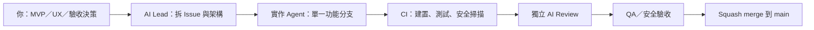

可以開始，但先別把整份規格一次交給 AI 全做。你目前有很完整的「產品／安全規格」，但還沒有真正的開發專案：`E:\Pdf reader spec` 只有 Markdown、沒有 Git、原始碼、前端、CI、測試或設計稿。

你確實還需要前端；不過不需要雲端後端。Tauri 是桌面殼與 Rust 原生層，不是前端本身。

我建議直接定這套：

| 層 | 建議 |
|---|---|
| 首發平台 | Windows-first；macOS/Linux 之後再做 |
| 桌面框架 | Tauri 2 + Rust |
| 前端 | React + TypeScript + Vite；Tailwind + shadcn/ui |
| PDF 核心 | MuPDF，包在 Rust `pdf_worker` 獨立低權限行程，不直接暴露給前端 |
| 本機資料 | SQLite（設定、信任、佇列、索引）+ Windows Credential Manager（密碼） |
| Git／工作管理 | 私有 GitHub repo + Issues + Projects + Pull Requests |
| CI | GitHub Actions：格式化、lint、型別、單元測試、E2E、依賴／秘密掃描 |
| AI coding | Codex 實作；另一個獨立 AI agent 做 review，不能審自己的 PR |

Git 是必須的，尤其是 vibe coding：它讓你能看 AI 改了什麼、退回錯誤版本、平行開分支、用 PR 審查。GitHub 可要求 CI status checks 全綠才允許合併。 [GitHub 文件](https://docs.github.com/en/pull-requests/reference/status-checks)

你的規格方向是對的，但要補成 AI 可執行的任務卡。每張卡都要有：

`需求 ID`、目標、範圍／不做什麼、可動的模組、驗收情境、必跑測試、資安限制。

前端目前缺的不只是 React，而是：

- 閱讀器畫面地圖：工具列、縮圖／目錄側欄、頁面畫布、搜尋、設定、安全警告。
- UI 行為：縮放、拖曳、快捷鍵、深色模式、載入／錯誤／空狀態。
- Rust 與前端的 IPC 合約：頁面影像、縮圖、搜尋結果、選取範圍、註解覆蓋層怎麼傳。
- UX 驗收截圖或 wireframe；不一定先用 Figma，但一定要有可驗收畫面。

第一版 MVP 建議只做：

1. 開啟本機 PDF。
2. MuPDF 子行程渲染頁面。
3. 虛擬滾動、縮放、旋轉、目錄、搜尋。
4. 預設封鎖 PDF JavaScript、遠端資源與外部連結；連結需顯示完整 URL 後確認。
5. 基本 Tauri UI、離線運作、無遙測。

先不要塞進 MVP：OCR、Word 雙向轉檔、完整編輯、簽章、加密、批次背景服務、表單 JS 沙盒。這些每項都應先做 POC 與 ADR。

你有幾個必須先解掉的規格風險：

- 「完全離線」和 GitHub Releases 更新檢查、受信任 PDF 載入遠端資源彼此衝突；要明訂預設網路政策。
- 將 Document ID 寫進 PDF metadata 會改變 PDF；已簽章、加密、唯讀文件可能因此失效或不能寫入。
- MuPDF 的 AGPL／商業授權要在任何公開發布前定案；Artifex 的 AGPL 路線涉及原始碼揭露義務。 [Artifex 授權說明](https://artifex.com/licensing)
- Tauri capability 只能縮小 WebView 到系統 API 的權限，不能保護不安全的 Rust、過寬檔案範圍、供應鏈或 PDF 引擎漏洞；PDF worker、最小權限、fuzzing 與人工安全 gate 都要保留。 [Tauri 安全邊界說明](https://tauri.app/security/capabilities/)

工作分配建議如下：

- 你：決定 MVP、優先順序、UX 與安全例外，核准發布。
- 核心 Agent：MuPDF FFI、渲染、搜尋、子行程隔離。
- 前端 Agent：閱讀器 UI、快捷鍵、無障礙、視覺測試。
- QA／安全 Agent：惡意、損毀、加密、簽章、超大 PDF 測試集與 fuzzing。
- Review／Release Agent：CI、PR 規則、依賴掃描、安裝包與簽章。

規則是：一個 agent 同時只做一張 Issue、一張 Issue 一個 branch、一個 PR 只做一件事；`main` 永遠保持可建置。AI review 要有，但它不是安全審計的替代品。

下一步最值得做的是建立 Git 專案骨架、整理 ADR 到 `docs/adr/`、加入 `AGENTS.md`、CI、PR／Issue 模板，並把 MVP 拆成第一批工作卡。若你要，我可以直接替你建立這個開發骨架。