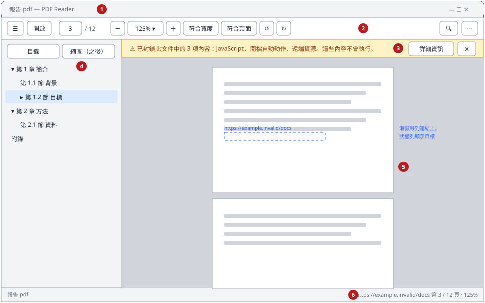
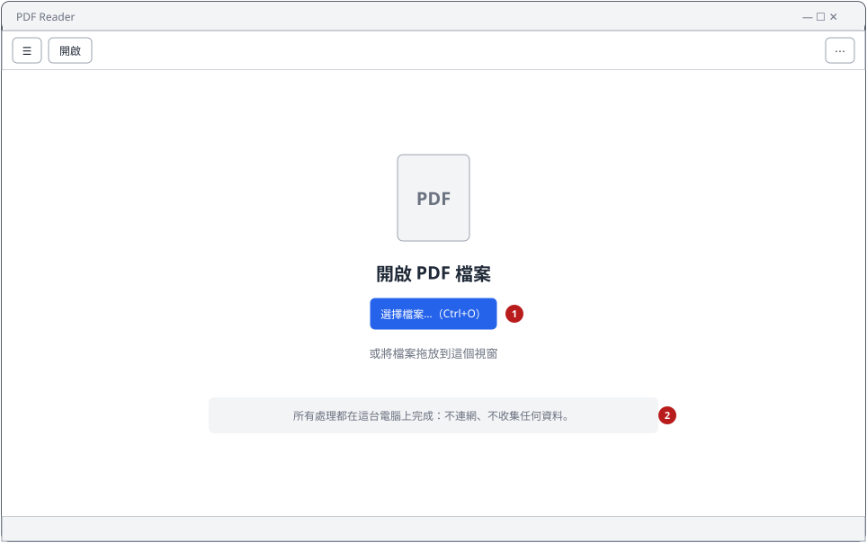
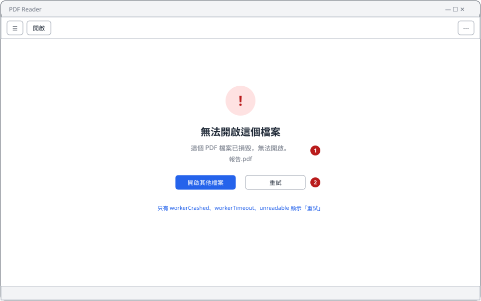
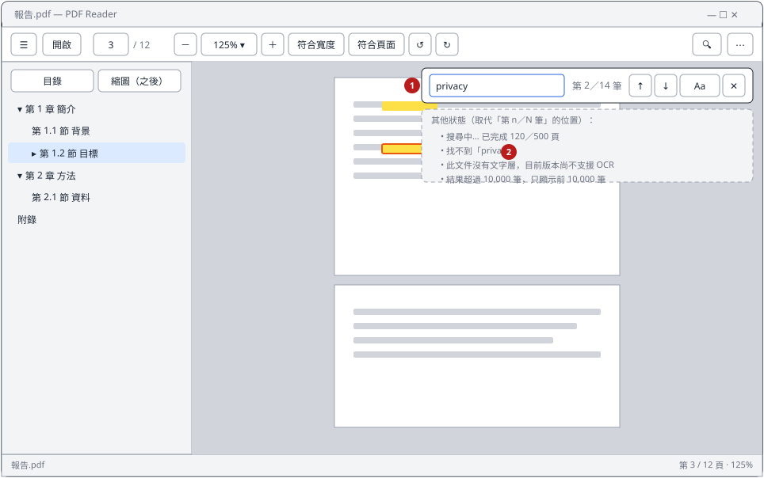
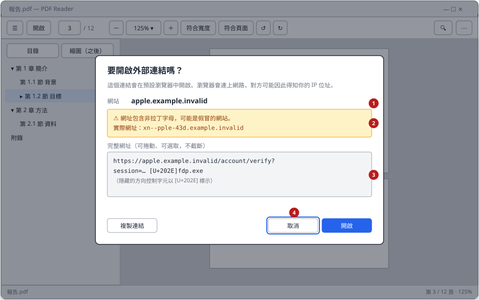
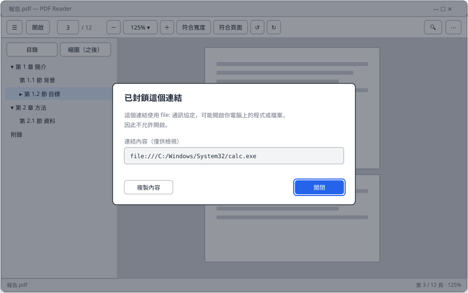
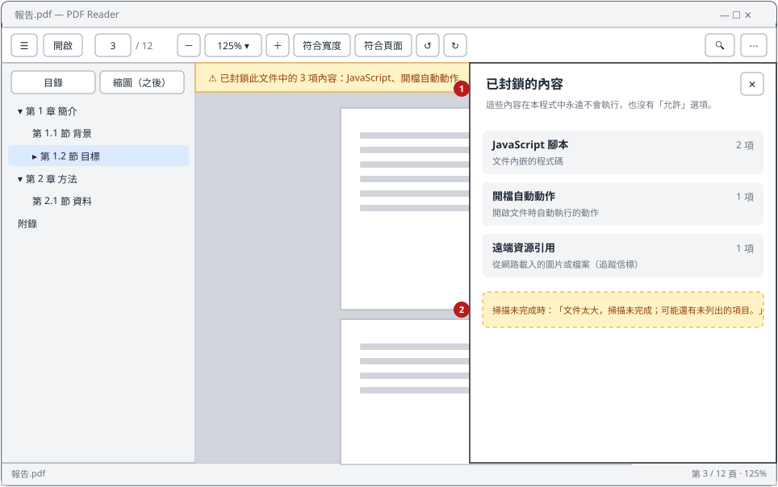
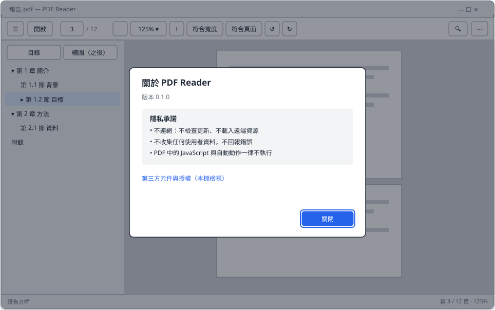

# 閱讀器畫面地圖與 UI 行為規格

對應工作卡 UX-01。MVP-05～MVP-12 的前端工作都以本文件為準；**需經負責人核准**。

- Wireframe 只呈現版面與文字，不代表視覺設計（顏色、圖示、字型之後再定）。
- Wireframe 由 [`wireframes/make_wireframes.py`](wireframes/make_wireframes.py) 產生：修改畫面時改腳本後重新執行，不要直接編輯 SVG。
- 所有使用者可見文字集中在「文字表」一節，實作時放進 `src/i18n/zh-TW.ts`，不得寫死在元件裡。

## 1. 主視窗

| # | 區域 | 內容與行為 | 實作卡 |
|---|---|---|---|
| 1 | 標題列 | `<檔名> — PDF Reader`；沒有開啟文件時只顯示 `PDF Reader`。只顯示檔名，不顯示路徑。 | MVP-05 |
| 2 | 工具列 | 左到右：側欄開關、開啟、頁碼輸入框／總頁數、縮小、縮放比例下拉、放大、符合寬度、符合頁面、逆時針旋轉、順時針旋轉；右側：搜尋、更多（⋯：設定、快捷鍵、關於）。沒有開啟文件時只顯示側欄開關、開啟、更多。每個圖示按鈕都有工具提示，內容包含快捷鍵。 | MVP-05、08 |
| 3 | 安全警示橫幅 | 文件含有已封鎖內容時才出現，位於工具列下方、頁面畫布上方。顯示摘要（最多列 3 類，其餘以「等」表示）與「詳細資訊」、關閉（✕）。關閉只對目前這份文件的這次開啟有效。 | MVP-11 |
| 4 | 側欄 | 預設寬 280 px，可拖曳調整為 200～480 px。分頁：「目錄」、「縮圖（之後）」。目前頁面所屬的目錄項目以底色標示。視窗寬度小於 960 px 時側欄改為浮動覆蓋，開啟後點畫布即關閉。 | MVP-05、09 |
| 5 | 頁面畫布 | 連續垂直捲動，頁與頁間距 12 px，水平置中；放大後比視窗寬時出現水平捲軸。尚未渲染的頁面顯示淺灰占位框（尺寸正確）。連結區域滑鼠游標變成手指，懸停時狀態列顯示目標。 | MVP-07、08、12 |
| 6 | 狀態列 | 左：檔名。右：連結懸停目標（見「連結」）、`第 n / N 頁 · 縮放%`。 | MVP-05 |

「目前頁」定義：與畫布垂直中線相交的頁面；若中線落在頁與頁之間，取上方那一頁。

## 2. 狀態

| 空狀態 | 載入中 | 錯誤 |
|---|---|---|
|  |  |  |

- **空狀態**：①「選擇檔案…（Ctrl+O）」是主要按鈕，啟動後焦點預設在它上面。② 隱私說明固定顯示。整個畫布都是拖放目標；拖曳進入時畫布邊框以強調色虛線標示。
- **載入中**：開檔超過 300 ms 才顯示，避免快速開檔時閃爍。顯示頁面骨架與「正在開啟 <檔名>…」。
- **錯誤**：① 標題固定為「無法開啟這個檔案」，說明依錯誤碼（見文字表）。② 「開啟其他檔案」一律顯示；「重試」只在 `workerCrashed`、`workerTimeout`、`unreadable` 時顯示。
- **單頁渲染失敗**（MVP-07）：該頁占位框內顯示「這一頁無法顯示」與「重試」，其他頁面不受影響。

## 3. 搜尋

- ① `Ctrl+F` 開啟搜尋列（浮在畫布右上角），焦點移到輸入框並全選既有文字。輸入停止 250 ms 後自動搜尋；`Enter` 立即搜尋或跳到下一筆。
- 顯示「第 n／N 筆」。搜尋中改顯示進度；其他狀態見圖中虛線框與文字表。
- ② 所有結果以黃色標示，目前結果另加橘色外框；跳到結果時捲動讓它位於畫布垂直 1/3 處。
- `Aa` 切換區分大小寫（預設不區分）。
- 開始新搜尋、改文字、關閉搜尋列（`Esc`、✕）都會取消進行中的搜尋；關閉時清除標示。
- 查詢超過 1,024 bytes（UTF-8）時輸入框不接受更多字元（`LIMITS.maxQueryBytes`）。

## 4. 連結

| 類型 | 懸停時狀態列 | 點擊 |
|---|---|---|
| 內部（頁面） | `前往第 n 頁` | 直接跳頁，不詢問 |
| 外部 `http`／`https`／`mailto` | 完整 URL（過長時以 … 截斷，只限狀態列） | 開啟「外部連結確認」對話框 |
| 其他 scheme、Launch、GoToR、GoToE、UNC 等 | `已封鎖：<原因>` | 開啟「已封鎖的連結」對話框 |

跳頁後可以 `Alt+←` 回到跳頁前的位置（之後實作，MVP 不強制）。

### 外部連結確認

- ① 「網站」一行以粗體顯示主機名稱；有國際化網域（IDN）時顯示原樣。
- ② 主機名稱含非 ASCII 字元時顯示警示與 punycode 版本；網址含雙向控制字元（U+202A～U+202E、U+2066～U+2069）或其他控制字元時，以 `[U+XXXX]` 標示並顯示警示。兩種警示可同時出現。
- ③ 完整網址放在可捲動、可選取的等寬字型區塊，**絕不截斷**（最長 32,768 bytes）。
- ④ 按鈕：「複製連結」、「取消」、「開啟」。**預設焦點在「取消」**；`Esc` 等同取消；`Enter` 觸發目前焦點的按鈕。
- 「開啟」只會由主行程以連結 ID 交給系統瀏覽器（見 IPC 合約）；此對話框本身不做任何網路存取。
- 不提供「永遠信任此網域」。

### 已封鎖的連結

說明封鎖原因（見文字表），並以等寬字型顯示 PDF 提供的內容（僅供檢視，可複製）。只有「複製內容」與「關閉」兩個按鈕，沒有任何「仍要開啟」的選項。

## 5. 已封鎖內容明細

- 從安全警示橫幅的「詳細資訊」開啟，為畫布右側的面板（寬 380 px），`Esc` 或 ✕ 關閉。
- ① 每類內容一列：名稱、說明、數量（名稱與說明見文字表）。依文字表的順序排列。
- ② 掃描未完成（`scanComplete = false`）時在清單下方顯示提醒。
- **沒有「允許」或「執行」按鈕**（信任例外不在 MVP）。

## 6. 關於與設定

- 「關於」：版本、隱私承諾、第三方元件授權（本機檢視，不連網）。
- 「設定」（MVP 只有一項）：外觀＝跟隨系統（預設）／淺色／深色。

## 7. 行為規格

### 縮放與旋轉（MVP-08）

- 級距：25、33、50、67、75、90、100、110、125、150、175、200、250、300、400、500、800 %。範圍 25～800 %。
- 「符合寬度」：頁面寬度（含左右各 16 px 邊距）等於畫布寬度；「符合頁面」：整頁可見。這兩個是模式，視窗大小改變時持續生效，直到使用者手動縮放。
- 開啟文件時預設「符合寬度」，但不超過 200 %。
- 縮放錨點：`Ctrl+滾輪` 以游標位置為錨點；按鈕與快捷鍵以畫布中心為錨點。
- 旋轉以 90° 為單位作用於整份文件的檢視，**不修改檔案**；關閉文件後不保留。

### 捲動

- 滾輪與觸控板：一般捲動；`PageDown`／`PageUp`：捲動一個畫布高度減 40 px；`Home`／`End`：第一頁頂端／最後一頁底端。
- 頁碼輸入框：輸入數字按 `Enter` 跳到該頁頂端；超出範圍時框線變紅並顯示「頁碼需介於 1 與 N 之間」，不跳頁。
- 開啟文件時從第一頁開始（MVP 不記住上次位置，避免留存閱讀紀錄）。

### 快捷鍵

依 Windows 與常見 PDF 閱讀器的慣例；`Ctrl+/` 開啟快捷鍵說明。

| 動作 | 快捷鍵 |
|---|---|
| 開啟檔案 | `Ctrl+O` |
| 關閉文件 | `Ctrl+W` |
| 搜尋 | `Ctrl+F` |
| 下一筆／上一筆結果 | `Enter`／`Shift+Enter`（搜尋列中）；`F3`／`Shift+F3`（任何時候） |
| 放大／縮小 | `Ctrl+=`（或 `Ctrl++`）／`Ctrl+-`；`Ctrl+滾輪` |
| 符合頁面／實際大小（100%）／符合寬度 | `Ctrl+0`／`Ctrl+1`／`Ctrl+2` |
| 順時針／逆時針旋轉 | `Ctrl+]`／`Ctrl+[` |
| 跳到頁碼 | `Ctrl+G`（焦點移到頁碼輸入框） |
| 第一頁／最後一頁 | `Home`／`End` |
| 開關側欄 | `F4` |
| 在區域間移動焦點 | `F6`／`Shift+F6`（工具列 → 橫幅 → 側欄 → 畫布） |
| 關閉對話框、面板、搜尋列 | `Esc` |
| 快捷鍵說明 | `Ctrl+/` |

焦點在文字輸入框時，只保留 `Ctrl` 組合鍵與 `Esc`，其他單鍵快捷鍵不作用。

### 焦點與無障礙

- `Tab` 順序：工具列（左到右）→ 安全警示橫幅 → 側欄 → 畫布 → 搜尋列（開啟時）。
- 所有互動元件都能只用鍵盤操作；焦點框清楚可見（2 px 強調色外框）。
- 圖示按鈕都有可讀名稱（`aria-label`）；點擊區至少 32 × 32 px。
- 對話框開啟時焦點鎖在對話框內，關閉後回到觸發它的元件。
- 文字對比符合 WCAG AA；尊重系統的「減少動態效果」設定。
- 目錄樹以方向鍵操作：`↑`／`↓` 移動、`→` 展開／進入子項、`←` 收合／回到父項、`Enter` 跳頁。

### 深色模式

- 預設跟隨系統；設定可改為固定淺色或深色。
- 深色模式只改介面與畫布背景，**頁面內容照原樣顯示**（不反色）。

### 視窗

- 最小 800 × 600；預設 1200 × 800。寬度 800～2560 px 版面都不能破（MVP-05 驗收）。

## 8. 文字表

以下文字實作時放進 `src/i18n/zh-TW.ts`。`<…>` 為變數。

### 一般

| 鍵 | 文字 |
|---|---|
| appName | PDF Reader |
| emptyTitle | 開啟 PDF 檔案 |
| emptyOpenButton | 選擇檔案…（Ctrl+O） |
| emptyDropHint | 或將檔案拖放到這個視窗 |
| privacyNote | 所有處理都在這台電腦上完成：不連網、不收集任何資料。 |
| loading | 正在開啟 <檔名>… |
| dropMultiple | 一次只能開啟一個檔案，已開啟第一個：<檔名> |
| pageStatus | 第 <n> / <N> 頁 · <縮放>% |
| pageOutOfRange | 頁碼需介於 1 與 <N> 之間 |
| pageRenderFailed | 這一頁無法顯示 |
| retry | 重試 |
| openAnother | 開啟其他檔案 |
| errorTitle | 無法開啟這個檔案 |

### 錯誤訊息（依 `ErrorCode`）

| ErrorCode | 文字 |
|---|---|
| unknownDocument | 文件已關閉，請重新開啟。 |
| invalidArgument | 發生內部錯誤（參數不正確）。 |
| cancelled | （不顯示） |
| notPdf | 這不是 PDF 檔案。 |
| corrupted | 這個 PDF 檔案已損毀，無法開啟。 |
| encrypted | 這份文件有密碼保護，目前版本尚不支援開啟加密文件。 |
| unreadable | 無法讀取這個檔案，請確認檔案存在且你有存取權限。 |
| tooLarge | 檔案太大，無法開啟。 |
| limitExceeded | 內容超過可處理的上限，部分內容可能無法顯示。 |
| workerCrashed | PDF 引擎發生錯誤，已重新啟動。 |
| workerTimeout | PDF 引擎沒有回應，已重新啟動。 |
| protocolViolation | PDF 引擎回傳了無效的資料，已停止處理這份文件。 |
| internal | 發生未預期的錯誤。 |

### 搜尋

| 鍵 | 文字 |
|---|---|
| searchPlaceholder | 搜尋文件 |
| searchCount | 第 <n>／<N> 筆 |
| searchProgress | 搜尋中… 已完成 <已搜尋頁數>／<總頁數> 頁 |
| searchNoResults | 找不到「<查詢>」 |
| searchNoTextLayer | 此文件沒有文字層，目前版本尚不支援 OCR |
| searchTruncated | 結果超過 <上限> 筆，只顯示前 <上限> 筆 |
| searchCaseSensitive | 區分大小寫 |

### 目錄

| 鍵 | 文字 |
|---|---|
| outlineTab | 目錄 |
| thumbnailsTab | 縮圖（之後） |
| outlineEmpty | 這份文件沒有目錄 |
| outlineLoading | 正在讀取目錄… |
| outlineFailed | 無法讀取這份文件的目錄 |
| outlineTruncated | 目錄項目過多或層級過深，只顯示部分內容 |
| outlineExpand／outlineCollapse | 展開／收合（展開鈕的可讀名稱） |
| outlineExternalLink | 外部連結（指向網址的目錄項目上的圖示） |
| outlineBlockedAction | 已封鎖的動作（指向其他檔案、程式或腳本的目錄項目上的圖示） |

### 連結

| 鍵 | 文字 |
|---|---|
| linkHoverPage | 前往第 <n> 頁 |
| linkHoverBlocked | 已封鎖：<原因> |
| linkConfirmTitle | 要開啟外部連結嗎？ |
| linkConfirmBody | 這個連結會在預設瀏覽器中開啟。瀏覽器會連上網路，對方可能因此得知你的 IP 位址。 |
| linkConfirmHost | 網站 |
| linkConfirmFullUrl | 完整網址 |
| linkWarnIdn | 網址包含非拉丁字母，可能是假冒的網站。實際網址：<punycode 主機> |
| linkWarnControl | 網址包含會改變文字顯示方向的隱藏字元，已以 [U+XXXX] 標示。 |
| linkCopy | 複製連結 |
| linkCancel | 取消 |
| linkOpen | 開啟 |
| linkBlockedTitle | 已封鎖這個連結 |
| linkBlockedContent | 連結內容（僅供檢視） |
| linkBlockedCopy | 複製內容 |
| close | 關閉 |

封鎖原因（`linkHoverBlocked` 的 `<原因>` 與對話框說明）：

| 情況 | 狀態列 | 對話框說明 |
|---|---|---|
| `file:` | 本機檔案連結 | 這個連結使用 file: 通訊協定，可能開啟你電腦上的程式或檔案，因此不允許開啟。 |
| `javascript:` | 腳本連結 | 這個連結會執行程式碼，因此不允許開啟。 |
| `smb:`、UNC（`\\伺服器\…`） | 網路共用路徑 | 這個連結指向網路共用資料夾，Windows 可能因此自動傳送你的帳號資訊，因此不允許開啟。 |
| 其他 scheme（`ms-*`、`search-ms:`、`data:` 等） | 不支援的連結類型 | 這個連結會交給其他程式處理，可能被用來啟動程式，因此不允許開啟。 |
| Launch | 啟動外部程式 | 這個連結會啟動電腦上的程式，因此不允許開啟。 |
| GoToR | 開啟其他文件 | 這個連結會開啟其他檔案或網路位置，因此不允許開啟。 |
| GoToE | 開啟內嵌文件 | 這個連結會開啟文件內嵌的其他文件，目前版本不支援。 |

### 已封鎖內容

| 鍵 | 文字 |
|---|---|
| bannerSummary | 已封鎖此文件中的 <總數> 項內容：<類別 1>、<類別 2>、<類別 3>（等）。這些內容不會執行。 |
| bannerDetails | 詳細資訊 |
| detailsTitle | 已封鎖的內容 |
| detailsNote | 這些內容在本程式中永遠不會執行，也沒有「允許」選項。 |
| detailsCount | <n> 項 |
| scanIncomplete | 文件太大，掃描未完成；可能還有未列出的項目。 |

依以下順序顯示（`FindingKind` → 名稱／說明）：

| FindingKind | 名稱 | 說明 |
|---|---|---|
| javaScript | JavaScript 腳本 | 文件內嵌的程式碼 |
| openAction | 開檔自動動作 | 開啟文件時自動執行的動作 |
| additionalActions | 事件觸發動作 | 開啟頁面、輸入欄位等時機自動執行的動作 |
| launch | 啟動外部程式 | 會開啟電腦上其他程式的動作 |
| submitForm | 表單傳送 | 把表單內容送到網路或其他位置 |
| importData | 匯入外部資料 | 從其他檔案讀取資料到表單 |
| remoteGoTo | 開啟其他文件 | 連到其他檔案或網路位置的文件 |
| embeddedGoTo | 開啟內嵌文件 | 開啟文件內嵌的其他文件 |
| remoteFileSpec | 遠端資源引用 | 從網路載入的圖片或檔案（可能用來追蹤開啟時間與 IP） |
| uncReference | 網路共用路徑 | 指向 `\\伺服器` 的路徑，Windows 可能自動傳送帳號資訊 |
| xfa | XFA 動態表單 | 舊式動態表單，可能包含腳本與網路傳送 |
| richMedia | 多媒體內容 | 內嵌的影片、音訊或互動元件 |
| embeddedFile | 內嵌附件 | 文件夾帶的其他檔案（不會自動開啟） |

### 關於與設定

| 鍵 | 文字 |
|---|---|
| aboutTitle | 關於 PDF Reader |
| aboutVersion | 版本 <版本> |
| aboutPrivacyTitle | 隱私承諾 |
| aboutPrivacy1 | 不連網：不檢查更新、不載入遠端資源 |
| aboutPrivacy2 | 不收集任何使用者資料，不回報錯誤 |
| aboutPrivacy3 | PDF 中的 JavaScript 與自動動作一律不執行 |
| aboutLicenses | 第三方元件與授權 |
| settingsAppearance | 外觀 |
| settingsSystem | 跟隨系統 |
| settingsLight | 淺色 |
| settingsDark | 深色 |

## 9. 驗收截圖清單

各卡片的 PR 必須附上下列截圖（淺色與深色各一張，除非另外註明；截圖中不得有私人內容，一律使用 `tests/corpus/`）。

| 卡片 | 截圖 |
|---|---|
| MVP-05 | 空狀態、載入中、錯誤（損毀）、已開啟（假資料）；工具列有鍵盤焦點的畫面；視窗寬 800 px 與 2560 px 各一張（淺色即可） |
| MVP-06 | 以對話框開啟 `benign/multi-page-10.pdf`；拖放多個檔案的提示；`benign/encrypted-rc4-40.pdf` 的錯誤；`malformed/not-a-pdf.pdf` 的錯誤 |
| MVP-07 | 大型檔捲動到中段；單頁渲染失敗的占位框 |
| MVP-08 | 400 % 縮放；旋轉 90°；「符合寬度」與「符合頁面」 |
| MVP-09 | `benign/outline-3-levels.pdf` 目錄展開並標示目前頁；無目錄；截斷提示（`outline-100k-items.pdf`） |
| MVP-10 | `benign/multi-page-10.pdf` 搜尋 `needle` 的結果與標示；搜尋進度；`benign/image-only.pdf` 的無文字層提示 |
| MVP-11 | `malicious/openaction-js.pdf` 的警示橫幅；明細面板；掃描未完成提示 |
| MVP-12 | `benign/external-https-link.pdf` 確認對話框；`link-idn-homograph.pdf`、`link-rtl-override.pdf` 的警示；`link-long-url.pdf`；`link-file-scheme.pdf` 與 `launch.pdf` 的封鎖對話框 |
