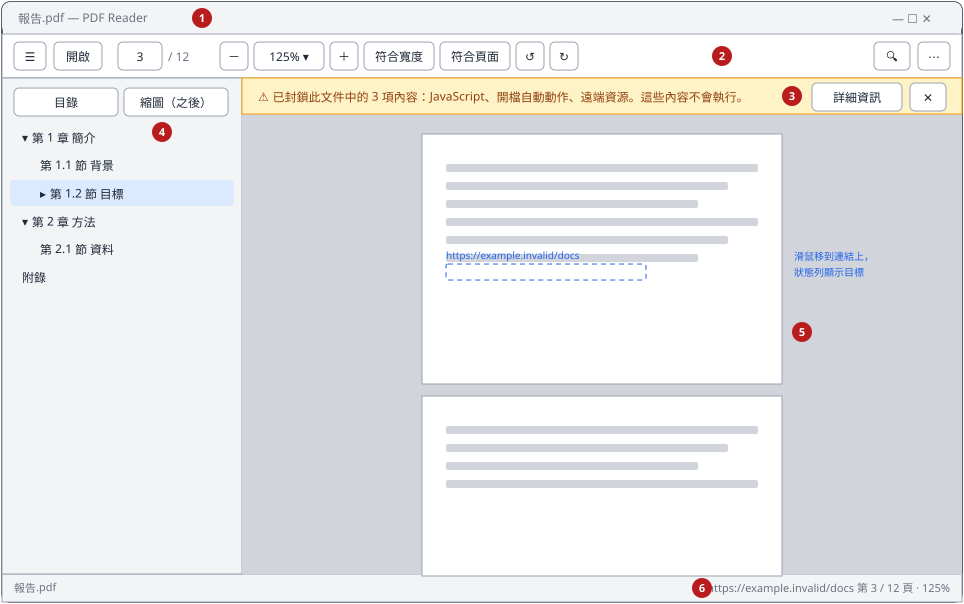
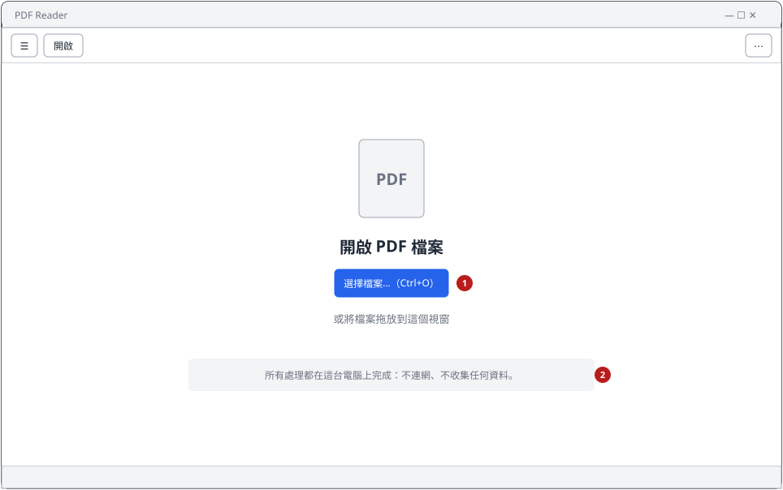
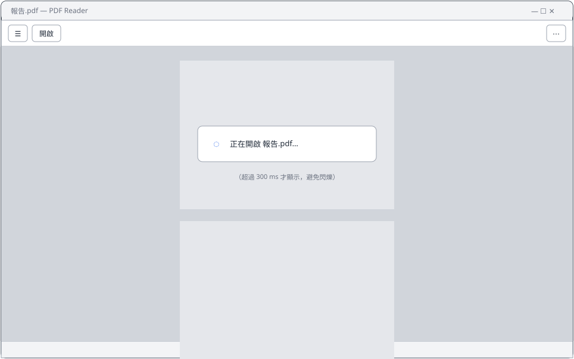
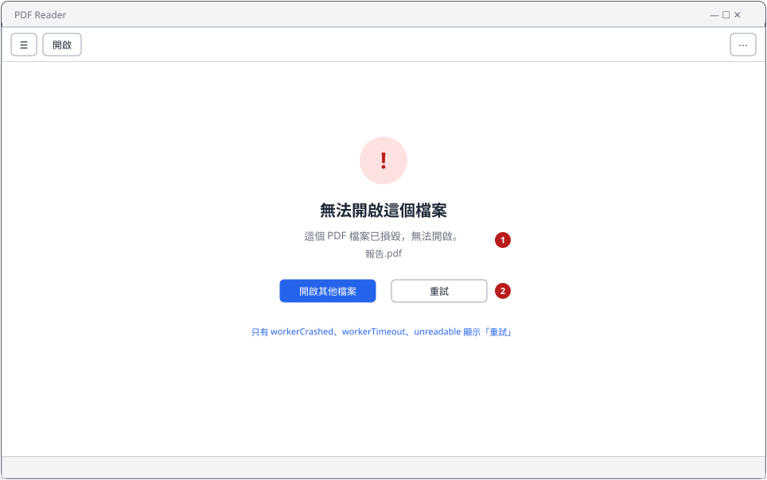
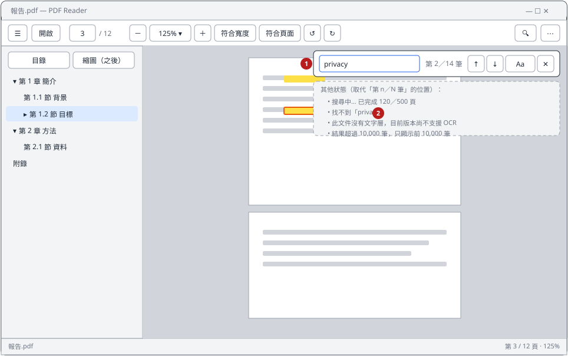
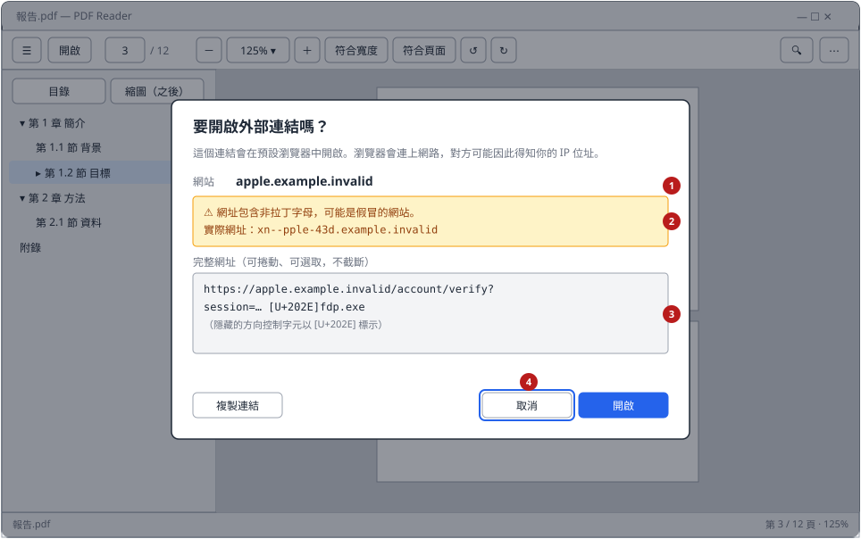
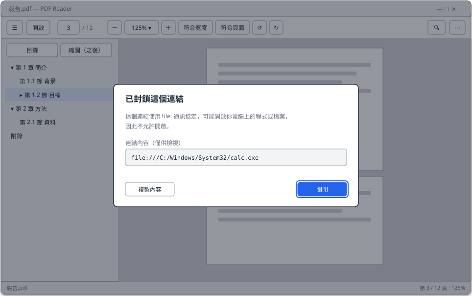
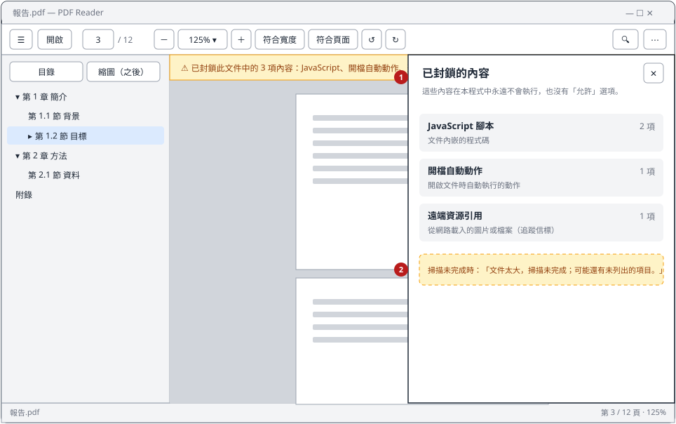
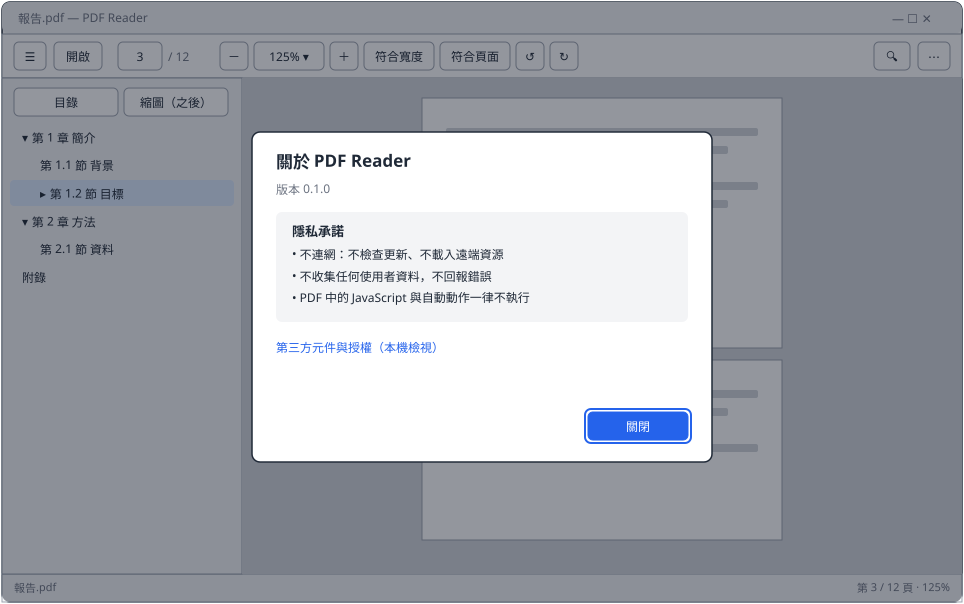

# 閱讀器畫面地圖與 UI 行為規格

對應工作卡 UX-01。MVP-05～MVP-12 的前端工作都以本文件為準；**需經負責人核准**。

- Wireframe 只呈現版面與文字，不代表視覺設計（顏色、圖示、字型之後再定）。
- Wireframe 由 [`wireframes/make_wireframes.py`](wireframes/make_wireframes.py) 產生：修改畫面時改腳本後重新執行，不要直接編輯 SVG。
- 所有使用者可見文字集中在「文字表」一節，實作時放進 `src/i18n/zh-TW.ts`，不得寫死在元件裡。

## 1. 主視窗

| # | 區域 | 內容與行為 | 實作卡 |
|---|---|---|---|
| 0 | 分頁列 | 有開啟檔案時出現在最上方。每個檔案一個分頁：檔名（太長時截斷，滑鼠停留顯示全名）；載入中顯示轉動圖示，開檔失敗顯示警告圖示。右側「＋」開啟檔案。✕ 或中鍵關閉分頁；關閉目前的分頁後顯示右邊的分頁，沒有就顯示左邊的。最多 20 個分頁。每個分頁記住自己的頁碼、縮放、旋轉、側欄與搜尋。 | MVP-14 |
| 1 | 標題列 | `<檔名> — PDF Reader`（目前分頁的檔名）；沒有開啟文件時只顯示 `PDF Reader`。只顯示檔名，不顯示路徑。 | MVP-05、14 |
| 2 | 工具列 | 左到右：側欄開關、開啟、頁碼輸入框／總頁數、縮小、縮放比例下拉、放大、符合寬度、符合頁面、逆時針旋轉、順時針旋轉；右側：搜尋、更多（⋯：設定、快捷鍵、關於）。沒有開啟文件時只顯示側欄開關、開啟、更多。每個圖示按鈕都有工具提示，內容包含快捷鍵。 | MVP-05、08 |
| 3 | 安全警示橫幅 | 文件含有已封鎖內容、或掃描未完成時才出現，位於工具列下方、頁面畫布上方。顯示摘要（最多列 3 類，其餘以「等」表示；數字是類別數，不是各類數量的總和，因為類別會重疊，例如頁面事件執行的腳本同時是「JavaScript」與「事件觸發動作」）與「詳細資訊」、關閉（✕）。沒有任何發現但掃描未完成時，摘要改為 scanIncomplete 的文字。關閉只對目前這份文件的這次開啟有效。 | MVP-11 |
| 3a | 未儲存變更的提示列 | 上一次執行留下這個檔案的未儲存變更時才出現（app 當機、被強制結束或斷電），位於工具列下方、安全警示橫幅上方。說明 recovery.available，按鈕 recovery.restore、recovery.discard、✕（recovery.later）；檔案在那之後被修改過時說明 recovery.stale，只有 recovery.discard 與 ✕。見「崩潰復原」。 | B2-13 |
| 4 | 側欄 | 預設寬 280 px，可拖曳調整為 200～480 px。分頁：「目錄」、「縮圖」。目前頁面所屬的目錄項目以底色標示。「縮圖」：每頁一張，寬 128 px、依頁面比例（很細長的頁面最高 256 px），下方標示頁碼；只渲染畫面附近的縮圖，在畫面上停留片刻才渲染；點擊跳到該頁；目前頁以強調色外框標示並保持在畫面內；`↑`／`↓` 在縮圖之間移動，`Enter` 跳到該頁。縮圖可以多選並變更頁面（見第 7 節「頁面管理」）。視窗寬度小於 960 px 時側欄改為浮動覆蓋，開啟後點畫布即關閉。 | MVP-05、09、18 |
| 5 | 頁面畫布 | 連續垂直捲動，頁與頁間距 12 px，水平置中；放大後比視窗寬時出現水平捲軸。尚未渲染的頁面顯示淺灰占位框（尺寸正確）。連結區域滑鼠游標變成手指，懸停時狀態列顯示目標。文字上方游標變成 I 字形，可以選取與複製文字；右鍵顯示 app 自己的功能表（見「選取與複製文字」）。 | MVP-07、08、12、15 |
| 6 | 狀態列 | 左：檔名；文件作者限制了複製或列印時，後面接著鎖頭圖示與 permissions.restricted（見「文件權限」）。右：連結懸停目標（見「連結」）或暫時的提示（沒有文字層、作者不允許複製或列印；螢幕閱讀器會讀出）、`第 n / N 頁 · 縮放%`。 | MVP-05、15、19 |

「目前頁」定義：與畫布垂直中線相交的頁面；若中線落在頁與頁之間，取上方那一頁。

## 2. 狀態

| 空狀態 | 載入中 | 錯誤 |
|---|---|---|
|  |  |  |

- **空狀態**：①「選擇檔案…（Ctrl+O）」是主要按鈕，啟動後焦點預設在它上面。② 隱私說明固定顯示。整個畫布都是拖放目標；拖曳進入時畫布邊框以強調色虛線標示。
- **最近開啟的檔案**（#73）：空狀態的拖放提示下方列出最近開啟的檔案，最新的在前，最多 20 筆；沒有時不顯示這一區。
  - 每一筆只顯示**檔名**（不顯示資料夾），按下以新分頁開啟；右側的 × 從清單移除。
  - 「清除清單」一鍵清除全部。
  - 檔案已經不在時顯示 recent.missing，並從清單移除。
  - 下方說明 recent.note。
  - 儲存方式見 [recent-files.md](../architecture/recent-files.md)。
- **不記錄此檔案**：開啟文件時，「⋯」選單有核取項目「不記錄此檔案」。勾選後這個檔案從清單移除，之後再開也不記錄；取消勾選後恢復記錄。
- **載入中**：開檔超過 300 ms 才顯示，避免快速開檔時閃爍。顯示頁面骨架與「正在開啟 <檔名>…」。
- **錯誤**：① 標題固定為「無法開啟這個檔案」，說明依錯誤碼（見文字表）。② 「開啟其他檔案」一律顯示；「重試」只在 `workerCrashed`、`workerTimeout`、`unreadable` 時顯示。
- **需要密碼**（MVP-16）：加密的檔案在它的分頁中顯示鎖頭圖示、「這份文件受密碼保護」、說明與密碼欄位（遮蔽輸入，焦點預設在欄位上），以及「解鎖」（欄位空白時停用）與「取消」。
  - `Enter` 或「解鎖」送出；送出後欄位立刻清空，分頁改為載入中。
  - 密碼不對時回到這個畫面，欄位下方以紅字顯示 password.wrong。
  - 「取消」關閉這個分頁。
  - 分頁列上這個分頁顯示鎖頭圖示。
  - 以憑證加密等不支援的方式時，顯示錯誤畫面與 unsupportedEncryption 的說明。
- **單頁渲染失敗**（MVP-07）：該頁占位框內顯示「這一頁無法顯示」與「重試」，其他頁面不受影響。

## 3. 搜尋

- ① `Ctrl+F` 開啟搜尋列（浮在畫布右上角），焦點移到輸入框並全選既有文字。輸入停止 250 ms 後自動搜尋；`Enter` 立即搜尋或跳到下一筆。
- 顯示「第 n／N 筆」。搜尋中改顯示進度；其他狀態見圖中虛線框與文字表。
- ② 所有結果以黃色標示，目前結果另加橘色外框；跳到結果時捲動讓它位於畫布垂直 1/3 處。
- `Aa` 切換區分大小寫（預設不區分）。
- 開始新搜尋、改文字、關閉搜尋列（`Esc`、✕）都會取消進行中的搜尋；關閉時清除標示，焦點回到畫布。輸入法組字中不搜尋。
- 查詢超過 1,024 bytes（UTF-8）時輸入框不接受更多字元（`LIMITS.maxQueryBytes`）。

## 4. 連結

| 類型 | 懸停時狀態列 | 點擊 |
|---|---|---|
| 內部（頁面） | `前往第 n 頁` | 直接跳頁，不詢問 |
| 外部 `http`／`https`／`mailto` | 完整 URL（過長時以 … 截斷，只限狀態列） | 開啟「外部連結確認」對話框 |
| 其他 scheme、Launch、GoToR、GoToE、UNC 等 | `已封鎖：<原因>` | 開啟「已封鎖的連結」對話框 |

跳頁後可以 `Alt+←` 回到跳頁前的位置（之後實作，MVP 不強制）。

### 外部連結確認

- ① 「網站」一行以粗體顯示主機名稱；有國際化網域（IDN）時顯示原樣。
- ② 主機名稱含非 ASCII 字元時顯示警示與 punycode 版本；網址含雙向控制字元（U+202A～U+202E、U+2066～U+2069）或其他控制字元時，以 `[U+XXXX]` 標示並顯示警示。兩種警示可同時出現。
- ③ 完整網址放在可捲動、可選取的等寬字型區塊，**絕不截斷**（最長 32,768 bytes）。
- ④ 按鈕：「複製連結」、「取消」、「開啟」。**預設焦點在「取消」**；`Esc` 等同取消；`Enter` 觸發目前焦點的按鈕。
- 「開啟」只會由主行程以連結 ID 交給系統瀏覽器（見 IPC 合約）；此對話框本身不做任何網路存取。
- 不提供「永遠信任此網域」。

### 已封鎖的連結

說明封鎖原因（見文字表），並以等寬字型顯示 PDF 提供的內容（僅供檢視，可複製）。只有「複製內容」與「關閉」兩個按鈕，沒有任何「仍要開啟」的選項。

## 5. 已封鎖內容明細

- 從安全警示橫幅的「詳細資訊」開啟，為畫布右側的面板（寬 380 px），`Esc` 或 ✕ 關閉。
- ① 每類內容一列：名稱、說明、數量（名稱與說明見文字表）。依文字表的順序排列。「網路共用路徑」（UNC）以警示色與圖示特別標示：在 Windows 上存取 UNC 路徑可能洩漏帳號雜湊。
- 開啟時焦點移到面板的 ✕；關閉後焦點回到「詳細資訊」按鈕。
- ② 掃描未完成（`scanComplete = false`）時在清單下方顯示提醒。
- **沒有「允許」或「執行」按鈕**（信任例外不在 MVP）。

## 6. 關於與設定

- 「關於」：版本、隱私承諾、第三方元件授權（本機檢視，不連網）。隱私承諾說明唯一的連網：使用者在設定中按下「檢查更新」時。
- 「設定」（B2-12）：「⋯」→「設定…」開啟對話框。變更立即套用並儲存，沒有「確定」按鈕。
  - **外觀**：跟隨系統（預設）／淺色／深色。與「⋯」選單的外觀是同一個設定，所有分頁共用，重新啟動後保留。
  - **最近開啟的檔案**：
    - 「記錄最近開啟的檔案」（預設開啟）：關閉時清除目前的清單，之後開啟的檔案都不記錄，「⋯」選單也不再有「不記錄此檔案」；
    - 「清除清單」、「清除『不記錄此檔案』的選擇」：完成後在下方說明（settings.listCleared、settings.exclusionsCleared）。
  - **更新**（#64，ADR 0009）：
    - settings.updatesNote 說明只在按下時查詢、不會自動下載或安裝，以及 GitHub 會看到 IP 位址與時間；
    - 「檢查更新」：每按一次向 GitHub 查詢一次，查詢期間停用。結果顯示在下方：settings.upToDate、settings.available、settings.noRelease 或 settings.checkFailed；
    - 有新版本時多一個「前往下載頁…」：與文件中的外部連結一樣，先顯示確認對話框（第 4 節）與完整網址，使用者確認後才交給瀏覽器開啟；網址固定為本專案的 GitHub Releases 頁面。
  - **這台電腦上保存的資料**：列出 settings.dataItems 與 settings.dataLocation。
  - 設定寫不進檔案時顯示 settings.saveFailed：仍然套用，但重新啟動後會回到之前的設定。
  - 保存方式見 [local-data.md](../architecture/local-data.md)。

## 7. 行為規格

### 縮放與旋轉（MVP-08）

- 級距：25、33、50、67、75、90、100、110、125、150、175、200、250、300、400、500、800 %。範圍 25～800 %。
- 「符合寬度」：頁面寬度（含左右各 16 px 邊距）等於畫布寬度；「符合頁面」：整頁可見。這兩個是模式，視窗大小改變時持續生效，直到使用者手動縮放。
- 開啟文件時預設「符合寬度」，但不超過 200 %。
- 縮放錨點：`Ctrl+滾輪` 以游標位置為錨點；按鈕與快捷鍵以畫布中心為錨點。
- 旋轉以 90° 為單位作用於整份文件的檢視，**不修改檔案**；關閉文件後不保留。

### 捲動

- 滾輪與觸控板：一般捲動；`PageDown`／`PageUp`：捲動一個畫布高度減 40 px；`Home`／`End`：第一頁頂端／最後一頁底端。
- 頁碼輸入框：輸入數字按 `Enter` 跳到該頁頂端；超出範圍時框線變紅並顯示「頁碼需介於 1 與 N 之間」，不跳頁。
- 開啟文件時從第一頁開始（MVP 不記住上次位置，避免留存閱讀紀錄）。

### 選取與複製文字（MVP-15）

- **選取**：
  - 在文字上按住拖曳；拖到畫布邊緣時自動捲動，可以跨行、跨頁；
  - 雙擊選取一個詞（中文依系統的斷詞），三擊選取一整行；雙擊或三擊後繼續拖曳，以詞或行為單位延伸；
  - `Shift`+點擊延伸目前的選取；
  - 在文字以外的地方按一下取消選取。
- **標示**：半透明藍色，與搜尋的黃色標示並存；縮放、旋轉後仍在文字上。每個分頁有自己的選取。
- **複製**：`Ctrl+C`，或在畫布上按右鍵選「複製」。
  - 每一行之間換行，跨頁也換行；
  - 控制字元、雙向文字控制與零寬字元不會被複製；
  - 焦點在文字欄位（搜尋框、頁碼）時，`Ctrl+C` 複製欄位中的文字；對話框裡的文字由 WebView 自己複製。
- **右鍵功能表**：開啟文件時，在畫布上按右鍵顯示 app 自己的功能表，取代 WebView 預設的功能表：「複製」（沒有選取時停用），以及註解的「螢光筆」與「在這裡新增附註…」（見「註解」）。
- **沒有文字層的頁面**（掃描件）不能選取；在上面拖曳時，狀態列顯示 text.noTextLayer 4 秒。
- **作者禁止複製**時仍可選取，但 `Ctrl+C` 不複製，狀態列顯示 permissions.copyBlocked 4 秒；右鍵「複製」停用，快捷鍵的位置改為 permissions.notAllowed。

### 列印（MVP-17）

- `Ctrl+P` 或「⋯」→「列印…」開啟 app 的列印對話框（沒有開啟文件時停用；`Ctrl+P` 不會印出 app 本身）。
- **範圍**：全部（預設）、目前頁，或頁碼（例如 `1-3, 5`，可用 `,`、`，`、`、` 或空白分隔，範圍用 `-` 或 `~`）。
  - 頁碼不在文件中時顯示 print.invalid；
  - 一次最多 300 頁，超過時顯示 print.tooMany。
- **繼續**：逐頁準備列印，對話框顯示 print.preparing 的進度，可以取消。準備好後開啟系統的列印對話框，在那裡選印表機、份數、直向／橫向。
- 列印時不套用檢視用的旋轉與縮放；每一頁依紙張大小等比例縮放，完整印在一張紙上。
- 做法與限制見 [printing.md](../architecture/printing.md)。

### 匯出（B2-04）

- 「⋯」→「匯出…」開啟匯出對話框（沒有開啟文件時停用；作者禁止複製時停用並標示 permissions.notAllowed）。
- **格式**：純文字（.txt，預設），或頁面圖片：PNG 或 JPG（#111），每頁一個檔案；解析度 72／150（預設）／300 dpi，兩種圖片共用，選純文字時停用。
- **頁面**：與列印相同的範圍（全部、目前頁、頁碼）；一次最多 1,000 頁，超過時顯示 export.tooMany。
- **匯出…**：主行程顯示系統的對話框：
  - 純文字：另存新檔，建議檔名 `<原檔名>.txt`，已存在時由對話框詢問是否取代；
  - 圖片：選擇資料夾，檔名是 `<原檔名>-p<頁碼>.png` 或 `.jpg`，已有同名檔案時以訊息方塊詢問是否覆寫。

  關閉系統的對話框時回到匯出對話框，可以再試。
- 匯出時顯示 export.progress，按「停止」在下一頁之前停止。
- 結束後關閉對話框，狀態列顯示 export.done 或 export.stopped 4 秒。
- 做法與限制見 [export.md](../architecture/export.md)。

### 隱私匯出（B2-03）

- 「⋯」→「隱私匯出…」（在「匯出…」之後）開啟說明對話框。沒有開啟文件時停用；加密的文件停用，並標示 privacyExport.encrypted。
- **對話框**：privacyExport.description，列出 privacyExport.removed（副本中會清除）與 privacyExport.kept（不會清除，分享前請自行檢查），以及 privacyExport.signatures。
- **選擇位置並匯出…**：主行程顯示系統的另存對話框，建議檔名 `<原檔名>（隱私匯出）.pdf`，已存在時由對話框詢問是否取代。
  - 選到原本的檔案時，以訊息方塊說明（PRIVACY_EXPORT_SAME_FILE_MESSAGE），再顯示一次另存對話框；
  - 關閉系統的對話框時回到說明對話框，可以再試；失敗時在對話框中顯示 privacyExport.failed。
- 完成後關閉對話框，狀態列顯示 privacyExport.done 4 秒。分頁仍然是原本的文件，副本不加入最近開啟的檔案。
- 做法與限制見 [privacy-export.md](../architecture/privacy-export.md)。

### 儲存（B2-02）

- 「⋯」→「儲存」（`Ctrl+S`）：沒有未儲存的變更時停用；「另存新檔…」（`Ctrl+Shift+S`）：有開啟的文件就可以用。沒有文件時 `Ctrl+S` 也不會讓 WebView 儲存網頁。
- 另存新檔由主行程顯示系統的另存對話框（建議原檔名；已存在時由對話框詢問是否取代）。關閉對話框什麼都不做。
- 成功：狀態列顯示 saving.saved 4 秒；已簽章的文件以附加的方式儲存，改顯示 saving.savedIncremental。另存之後分頁改用新檔名。
- 失敗：對話框 saving.failedTitle，說明原因（error.messages 的 readOnly、diskFull、fileInUse、changedOnDisk、unwritable）、saving.keptChanges，可能有幫助時加上 saving.trySaveAs 與「另存新檔…」按鈕。
- **未儲存的標示**：分頁名稱前有「•」（報讀 tabs.unsaved），視窗標題是「• 檔名 — PDF Reader」。
- **關閉前詢問**：
  - 關閉有未儲存變更的分頁（按鈕、`Ctrl+W`、中鍵）：saving.askTitle，說明 saving.askOne；按鈕「取消」、「不儲存」、「儲存」；
  - 關閉視窗時有未儲存的文件：saving.askMany 並列出檔名；按鈕「取消」、「不儲存」、「全部儲存」；
  - 儲存時顯示 saving.saving；失敗時在對話框中說明，分頁或視窗不關閉。
- 表單欄位輸入到一半時，儲存與另存新檔會先送出輸入的值（見下方「表單」）。
- 編輯的 UI 見下方「頁面管理」。做法與限制見 [saving.md](../architecture/saving.md)。

### 頁面管理（B2-05）

在側欄的「縮圖」中操作；存檔後才寫入檔案。

- **選取**：
  - 點擊選取一頁並跳到該頁；`Ctrl`＋點擊加選或取消，`Shift`＋點擊選取一段（都不跳頁）；
  - 鍵盤：`↑`／`↓`、`Home`／`End` 移動焦點，`Shift`＋方向鍵延伸選取，空白鍵加選或取消，`Ctrl+A` 全選，`Enter` 跳到該頁；
  - 選取的縮圖有底色；選取兩頁以上時，縮圖上方顯示 pages.selected。
- **右鍵功能表**（在沒有選取的縮圖上按右鍵，會先只選取它）：
  - pages.rotateCw、pages.rotateCcw：永久旋轉選取的頁面（與工具列只改變檢視的旋轉不同）；
  - pages.delete（`Delete`；沒有選取時，`Delete` 刪除有焦點的縮圖）：選取全部頁面時停用，按 `Delete` 則在縮圖上方顯示 pages.keepOne；
  - pages.insertBefore、pages.insertAfter：在第一個（或最後一個）選取的頁面前（或後）插入空白頁，大小與那一頁顯示的大小相同；
  - pages.moveTo：對話框 pages.move.title，輸入頁碼並選擇「之前／之後」；頁碼超出範圍時顯示 pages.move.outOfRange。
- **拖曳**：把選取的縮圖拖到兩張縮圖之間（以一條線標示位置），靠近清單上下緣時自動捲動；`Esc` 取消。拖曳沒有選取的縮圖時只移動它。
- **之後**：旋轉與移動的頁面仍保持選取，插入的空白頁被選取；刪除後不選取任何頁面。分頁標示未儲存（「•」）。
- **作者的權限**（MVP-19）：不允許組合文件與修改時，功能表的項目停用並標示 pages.notAllowed，`Delete` 與拖曳都不作用。
- 失敗時在縮圖上方顯示 pages.failed；未儲存的變更太多（最多 1,000 個編輯，崩潰復原日誌最大 4 MiB）時顯示 pages.saveFirst。
- **復原／重做**：`Ctrl+Z`／`Ctrl+Y`（或 `Ctrl+Shift+Z`），「⋯」→ menu.undo／menu.redo（不能用時停用）。回到存檔時的狀態後，分頁不再標示未儲存；存檔後不能復原到存檔之前。以密碼開啟的文件復原時，對話框 pages.undoPassword.title 再要一次密碼（pages.undoPassword.description）；密碼錯誤時顯示 pages.undoPassword.wrong，取消則不復原；重做不需要密碼。焦點在文字欄位時，這些鍵留給欄位。做法見 [page-management.md](../architecture/page-management.md)。

### 崩潰復原（B2-13）

app 在編輯途中當機、被強制結束或斷電時，下次開啟同一個檔案會出現提示列（主視窗 3a）。做法見 [crash-recovery.md](../architecture/crash-recovery.md)。

- recovery.restore：重新套用上次的變更；之後分頁標示未儲存，可以逐一復原。文件已經有這次的變更時，狀態列提示 recovery.ownChanges。
- recovery.discard：刪除上次的變更，不再提示。
- ✕（recovery.later）：關閉提示列，下次開啟這個檔案時再提示。
- 檔案在那之後被其他程式修改過時（recovery.stale），不能還原，只能捨棄或稍後再決定。
- 處理失敗時狀態列提示 recovery.failed。
- 以密碼開啟的文件，worker 崩潰後再輸入密碼時，變更自動重新套用，不顯示提示列。

### 註解（B2-07）

螢光筆與文字附註存成標準的 PDF 註解，其他閱讀器也看得到；不寫入作者、時間等可以識別使用者的資訊。做法見 [annotations.md](../architecture/annotations.md)。

- **螢光筆**：選取文字後，右鍵功能表的「annotations.highlight」展開四種顏色（黃、綠、藍、粉紅）；或按工具列的螢光筆按鈕，用上次的顏色（一開始是黃色）。
  - 沒有選取文字時，右鍵的項目與工具列的按鈕停用，按鈕的說明是 toolbar.highlightNeedsText；
  - 跨頁的選取是一個編輯，一次復原全部取消；
  - 標示之後選取清除。
- **附註**：在頁面上按右鍵，選「annotations.addNote」；對話框 annotations.noteDialog.addTitle，輸入內容後按「儲存」。空的顯示 annotations.noteDialog.empty，太長顯示 annotations.noteDialog.tooLong。在頁面以外按右鍵時，狀態列顯示 annotations.notOnPage。
- **選取註解**：
  - 頁面上每個註解（螢光筆、附註、文件原有的其他註解）有一個透明的輪廓，可以用 `Tab` 或點擊選取，選取時以虛線輪廓標示；
  - 選取的註解旁出現小工具列：螢光筆有四種顏色（目前的有外框）與刪除；附註顯示文字、「編輯附註…」與刪除；其他種類只有刪除；
  - `Delete` 刪除選取的註解，`Esc` 放開；在頁面上的其他地方點一下也放開；
  - 螢光筆下面的文字仍然可以選取。
- **作者不允許註解**時，上述的編輯都停用，右鍵的「新增附註」標示 permissions.notAllowed，工具列的按鈕說明 annotations.notAllowed；註解仍然顯示。
- 編輯失敗時，狀態列顯示 annotations.failed；未儲存的變更太多時顯示 pages.saveFirst。
- 沒有鍵盤快捷鍵（螢光筆可以從工具列的按鈕以鍵盤操作）。

### 表單（B2-09）

文件有表單（AcroForm）時，欄位直接顯示在頁面上，可以填寫。做法與限制見 [forms.md](../architecture/forms.md)。

- **欄位**：文字框（多行欄位是多行輸入框，密碼欄位顯示為圓點）、核取方塊、選項按鈕（同一群組只有一個停留點，方向鍵在群組內移動）、下拉選單（有些可以自己輸入）與清單方塊，位置與頁面上的欄位一致，縮放與旋轉時跟著移動。`Tab` 依頁面的順序在欄位之間移動，只用鍵盤就能填完整份表單。
- **送出的時機**：
  - 文字框在離開時（`Tab`、點別處）或按 `Enter`（多行欄位按 `Ctrl+Enter`）時送出，`Esc` 放棄剛輸入的；超過最大長度的字打不進去；
  - 核取方塊、選項按鈕、下拉選單與清單方塊在選擇的當下送出；
  - 之後分頁標示未儲存（「•」），可以用 `Ctrl+Z`／`Ctrl+Y` 一個值一個值復原與重做（焦點在文字框時，`Ctrl+Z` 是文字框自己的復原）；
  - 輸入到一半按 `Ctrl+S`、`Ctrl+Shift+S` 或關閉分頁，會先送出輸入的值；儲存之後焦點仍在原來的欄位，可以接著輸入；關閉分頁時照常詢問是否儲存。直接關閉視窗（標題列的 ✕）不會，見 forms.md 的「已知限制」。
- **必填欄位**空著時有紅色外框。
- **唯讀欄位**與作者不允許填寫表單（MVP-19）：欄位只能看（文字框仍可選取與複製），滑鼠停留時說明原因（forms.readOnly、forms.notAllowed）；「扁平化表單…」停用並標示 permissions.notAllowed。
- **有腳本的欄位**：進入欄位時，狀態列顯示 forms.scriptNotRun 4 秒；欄位仍可填寫，腳本不會執行（自動計算、格式化與檢查都沒有作用）。
- 填寫失敗時，欄位回到原來的值，狀態列顯示 forms.failed；未儲存的變更太多時顯示 pages.saveFirst。
- **扁平化**：「⋯」→ forms.flatten（只在文件有表單時出現）；對話框 forms.flattenDialog.title 說明欄位會成為頁面的一部分、可以復原；按 forms.flattenDialog.confirm 後立刻顯示另存新檔的對話框（原檔不變）。有簽章的文件不能扁平化（forms.flattenFailed）。扁平化之後頁面上沒有欄位，選單裡也不再有這個項目。

### 文件權限（MVP-19）

加密的 PDF 可以限制複製與列印，app 比照 Adobe Acrobat 遵守（[encryption.md](../architecture/encryption.md)「權限」）。

| 作者的限制 | 畫面 |
|---|---|
| 禁止複製 | 見上方「選取與複製文字」 |
| 禁止列印 | 「⋯」→「列印…」停用，快捷鍵的位置改為 permissions.notAllowed；`Ctrl+P` 在狀態列顯示 permissions.printBlocked 4 秒 |
| 只允許低解析度列印 | 列印對話框多一行 permissions.lowResNote；頁面以 150 dpi 列印 |

狀態列在檔名後面列出所有限制，例如「已限制：不可複製、不可列印」。

### 快捷鍵

依 Windows 與常見 PDF 閱讀器的慣例；`Ctrl+/` 開啟快捷鍵說明。

| 動作 | 快捷鍵 |
|---|---|
| 開啟檔案 | `Ctrl+O`（對話框可以選多個檔案，每個一個分頁） |
| 儲存／另存新檔 | `Ctrl+S`／`Ctrl+Shift+S` |
| 復原／重做 | `Ctrl+Z`／`Ctrl+Y`（或 `Ctrl+Shift+Z`）；焦點在文字欄位時是欄位自己的復原 |
| 關閉分頁 | `Ctrl+W`（有未儲存的變更時先詢問） |
| 複製選取的文字 | `Ctrl+C`（焦點在文字欄位時複製欄位中的文字） |
| 列印 | `Ctrl+P` |
| 下一個／上一個分頁 | `Ctrl+Tab`（或 `Ctrl+PageDown`）／`Ctrl+Shift+Tab`（或 `Ctrl+PageUp`）；焦點在分頁列時用 `←`／`→`、`Home`／`End` |
| 搜尋 | `Ctrl+F` |
| 下一筆／上一筆結果 | `Enter`／`Shift+Enter`（搜尋列中）；`F3`／`Shift+F3`（任何時候） |
| 放大／縮小 | `Ctrl+=`（或 `Ctrl++`）／`Ctrl+-`；`Ctrl+滾輪` |
| 符合頁面／實際大小（100%）／符合寬度 | `Ctrl+0`／`Ctrl+1`／`Ctrl+2` |
| 順時針／逆時針旋轉 | `Ctrl+]`／`Ctrl+[` |
| 跳到頁碼 | `Ctrl+G`（焦點移到頁碼輸入框） |
| 第一頁／最後一頁 | `Home`／`End`（焦點在縮圖時：第一張／最後一張縮圖） |
| 刪除選取的頁面 | `Delete`（焦點在縮圖時） |
| 全選頁面 | `Ctrl+A`（焦點在縮圖時） |
| 開關側欄 | `F4` |
| 在區域間移動焦點 | `F6`／`Shift+F6`（工具列 → 橫幅 → 側欄 → 畫布） |
| 關閉對話框、面板、搜尋列 | `Esc` |
| 快捷鍵說明 | `Ctrl+/` |

焦點在文字輸入框時，只保留 `Ctrl` 組合鍵與 `Esc`，其他單鍵快捷鍵不作用；下拉選單與清單方塊也一樣（單鍵用來選擇選項）。

### 右鍵

WebView 預設的右鍵功能表（重新整理、另存新檔、列印網頁等）不出現。文字欄位（搜尋框、頁碼）保留原生功能表，可以剪下、複製、貼上。

### 焦點與無障礙

- `Tab` 順序：工具列（左到右）→ 安全警示橫幅 → 側欄 → 畫布 → 搜尋列（開啟時）。
- 所有互動元件都能只用鍵盤操作；焦點框清楚可見（2 px 強調色外框）。
- 圖示按鈕都有可讀名稱（`aria-label`）；點擊區至少 32 × 32 px。
- 對話框開啟時焦點鎖在對話框內，關閉後回到觸發它的元件。
- 文字對比符合 WCAG AA；尊重系統的「減少動態效果」設定。
- 目錄樹以方向鍵操作：`↑`／`↓` 移動、`→` 展開／進入子項、`←` 收合／回到父項、`Enter` 跳頁。

### 深色模式

- 預設跟隨系統；設定可改為固定淺色或深色。
- 深色模式只改介面與畫布背景，**頁面內容照原樣顯示**（不反色）。

### 視窗

- 最小 800 × 600；預設 1200 × 800。寬度 800～2560 px 版面都不能破（MVP-05 驗收）。

## 8. 文字表

以下文字實作時放進 `src/i18n/zh-TW.ts`。`<…>` 為變數。

### 一般

| 鍵 | 文字 |
|---|---|
| appName | PDF Reader |
| emptyTitle | 開啟 PDF 檔案 |
| emptyOpenButton | 選擇檔案…（Ctrl+O） |
| emptyDropHint | 或將檔案拖放到這個視窗 |
| privacyNote | 所有處理都在這台電腦上完成：不會自行連網、不收集任何資料。 |
| recent.title | 最近開啟的檔案 |
| recent.remove | 從清單移除「<檔名>」 |
| recent.clear | 清除清單 |
| recent.missing | 找不到「<檔名>」，已從清單移除。 |
| recent.failed | 無法開啟這個檔案，請再試一次。 |
| recent.note | 清單只顯示檔名；完整路徑只存在這台電腦上的 app 資料中。 |
| menu.dontRecord | 不記錄此檔案 |
| loading | 正在開啟 <檔名>… |
| pageStatus | 第 <n> / <N> 頁 · <縮放>% |
| pageOutOfRange | 頁碼需介於 1 與 <N> 之間 |
| pageRenderFailed | 這一頁無法顯示 |
| retry | 重試 |
| openAnother | 開啟其他檔案 |
| errorTitle | 無法開啟這個檔案 |

### 錯誤訊息（依 `ErrorCode`）

| ErrorCode | 文字 |
|---|---|
| unknownDocument | 文件已關閉，請重新開啟。 |
| invalidArgument | 發生內部錯誤（參數不正確）。 |
| cancelled | （不顯示） |
| notPdf | 這不是 PDF 檔案。 |
| corrupted | 這個 PDF 檔案已損毀，無法開啟。 |
| encrypted | 這份文件需要密碼才能開啟。 |
| unsupportedEncryption | 這份文件使用本程式不支援的加密方式（例如以憑證加密），無法開啟。 |
| unreadable | 無法讀取這個檔案，請確認檔案存在且你有存取權限。 |
| tooLarge | 檔案太大，無法開啟。 |
| limitExceeded | 內容超過可處理的上限，部分內容可能無法顯示。 |
| workerCrashed | PDF 引擎發生錯誤，已重新啟動。 |
| workerTimeout | PDF 引擎沒有回應，已重新啟動。 |
| protocolViolation | PDF 引擎回傳了無效的資料，已停止處理這份文件。 |
| internal | 發生未預期的錯誤。 |

### 搜尋

| 鍵 | 文字 |
|---|---|
| searchPlaceholder | 搜尋文件 |
| searchCount | 第 <n>／<N> 筆 |
| searchProgress | 搜尋中… 已完成 <已搜尋頁數>／<總頁數> 頁 |
| searchNoResults | 找不到「<查詢>」 |
| searchNoTextLayer | 此文件沒有文字層，目前版本尚不支援 OCR |
| searchTruncated | 結果超過 <上限> 筆，只顯示前 <上限> 筆 |
| searchFailed | 搜尋失敗，請再試一次。 |
| searchCaseSensitive | 區分大小寫 |

### 目錄

| 鍵 | 文字 |
|---|---|
| outlineTab | 目錄 |
| thumbnailsTab | 縮圖 |
| outlineEmpty | 這份文件沒有目錄 |
| outlineLoading | 正在讀取目錄… |
| outlineFailed | 無法讀取這份文件的目錄 |
| outlineTruncated | 目錄項目過多或層級過深，只顯示部分內容 |
| outlineExpand／outlineCollapse | 展開／收合（展開鈕的可讀名稱） |
| outlineExternalLink | 外部連結（指向網址的目錄項目上的圖示） |
| outlineBlockedAction | 已封鎖的動作（指向其他檔案、程式或腳本的目錄項目上的圖示） |

### 連結

| 鍵 | 文字 |
|---|---|
| linkHoverPage | 前往第 <n> 頁 |
| linkHoverBlocked | 已封鎖：<原因> |
| linkConfirmTitle | 要開啟外部連結嗎？ |
| linkConfirmBody | 這個連結會在預設瀏覽器中開啟。瀏覽器會連上網路，對方可能因此得知你的 IP 位址。 |
| linkConfirmHost | 網站 |
| linkConfirmFullUrl | 完整網址 |
| linkWarnIdn | 網址包含非拉丁字母，可能是假冒的網站。實際網址：<punycode 主機> |
| linkWarnControl | 網址包含會改變文字顯示方向的隱藏字元，已以 [U+XXXX] 標示。 |
| linkCopy | 複製連結 |
| linkCancel | 取消 |
| linkOpen | 開啟 |
| linkBlockedTitle | 已封鎖這個連結 |
| linkBlockedContent | 連結內容（僅供檢視） |
| linkBlockedCopy | 複製內容 |
| close | 關閉 |

封鎖原因（`linkHoverBlocked` 的 `<原因>` 與對話框說明）：

| 情況 | 狀態列 | 對話框說明 |
|---|---|---|
| `file:` | 本機檔案連結 | 這個連結使用 file: 通訊協定，可能開啟你電腦上的程式或檔案，因此不允許開啟。 |
| `javascript:` | 腳本連結 | 這個連結會執行程式碼，因此不允許開啟。 |
| `smb:`、UNC（`\\伺服器\…`） | 網路共用路徑 | 這個連結指向網路共用資料夾，Windows 可能因此自動傳送你的帳號資訊，因此不允許開啟。 |
| 其他 scheme（`ms-*`、`search-ms:`、`data:` 等） | 不支援的連結類型 | 這個連結會交給其他程式處理，可能被用來啟動程式，因此不允許開啟。 |
| Launch | 啟動外部程式 | 這個連結會啟動電腦上的程式，因此不允許開啟。 |
| GoToR | 開啟其他文件 | 這個連結會開啟其他檔案或網路位置，因此不允許開啟。 |
| GoToE | 開啟內嵌文件 | 這個連結會開啟文件內嵌的其他文件，目前版本不支援。 |
| SubmitForm | 表單傳送 | 這個連結會把表單內容送到網路或其他位置，因此不允許開啟。 |
| ImportData | 匯入外部資料 | 這個連結會從其他檔案讀取資料，因此不允許開啟。 |

### 已封鎖內容

| 鍵 | 文字 |
|---|---|
| bannerSummary | 已封鎖此文件中的 <類別數> 項內容：<類別 1>、<類別 2>、<類別 3>（等）。這些內容不會執行。 |
| bannerDetails | 詳細資訊 |
| detailsTitle | 已封鎖的內容 |
| detailsNote | 這些內容在本程式中永遠不會執行，也沒有「允許」選項。 |
| detailsCount | <n> 項 |
| detailsClose | 關閉已封鎖的內容（✕ 的無障礙名稱） |
| scanIncomplete | 文件太大，掃描未完成；可能還有未列出的項目。 |

依以下順序顯示（`FindingKind` → 名稱／說明）：

| FindingKind | 名稱 | 說明 |
|---|---|---|
| javaScript | JavaScript 腳本 | 文件內嵌的程式碼 |
| openAction | 開檔自動動作 | 開啟文件時自動執行的動作 |
| additionalActions | 事件觸發動作 | 開啟頁面、輸入欄位等時機自動執行的動作 |
| launch | 啟動外部程式 | 會開啟電腦上其他程式的動作 |
| submitForm | 表單傳送 | 把表單內容送到網路或其他位置 |
| importData | 匯入外部資料 | 從其他檔案讀取資料到表單 |
| remoteGoTo | 開啟其他文件 | 連到其他檔案或網路位置的文件 |
| embeddedGoTo | 開啟內嵌文件 | 開啟文件內嵌的其他文件 |
| remoteFileSpec | 遠端資源引用 | 從網路載入的圖片或檔案（可能用來追蹤開啟時間與 IP） |
| uncReference | 網路共用路徑 | 指向 `\\伺服器` 的路徑，Windows 可能自動傳送帳號資訊 |
| xfa | XFA 動態表單 | 舊式動態表單，可能包含腳本與網路傳送 |
| richMedia | 多媒體內容 | 內嵌的影片、音訊或互動元件 |
| embeddedFile | 內嵌附件 | 文件夾帶的其他檔案（不會自動開啟） |

### 關於與設定

| 鍵 | 文字 |
|---|---|
| aboutTitle | 關於 PDF Reader |
| aboutVersion | 版本 <版本> |
| aboutPrivacyTitle | 隱私承諾 |
| aboutPrivacy1 | 不會自行連網：只有在設定中按下「檢查更新」時，才向 GitHub 查詢最新的版本號碼；不載入遠端資源 |
| aboutPrivacy2 | 不收集任何使用者資料，不回報錯誤 |
| aboutPrivacy3 | PDF 中的 JavaScript 與自動動作一律不執行 |
| aboutLicenses | 第三方元件與授權 |
| settingsAppearance | 外觀 |
| settingsSystem | 跟隨系統 |
| settingsLight | 淺色 |
| settingsDark | 深色 |
| menu.settings | 設定… |
| settings.title | 設定 |
| settings.description | 變更會立即套用並儲存在這台電腦上。 |
| settings.recent | 最近開啟的檔案 |
| settings.record | 記錄最近開啟的檔案 |
| settings.recordNote | 關閉時也會清除目前的清單，之後開啟的檔案都不會記錄。 |
| settings.clearList | 清除清單 |
| settings.listCleared | 已清除最近開啟的檔案。 |
| settings.clearExclusions | 清除「不記錄此檔案」的選擇 |
| settings.exclusionsCleared | 之前選擇不記錄的檔案，之後開啟時會再記錄。 |
| settings.failed | 無法完成，請再試一次。 |
| settings.dataTitle | 這台電腦上保存的資料 |
| settings.dataItems | 最近開啟的檔案：完整路徑，只在這台電腦上；畫面只顯示檔名／設定：外觀、是否記錄最近開啟的檔案／畫面元件（WebView2）的暫存資料 |
| settings.dataLocation | 全部都在 %LOCALAPPDATA%\io.github.winner0988.pdfreader 資料夾中，不會同步到其他電腦，也不會上傳。關閉 app 後可以直接刪除這個資料夾。 |
| settings.saveFailed | 設定無法儲存：目前已套用，但重新啟動後會回到之前的設定。 |
| settings.updates | 更新 |
| settings.updatesNote | 只在你按下時向 GitHub 查詢最新的版本號碼，不會自動下載或安裝。GitHub 會看到你的 IP 位址與查詢的時間。 |
| settings.checkUpdates | 檢查更新 |
| settings.checking | 正在向 GitHub 查詢… |
| settings.upToDate | 已是最新版本（<目前版本>）。 |
| settings.available | 有新版本 <最新版本>（目前是 <目前版本>）。 |
| settings.noRelease | GitHub 上還沒有任何發行版本。 |
| settings.checkFailed | 無法檢查更新，請確認網路連線後再試一次。 |
| settings.openReleases | 前往下載頁… |
| menu.setDefault | 設為預設 PDF 閱讀器 |
| defaultApp.failedTitle | 無法開啟 Windows 設定 |
| defaultApp.failedHelp | 請手動開啟：設定 → 應用程式 → 預設應用程式，搜尋「PDF Reader」，再把 .pdf 設為用它開啟。 |

### 分頁

| 鍵 | 文字 |
|---|---|
| tabs.label | 已開啟的文件 |
| tabs.open | 開啟檔案 |
| tabs.close | 關閉「<檔名>」 |
| tabs.loading | （正在開啟） |
| tabs.failed | （無法開啟） |
| tabs.locked | （需要密碼） |
| tabs.tabLimit | 最多同時開啟 <上限> 份文件，有 <數量> 個檔案沒有開啟。 |

### 選取與複製文字

| 鍵 | 文字 |
|---|---|
| text.copy | 複製 |
| text.noTextLayer | 這一頁沒有文字層，無法選取文字（目前版本尚不支援 OCR） |
| shortcuts.descriptions.copy | 複製選取的文字 |

### 需要密碼（MVP-16）

| 鍵 | 文字 |
|---|---|
| password.title | 這份文件受密碼保護 |
| password.description | 輸入密碼以開啟「<檔名>」。密碼只用來開啟這份文件，不會被儲存。 |
| password.label | 密碼 |
| password.submit | 解鎖 |
| password.cancel | 取消 |
| password.wrong | 密碼不正確，請再試一次。 |

### 列印（MVP-17）

| 鍵 | 文字 |
|---|---|
| menu.print | 列印… |
| shortcuts.descriptions.print | 列印 |
| print.title | 列印 |
| print.note | 先選要列印的頁面；印表機、份數與直向／橫向在下一步的列印對話框中選擇。 |
| print.range | 列印範圍 |
| print.all | 全部（<N> 頁） |
| print.current | 目前頁（第 <n> 頁） |
| print.pages | 頁碼 |
| print.pagesPlaceholder | 例如 1-3, 5 |
| print.next | 繼續 |
| print.cancel | 取消 |
| print.invalid | 請輸入 1 到 <N> 之間的頁碼，例如 1-3, 5 |
| print.tooMany | 一次最多列印 <上限> 頁，請分次列印。 |
| print.preparing | 正在準備列印…（<n>／<N> 頁） |
| print.failed | 有頁面無法準備列印，請再試一次。 |

### 匯出（B2-04）

| 鍵 | 文字 |
|---|---|
| menu.export | 匯出… |
| export.title | 匯出 |
| export.note | 檔案只在這台電腦上產生；按「匯出…」後選擇存放的位置。 |
| export.format | 格式 |
| export.text | 純文字（.txt） |
| export.png | 頁面圖片（PNG，每頁一個檔案） |
| export.jpg | 頁面圖片（JPG，每頁一個檔案，檔案較小） |
| export.resolution | 解析度 |
| export.dpi | <dpi> dpi |
| export.range | 頁面 |
| export.tooMany | 一次最多匯出 <上限> 頁，請分次匯出。 |
| export.start | 匯出… |
| export.cancel | 取消 |
| export.stop | 停止 |
| export.progress | 正在匯出…（<n>／<N> 頁） |
| export.done | 已匯出 <N> 頁。 |
| export.stopped | 已停止，已匯出 <n> 頁。 |
| export.failed | 匯出失敗，請再試一次。 |
| EXPORT_TEXT_DIALOG_TITLE（主行程） | 匯出純文字 |
| TEXT_FILTER_NAME（主行程） | 純文字檔 |
| EXPORT_IMAGES_DIALOG_TITLE（主行程） | 選擇匯出頁面圖片的資料夾 |
| OVERWRITE_TITLE（主行程） | 檔案已經存在 |

### 頁面管理（B2-05）

| 鍵 | 文字 |
|---|---|
| pages.selected | 已選取 <N> 頁 |
| pages.rotateCw／pages.rotateCcw | 向右旋轉 90°／向左旋轉 90° |
| pages.delete | 刪除 |
| pages.insertBefore／pages.insertAfter | 在前面插入空白頁／在後面插入空白頁 |
| pages.moveTo | 移到… |
| pages.notAllowed | 文件作者不允許變更頁面 |
| pages.keepOne | 至少要留下一頁，無法刪除全部頁面 |
| pages.failed | 無法變更頁面，請再試一次。 |
| pages.saveFirst | 未儲存的變更太多，請先存檔再繼續編輯。 |
| pages.undoPassword.title | 輸入密碼以復原 |
| pages.undoPassword.description | 這份文件以密碼開啟。復原要重新開啟文件，所以需要再輸入一次密碼；密碼用完即清除，不會保留。 |
| pages.undoPassword.label／confirm／cancel | 密碼／復原／取消 |
| pages.undoPassword.wrong | 密碼不正確，請再試一次。 |
| menu.undo／menu.redo | 復原／重做 |
| pages.move.title | 移動頁面 |
| pages.move.description | 將選取的 <N> 頁移到： |
| pages.move.page | 頁碼 |
| pages.move.before／pages.move.after | 之前／之後（pages.move.position：位置，選項組的可讀名稱） |
| pages.move.outOfRange | 頁碼需介於 1 與 <總頁數> 之間 |
| pages.move.confirm／pages.move.cancel | 移動／取消 |

### 註解（B2-07）

| 鍵 | 文字 |
|---|---|
| annotations.highlight | 螢光筆 |
| annotations.colors.* | 黃色、綠色、藍色、粉紅色 |
| annotations.highlightIn(color) | 螢光筆標示（<顏色>）（頁面上輪廓與工具列的名稱） |
| annotations.noteSaying(text) | 附註：<文字> |
| annotations.kind.highlight／note／other | 螢光筆標示／附註／註解 |
| annotations.addNote | 在這裡新增附註… |
| annotations.editNote | 編輯附註… |
| annotations.delete | 刪除註解 |
| annotations.notAllowed | 文件作者不允許變更註解 |
| annotations.failed | 無法變更註解，請再試一次。 |
| annotations.tooMuch | 選取的範圍太大，請分段標示。 |
| annotations.notOnPage | 請在頁面上按右鍵，才能新增附註。 |
| annotations.noteDialog.addTitle／editTitle | 新增附註／編輯附註 |
| annotations.noteDialog.label | 附註內容 |
| annotations.noteDialog.save／cancel | 儲存／取消 |
| annotations.noteDialog.empty | 請輸入附註內容。 |
| annotations.noteDialog.tooLong | 附註太長了，請縮短一些。 |
| toolbar.highlight(color) | 螢光筆（<顏色>） |
| toolbar.highlightNeedsText | 螢光筆：先選取文字 |

### 崩潰復原（B2-13）

| 鍵 | 文字 |
|---|---|
| recovery.label | 上次未儲存的變更（提示列的可讀名稱） |
| recovery.available | 上次編輯這個檔案時，變更還沒儲存程式就結束了。要還原這些變更嗎？ |
| recovery.stale | 上次編輯這個檔案時，變更還沒儲存程式就結束了；之後這個檔案被修改過，所以無法還原。 |
| recovery.restore／recovery.discard／recovery.later | 還原變更／捨棄變更／稍後再決定 |
| recovery.ownChanges | 請先復原目前的變更，再還原上次的變更。 |
| recovery.failed | 無法處理上次的變更，請再試一次。 |

### 隱私匯出（B2-03）

| 鍵 | 文字 |
|---|---|
| menu.privacyExport | 隱私匯出… |
| privacyExport.title | 隱私匯出 |
| privacyExport.description | 另存一份清除中繼資料的副本，方便分享。原本的檔案不會改變。 |
| privacyExport.removedTitle | 副本中會清除 |
| privacyExport.removed | 文件資訊：作者、標題、主旨、關鍵字、建立與修改的程式、日期／XMP 中繼資料：文件、頁面、圖片等各處的（可能含有 GPS 位置）／應用程式的私有資料、頁面縮圖與修改時間／註解的作者與日期（註解本身保留）／文件識別碼：換成新的亂數 |
| privacyExport.keptTitle | 不會清除（分享前請自行檢查） |
| privacyExport.kept | 頁面上的文字與圖片，以及註解的內容／圖片本身的 EXIF（例如相片中的 GPS 位置）／附加的檔案、表單欄位的值、書籤 |
| privacyExport.signatures | 副本中的數位簽章會失效。 |
| privacyExport.start | 選擇位置並匯出… |
| privacyExport.cancel | 取消 |
| privacyExport.running | 正在匯出… |
| privacyExport.done | 已匯出隱私副本。 |
| privacyExport.failed | 隱私匯出失敗，請再試一次。 |
| privacyExport.encrypted | 加密的文件不適用 |
| PRIVACY_EXPORT_DIALOG_TITLE（主行程） | 隱私匯出：選擇副本的位置 |
| privacy_export_file_name（主行程） | <原檔名>（隱私匯出）.pdf |
| PRIVACY_EXPORT_SAME_FILE_TITLE（主行程） | 請選擇其他檔案 |
| PRIVACY_EXPORT_SAME_FILE_MESSAGE（主行程） | 隱私匯出會產生一份副本，不會改動原本的檔案。請選擇原檔以外的位置或檔名。 |
| overwrite_message（主行程） | 這個資料夾已經有 <N> 個同名的檔案。要覆寫嗎？ |
| NO_TEXT_LAYER_PAGE（主行程，寫在文字檔中） | （此頁沒有文字層） |

### 儲存（B2-02）

| 鍵 | 文字 |
|---|---|
| menu.save | 儲存 |
| menu.saveAs | 另存新檔… |
| tabs.unsaved | （有未儲存的變更） |
| saving.saved | 已儲存。 |
| saving.savedIncremental | 已儲存。為了保留數位簽章，變更附加在檔案後面：刪除的內容仍會留在檔案中。 |
| saving.failedTitle | 無法儲存 |
| saving.keptChanges | 變更仍保留在這裡，沒有遺失。 |
| saving.trySaveAs | 可以改用「另存新檔」存成另一個檔案。 |
| saving.saveAs | 另存新檔… |
| saving.ok | 確定 |
| saving.askTitle | 要儲存變更嗎？ |
| saving.askOne | 「<檔名>」有尚未儲存的變更。 |
| saving.askMany | 有 <N> 份文件的變更尚未儲存： |
| saving.save | 儲存 |
| saving.saveAll | 全部儲存 |
| saving.discard | 不儲存 |
| saving.cancel | 取消 |
| saving.saving | 正在儲存… |
| error.messages.readOnly | 檔案或它所在的資料夾是唯讀的，無法寫入。 |
| error.messages.diskFull | 磁碟空間不足，無法寫入。 |
| error.messages.fileInUse | 檔案正被其他程式使用，無法寫入。 |
| error.messages.changedOnDisk | 檔案在開啟後被其他程式修改過；為了不覆寫那些修改，沒有儲存。 |
| error.messages.unwritable | 無法寫入檔案。 |
| SAVE_AS_DIALOG_TITLE（主行程） | 另存新檔 |
| window_title（主行程，有未儲存的變更時） | • <檔名> — PDF Reader |

### 表單（B2-09）

| 鍵 | 文字 |
|---|---|
| forms.scriptNotRun | 這個欄位有腳本（自動計算、格式化或檢查），本程式不會執行它。 |
| forms.notAllowed | 文件作者不允許填寫表單 |
| forms.readOnly | 這個欄位是唯讀的 |
| forms.failed | 無法填寫這個欄位，請再試一次。 |
| forms.choice(group, choice) | <群組>：<選擇>（選項按鈕的可讀名稱） |
| forms.flatten | 扁平化表單… |
| forms.flattenFailed | 無法扁平化表單（有簽章的文件不能扁平化）。 |
| forms.flattenDialog.title | 扁平化表單 |
| forms.flattenDialog.description | 欄位目前填的內容會成為頁面的一部分，之後不能再修改，也不再有表單欄位。可以用「復原」（Ctrl+Z）取消；也可以另存新檔，保留原來的檔案。 |
| forms.flattenDialog.confirm／forms.flattenDialog.cancel | 扁平化並另存新檔…／取消 |

### 文件權限（MVP-19）

| 鍵 | 文字 |
|---|---|
| permissions.restricted | 已限制：<限制，以「、」分隔> |
| permissions.noCopy | 不可複製 |
| permissions.noPrint | 不可列印 |
| permissions.lowResPrint | 只能低解析度列印 |
| permissions.notAllowed | 作者不允許 |
| permissions.copyBlocked | 文件作者不允許複製此文件的文字 |
| permissions.printBlocked | 文件作者不允許列印此文件 |
| permissions.lowResNote | 文件作者只允許低解析度列印：頁面會以 <dpi> dpi 列印。 |

### 主行程的原生對話框

這些文字由主行程自己顯示，放在 `src-tauri/src/strings.rs`。

| 鍵 | 文字 |
|---|---|
| OPEN_DIALOG_TITLE | 開啟 PDF 檔案 |
| PDF_FILTER_NAME | PDF 檔案 |
| window_title | `<檔名> — PDF Reader`；沒有開啟文件時為 `PDF Reader` |
| WEBVIEW2_MISSING_TITLE | 無法開啟 PDF Reader |
| WEBVIEW2_MISSING_MESSAGE | 這台電腦缺少 Microsoft Edge WebView2 Runtime，PDF Reader 需要它才能顯示畫面。（空一行）Windows 11 已內建 WebView2。如果它被移除了，請到 Microsoft 官方網站下載並安裝「WebView2 Runtime」，然後再開啟 PDF Reader：https://developer.microsoft.com/microsoft-edge/webview2/（空一行）PDF Reader 不會自行下載任何東西。 |

## 9. 驗收截圖清單

各卡片的 PR 必須附上下列截圖（淺色與深色各一張，除非另外註明；截圖中不得有私人內容，一律使用 `tests/corpus/`）。

| 卡片 | 截圖 |
|---|---|
| MVP-05 | 空狀態、載入中、錯誤（損毀）、已開啟（假資料）；工具列有鍵盤焦點的畫面；視窗寬 800 px 與 2560 px 各一張（淺色即可） |
| MVP-06 | 以對話框開啟 `benign/multi-page-10.pdf`；拖放多個檔案的提示；`benign/encrypted-rc4-40.pdf` 的錯誤；`malformed/not-a-pdf.pdf` 的錯誤 |
| MVP-07 | 大型檔捲動到中段；單頁渲染失敗的占位框 |
| MVP-08 | 400 % 縮放；旋轉 90°；「符合寬度」與「符合頁面」 |
| MVP-09 | `benign/outline-3-levels.pdf` 目錄展開並標示目前頁；無目錄；截斷提示（`outline-100k-items.pdf`） |
| MVP-10 | `benign/multi-page-10.pdf` 搜尋 `needle` 的結果與標示；搜尋進度；`benign/image-only.pdf` 的無文字層提示 |
| MVP-11 | `malicious/openaction-js.pdf` 的警示橫幅；明細面板；掃描未完成提示 |
| MVP-12 | `benign/external-https-link.pdf` 確認對話框；`link-idn-homograph.pdf`、`link-rtl-override.pdf` 的警示；`link-long-url.pdf`；`link-file-scheme.pdf` 與 `launch.pdf` 的封鎖對話框 |
| MVP-14 | 三個分頁（一個已開啟、一個在背景、一個開檔失敗）的淺色與深色 |
| MVP-15 | `benign/mixed-text-zh-en.pdf` 跨中英文兩行的選取與右鍵功能表；順時針旋轉 90° 並放大到 400% 時的選取 |
| MVP-16 | `benign/encrypted-aes256.pdf` 詢問密碼；密碼錯誤的提示（淺色與深色） |
| MVP-17 | `benign/mixed-page-sizes.pdf` 的列印對話框（淺色與深色）；送到印表機的頁面（列印媒體下的畫面） |
| MVP-18 | `benign/multi-page-10.pdf` 的縮圖側欄，標示目前頁（淺色與深色）；空狀態的最近開啟的檔案；「⋯」選單的「不記錄此檔案」 |
| MVP-19 | `benign/restricted-no-copy-no-print.pdf` 的狀態列與停用的「列印…」；`benign/restricted-low-res-print.pdf` 的列印對話框（淺色與深色） |
| B2-12 | 設定對話框（淺色與深色） |
| B2-04 | 匯出對話框（淺色與深色） |
| B2-02 | 有未儲存變更的分頁與關閉分頁時的詢問（淺色與深色） |
| B2-05 | `benign/multi-page-10.pdf` 的縮圖多選與右鍵功能表；「移到…」對話框（淺色與深色，`screenshots/b2-05/`） |
