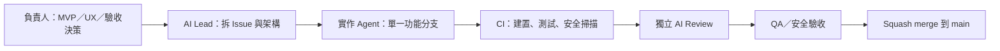

# 開發流程




## 角色

| 角色 | 負責 |
|---|---|
| 負責人（你） | 決定 MVP 範圍、優先順序、UX 與安全例外；把 ADR 改成「已接受」；核准安全敏感 PR 與發布 |
| AI Lead | 把需求拆成工作卡、維護架構文件、提出「提議中」的 ADR |
| 核心 agent | MuPDF 整合、渲染、搜尋、`pdf_worker` 隔離 |
| 前端 agent | 閱讀器 UI、快捷鍵、無障礙、視覺測試 |
| QA／安全 agent | 惡意、損毀、加密、簽章、超大 PDF 測試集與 fuzzing |
| Review／Release agent | CI、PR 規則、依賴掃描、安裝包與簽章；review 其他 agent 的 PR |

## 規則

1. 一個 agent 同時只做一張 Issue；一張 Issue 一個 branch；一個 PR 只做一件事。
2. `main` 永遠保持可建置；不直接 push 到 `main`。
3. PR 必須 CI 全綠、由**不同於作者**的 agent 或人 review，才能 squash merge。
4. AI review 不能取代安全審查：安全敏感 PR（見 [AGENTS.md](../AGENTS.md#需要人工安全審查的變更)）必須由負責人親自核准。
5. 分支命名與 PR 標題格式見 [AGENTS.md](../AGENTS.md#工作方式)。

## CI 檢查

| Workflow | Job（檢查名稱） | 內容 | 何時生效 |
|---|---|---|---|
| CI | `Guardrails` | 禁用遙測／網路依賴、ADR 編號與索引 | 現在 |
| CI | `PR hygiene` | PR 標題符合 Conventional Commits、內文連結 Issue | 現在（僅 PR） |
| CI | `Rust (Windows)` | `cargo fmt`、`clippy -D warnings`、`cargo test` | 出現 `Cargo.toml` 後 |
| CI | `Frontend` | `pnpm lint`、`typecheck`、`test`、`build` | 出現 `package.json` 後 |
| CI | `E2E (Windows)` | 建置 release app 與 worker，以 Playwright 操作真正的 app（`pnpm e2e`，見 [e2e.md](architecture/e2e.md)）；失敗時上傳截圖與日誌（保留 7 天） | 兩者都存在後 |
| Security | `Secret scan` | gitleaks 掃描所有 commit | 現在 |
| Security | `Dependency audit` | `cargo deny`、`pnpm audit` | 出現 `deny.toml`／`package.json` 後；每週一排程 |
| Fuzz | `Fuzz (worker_messages)`、`Fuzz (open_document)` | cargo-fuzz：IPC 解碼與以 MuPDF 開啟 PDF，見 [fuzzing.md](security/fuzzing.md) | 每週一排程，每個目標 20 分鐘；修改相關檔案的 PR 跑 2 分鐘 |

## GitHub 設定（需在網頁上手動完成）

### 1. 分支保護

> 公開 repo 在 GitHub Free 方案就能使用 Rulesets。repo 改為公開後請盡快設定；設定前，上述規則只能靠紀律與 agent 遵守 AGENTS.md。

Settings → Rules → Rulesets → New branch ruleset：

- Target：`main`
- 勾選 **Restrict deletions**、**Block force pushes**、**Require linear history**
- 勾選 **Require a pull request before merging**
  - Allowed merge methods：只留 **Squash**
- 勾選 **Require status checks to pass**，加入：`Guardrails`、`PR hygiene`、`Rust (Windows)`、`Frontend`、`E2E (Windows)`、`Secret scan`
  - `Dependency audit` 建議先不設為必要（新公告的弱點會讓無關 PR 突然失敗），改看每週排程結果
  - `Fuzz` 不能設為必要：它只在修改相關檔案時執行，沒執行的必要檢查會讓 PR 一直等待
- 若你是唯一維護者，**不要**勾「Require approvals」，否則你無法合併 AI 以你帳號開的 PR；改用 CODEOWNERS + `needs-security-review` 標籤當人工關卡

### 2. 合併設定

Settings → General → Pull Requests：只啟用 **Allow squash merging**（預設訊息選 *Pull request title and description*），勾選 **Automatically delete head branches**。

### 3. Actions

Settings → Actions → General：

- Workflow permissions 選 **Read repository contents**。
- Approval for running fork pull request workflows from contributors 選 **Require approval for all external contributors**：外部貢獻者的 PR 要你看過程式碼、按下核准後才會執行 CI。

> 公開 repo 使用 GitHub 提供的標準 runner 不計分鐘數。但 Actions 的**日誌與 artifact 也是公開的**：任何人都能看日誌，登入 GitHub 的人都能下載 artifact。fuzzing 的崩潰樣本與 AddressSanitizer 報告因此也會公開，做法待決定，見 [fuzzing.md](security/fuzzing.md#公開-repo-的限制) 與 [#57](https://github.com/winner0988/Pdf-reader/issues/57)。

### 4. 標籤與工作卡

安裝 [GitHub CLI](https://cli.github.com/) 並登入（`gh auth login`）後執行：

```bash
bash scripts/backlog-to-issues.sh --dry-run   # 先預覽
bash scripts/backlog-to-issues.sh             # 建立標籤與第一批 Issue
```

之後建立一個 GitHub Project（Board），欄位建議：`Backlog → Ready → In progress → In review → Done`，把 Issue 全部加進去。

### 5. 安全設定（公開 repo）

Settings → Advanced Security（舊版介面叫 Code security）：

- **Private vulnerability reporting**：啟用。[SECURITY.md](../SECURITY.md) 的回報方式需要它。
- **Dependabot alerts**：啟用。版本更新的 PR 由 [dependabot.yml](../.github/dependabot.yml) 設定。
- **Secret scanning** 與 **Push protection**：公開 repo 免費，啟用後含有憑證的 push 會直接被擋下。CI 的 `Secret scan`（gitleaks）照樣保留。
