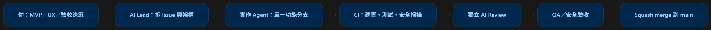
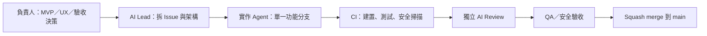

# 開發流程





## 角色

| 角色 | 負責 |
|---|---|
| 負責人（你） | 決定 MVP 範圍、優先順序、UX 與安全例外；把 ADR 改成「已接受」；核准安全敏感 PR 與發布 |
| AI Lead | 把需求拆成工作卡、維護架構文件、提出「提議中」的 ADR |
| 核心 agent | MuPDF 整合、渲染、搜尋、`pdf_worker` 隔離 |
| 前端 agent | 閱讀器 UI、快捷鍵、無障礙、視覺測試 |
| QA／安全 agent | 惡意、損毀、加密、簽章、超大 PDF 測試集與 fuzzing |
| Review／Release agent | CI、PR 規則、依賴掃描、安裝包與簽章；review 其他 agent 的 PR |

## 規則

1. 一個 agent 同時只做一張 Issue；一張 Issue 一個 branch；一個 PR 只做一件事。
2. `main` 永遠保持可建置；不直接 push 到 `main`。
3. PR 必須 CI 全綠、由**不同於作者**的 agent 或人 review，才能 squash merge。
4. AI review 不能取代安全審查：安全敏感 PR（見 [AGENTS.md](../AGENTS.md#需要人工安全審查的變更)）必須由負責人親自核准。
5. 分支命名與 PR 標題格式見 [AGENTS.md](../AGENTS.md#工作方式)。

## CI 檢查

| Workflow | Job（檢查名稱） | 內容 |
|---|---|---|
| CI | `Guardrails` | 禁用遙測／網路依賴、ADR 編號與索引、CSP／開發模式 CSP／capability 政策、守門腳本自身的測試 |
| CI | `PR hygiene` | PR 標題符合 Conventional Commits、內文連結 Issue（僅 PR） |
| CI | `Rust (Windows)` | `cargo fmt`、`clippy -D warnings`、`cargo test` |
| CI | `Frontend` | `pnpm lint`、`typecheck`、`test`、`build`、建置產物不得引用外部資源 |
| Security | `Secret scan` | gitleaks 掃描所有 commit |
| Security | `Dependency audit` | `cargo deny check`（弱點、禁用 crate、授權、來源）、`pnpm audit`；每週一排程 |

E2E 測試由 QA-02 加入，fuzzing 由 QA-03 加入。「不連網、零遙測」的完整驗證方式（含發布前的手動檢查）見 [docs/security/offline-verification.md](security/offline-verification.md)。

## GitHub 設定（需在網頁上手動完成）

### 1. 分支保護

> ⚠️ **私有 repo 在 GitHub Free 方案無法使用分支保護與 Rulesets**，需要 GitHub Pro（個人）或改為公開 repo。沒有分支保護時，上述規則只能靠紀律與 agent 遵守 AGENTS.md。

Settings → Rules → Rulesets → New branch ruleset：

- Target：`main`
- 勾選 **Restrict deletions**、**Block force pushes**、**Require linear history**
- 勾選 **Require a pull request before merging**
  - Allowed merge methods：只留 **Squash**
- 勾選 **Require status checks to pass**，加入：`Guardrails`、`PR hygiene`、`Rust (Windows)`、`Frontend`、`Secret scan`
  - `Dependency audit` 建議先不設為必要（新公告的弱點會讓無關 PR 突然失敗），改看每週排程結果
- 若你是唯一維護者，**不要**勾「Require approvals」，否則你無法合併 AI 以你帳號開的 PR；改用 CODEOWNERS + `needs-security-review` 標籤當人工關卡

### 2. 合併設定

Settings → General → Pull Requests：只啟用 **Allow squash merging**（預設訊息選 *Pull request title and description*），勾選 **Automatically delete head branches**。

### 3. Actions

Settings → Actions → General：Workflow permissions 選 **Read repository contents**。

> 私有 repo 的 Actions 每月有免費分鐘數上限，Windows runner 以 2 倍計算。`Rust (Windows)` 是最耗分鐘的 job。

### 4. 標籤與工作卡

安裝 [GitHub CLI](https://cli.github.com/) 並登入（`gh auth login`）後執行：

```bash
bash scripts/backlog-to-issues.sh --dry-run   # 先預覽
bash scripts/backlog-to-issues.sh             # 建立標籤與第一批 Issue
```

之後建立一個 GitHub Project（Board），欄位建議：`Backlog → Ready → In progress → In review → Done`，把 Issue 全部加進去。
